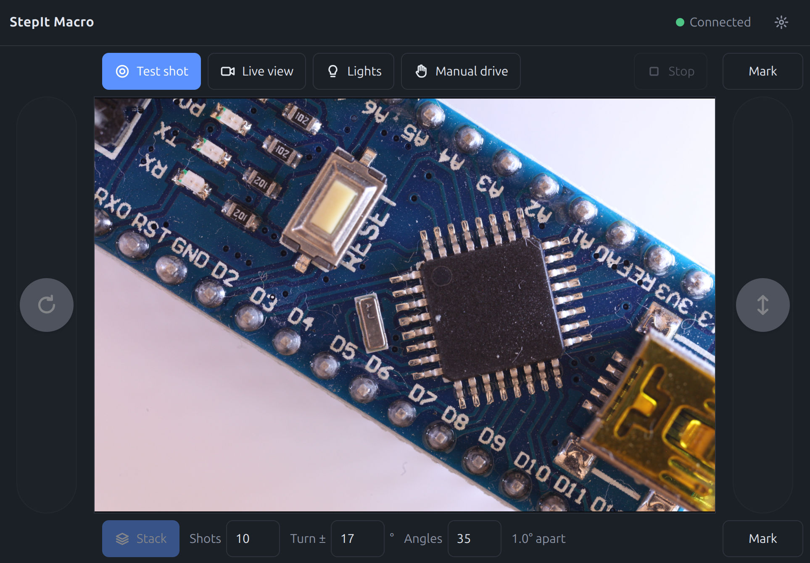

# StepIt Macro

[](https://github.com/kineticsystem/stepit-macro/actions/workflows/ci.yml)
[](https://github.com/kineticsystem/stepit-macro/actions/workflows/ci-format.yml)
[](https://github.com/kineticsystem/stepit-macro/actions/workflows/ci-ros-lint.yml)



An automated macro photography system for 3D focus stacking.

A camera is mounted on a motorized linear rail, which sits on a rotary stage.
For each angle, the rail moves the camera through a series of focus distances
and captures an image at each step. The stage then rotates to the next angle
and repeats, producing a full set of focus stacks around the subject.

The system also switches LED lights on and off during the shoot, so lighting
is consistent and synchronized with each capture.

## Table of Contents <!-- omit in toc -->

- [Features](#features)
- [The Modules](#the-modules)
- [StepIt UI](#stepit-ui)
- [Prerequisites](#prerequisites)
- [Install StepIt Macro](#install-stepit-macro)
  - [Check out the Git Repository](#check-out-the-git-repository)
  - [Build the Project](#build-the-project)
- [Running the Application](#running-the-application)
- [Configuring the Rig](#configuring-the-rig)
  - [The Launch Arguments](#the-launch-arguments)
  - [The Parameters of the Nodes](#the-parameters-of-the-nodes)
- [The Behaviors and Objectives](#the-behaviors-and-objectives)
  - [Packages](#packages)
  - [Objectives](#objectives)
  - [Adding an Objective](#adding-an-objective)
  - [Tests](#tests)
- [The Rig's Own Programs](#the-rigs-own-programs)
  - [The Gamepad](#the-gamepad)
  - [The State of the Rig](#the-state-of-the-rig)
  - [Switching the Rig Off](#switching-the-rig-off)
  - [The Workspaces](#the-workspaces)
- [Working on a Module](#working-on-a-module)
- [Updating the Modules](#updating-the-modules)
- [How It Works](#how-it-works)
- [Continuous Integration](#continuous-integration)

## Features

- Automated focus stacking along a linear rail
- Multi-angle capture via rotary stage
- Synchronized LED lighting control
- Output suitable for focus-stack merging and 3D reconstruction

## The Modules

StepIt Macro runs the whole rig with one command, in one Docker container, `stepit-macro`. It brings together five projects, checked out as git submodules under [`modules`](modules), and its own application, StepIt UI, in [`ui`](ui):

| Module | What it does |
|---|---|
| [StepIt Motors](https://github.com/kineticsystem/stepit-motors) | The robot: ROS2 control of the stepper motors, with fake motors by default, and RViz on demand. |
| [StepIt Commander](https://github.com/kineticsystem/stepit-commander) | The action server that runs *objectives*, behavior trees, and rosbridge on port 9090. The rig's own objectives and behaviors are in [`src/plugins`](src/plugins), see [The Behaviors and Objectives](#the-behaviors-and-objectives). |
| [StepIt Editor](https://github.com/kineticsystem/stepit-editor) | The web editor of the objectives, on <http://localhost:8080>, which runs them on the robot through the commander. |
| [StepIt Camera](https://github.com/kineticsystem/stepit-camera) | The ROS2 driver of the camera, over USB: live view, settings, and the download of every picture. It serves the pictures on port 8090, and the live view through web_video_server on port 8081. |
| [StepIt Freezer](https://github.com/kineticsystem/stepit-freezer) | The ROS2 driver of the Freezer board, an Arduino Nano that fires the cameras, the flashes and the lights with a hardware timer, with a fake controller by default. |
| [StepIt UI](ui) | The application of the whole rig, on <http://localhost:8070>, for a tablet or a desktop: the live view, the camera's settings, the shot and its pictures, the lights, and two sliders that drive the rotary stage and the rail. |

Each module is a project of its own, with its own container, tests, CI, fake hardware and test page, to work on it alone. StepIt UI is not: it is the rig's own page, which works only against the rig, and lives in this repo. In the rig, it replaces the test pages of the camera and of the Freezer, which `rig.yaml` turns off. StepIt Macro builds them all in its container, starts them with one launch file, and configures them with one file, [`rig.yaml`](src/stepit-macro/stepit_bringup/config/rig.yaml), see [Configuring the Rig](#configuring-the-rig). It also wires them up: the commander runs the rig's own objectives, from [`src/plugins`](src/plugins), and the editor opens them, so a tree saved in the editor is the tree the commander runs.

## StepIt UI

[StepIt UI](ui) puts the rig on one page, on port 8070 of the computer that runs it, e.g. `http://192.168.100.26:8070` from a tablet on the same network. It is made for a touch screen, and works on a desktop too.

- **The live view** of the camera, started and stopped from the page.
- **The camera's settings**, on the first tab of the settings menu, next to Appearance and Connection: the ISO, the shutter speed, the aperture, the white balance and the exposure compensation, with the values the camera accepts right now.
- **Test shot**: the objective [`TakeShot`](docs/TakeShot.md), which StepIt Freezer fires through the camera's jack, with the lights. A shot stops the live view, and the last picture then takes its place. The files stay on the rig, in the folder `pictures` of the repo: a test shot in `pictures/tests`, a stack in a folder named after when it started, with one folder per angle, e.g. `pictures/2026-10-06_15-20-04/angle_01_-17.0deg`.
- **The lights**, switched on and off by hand.
- **Two vertical sliders**, one at each edge under each thumb: the rotary stage (`joint1`) on the left and the rail (`joint2`) on the right, which work as the gamepad's sticks: the left one, left and right, for the stage, and the right one, up and down, for the rail, once the robot is handed to the user with **Manual drive**, the objective [`ActivateTeleop`](docs/ActivateTeleop.md). The knob rests in the middle; dragging it asks for a speed, up to 0.75 turns/s at the ends for the rotary stage and 3 turns/s, the motors' limit, for the rail; letting it go stops.
- **The focus stack**. A **Mark** button at each end of the rail's slider marks where the camera is, when **held** for 0.6 s, so that a thumb brushing it at the end of a drag marks nothing: the one above, with the camera away from the subject and its front sharp, runs [`MarkNear`](docs/MarkNear.md); the one below, with the camera close to the subject and its back sharp, runs [`MarkFar`](docs/MarkFar.md). Marking moves nothing and keeps manual drive on; a button turns green, **Marked**, and flashes at every new mark. Once both ends are marked, a **tap** goes back to one, [`MoveRailToMark`](docs/MoveRailToMark.md), to check the focus there. A start of the rig forgets the marks: they are counts of motor steps. A bar under the live view holds **Stack**, which runs [`FocusStack`](docs/FocusStack.md), the number of shots, how far the stage turns either way, **Turn ±**, e.g. 17° for −17° to 17°, from where it is when the stack starts, and the number of angles, with the angle between two of them; the rig keeps these, in its node `stack_state` and its state file, the `defaults` of its section in `rig.yaml` until a page sets them, so that they survive a restart; while a stack runs, a progress bar fills as its pictures come, and each picture shows in place of the live view, as a test shot's does.
- **Stop**, at the end of the toolbar, red while an objective runs: it stops every objective, whoever started it, and the sliders.
- **Switch the rig off**, at the bottom of the settings menu, away from the buttons a thumb uses all the time: **held for 3 seconds**, it switches the rig's computer off, filling while it is held; letting go sooner cancels, and a tap only says to hold. It is off, and the rig refuses, while a stack is shot, `FocusStack` or `Stack`, see [Switching the Rig Off](#switching-the-rig-off).

**Every page shows the same, whichever device opened it, and when.** What runs comes from the commander, which publishes the name of the running objective, latched; the marks and the counts of a stack from the rig's node `stack_state`, through its parameters `state.*`; the progress of a stack from `/focus_stack/progress`, latched; and every picture the camera takes shows on every page, whoever fired it. Only the live view is a page's own: it streams to the page that turned it on.

**Only the robot's tasks go through the commander**: a shot, handing the robot to the user, marking and shooting a stack. Configuring the rig, the camera's settings, the live view and the lights, goes straight to the drivers, so that it never replaces a running objective. While an objective runs, the page locks the settings and the lights, so that a shoot is not changed halfway through.

**The sliders are a second gamepad.** The page sends them as a `sensor_msgs/Joy` on `/ui/joy`, 20 times a second while one is held, and a second `gamepad_teleop`, `ui_teleop`, turns them into velocities. When they stop coming for 0.5 s, e.g. when the tablet loses the network in the middle of a move, `ui_teleop` stops the joints.

The page talks to the rig through the commander's rosbridge on port 9090, which knows every message of the rig, and loads the live view from port 8081 and the pictures from port 8090. See its [README](ui/README.md) for how to work on it, and [ARCHITECTURE.md](ui/docs/ARCHITECTURE.md) for how it is built.

## Prerequisites

We need a computer with Ubuntu 24.04 and Docker. Please refer to the document
[Install Docker Engine on Ubuntu](https://docs.docker.com/engine/install/ubuntu/),
or run:

```
curl -fsSL https://get.docker.com -o get-docker.sh
sudo sh get-docker.sh
```

The modules are cloned over SSH, so a GitHub account with an
[SSH key](https://docs.github.com/en/authentication/connecting-to-github-with-ssh)
is required.

For the camera, we need a camera supported by
[libgphoto2](http://www.gphoto.org/proj/libgphoto2/support.php), such as a
Canon EOS 5D Mark II, connected over USB, with its AC adapter. See
[Prepare the Camera](https://github.com/kineticsystem/stepit-camera#prepare-the-camera)
in the README of StepIt Camera, e.g. the mode dial on M. Without a camera, the
rest of the rig runs anyway, and the camera driver waits for one.

The Freezer board is not needed either: its driver runs with a fake controller by default. For the board, we need an Arduino Nano flashed with the firmware of the same commit of StepIt Freezer, see [Install StepIt Freezer on the Microcontroller](https://github.com/kineticsystem/stepit-freezer#install-stepit-freezer-on-the-microcontroller) in its README. The robot likewise runs on fake motors by default; its microcontroller is flashed as [StepIt Motors](https://github.com/kineticsystem/stepit-motors) tells. The container's user is in the group `dialout`, which owns the serial ports, so the host needs no grant.

> [!IMPORTANT]
> **Set _Auto power off_ to _Off_ in the camera's menu.** Otherwise the camera
> goes to sleep, as soon as a minute after the last use, and the driver loses
> it until it wakes up: the live view stops, and no picture is downloaded.

## Install StepIt Macro

### Check out the Git Repository

Check out this git repository, including all the modules and their own
submodules.

```
git clone --recurse-submodules git@github.com:kineticsystem/stepit-macro.git
cd stepit-macro
```

If you missed the switch `--recurse-submodules`, download the modules with:

```
./docker/dock.sh download
```

### Build the Project

Everything is driven by the [`docker/dock.sh`](docker/dock.sh) script, which can
be called from anywhere. Run it without arguments to list its commands.

> [!IMPORTANT]
> The container provides a default user `developer` with password `developer`.

Build the image, then install the dependencies and compile the code of every module and of the rig inside the container. The first build takes a while. The image is based on `ros:jazzy-ros-base`, which is published for arm64 too, for the Raspberry Pi 5 that runs the rig.

```
./docker/dock.sh build
```

The packages it downloads, for the image and for the dependencies of each module (rosdep), are kept on this machine by `stepit-apt-cache`, a local proxy that `build` starts, so that later builds take them from the disk. They are in the Docker volume `stepit-macro_apt-cache`, which `clean` keeps; remove it with `docker volume rm stepit-macro_apt-cache` to free the space. The dependencies are installed into the image while compiling, so the container starts without installing them again. See [The Package Cache](docs/PackageCache.md), which also describes the cache of CI.

To install the rig on the Raspberry Pi 5 that runs it, see [Running the Rig on a Raspberry Pi 5](docs/pi5.md).

This is also how we pick up a change to the `Dockerfile` or to the code: it rebuilds only the image layers that changed, and colcon only the packages that changed. To build part of the rig, see [Working on a Module](#working-on-a-module).

## Running the Application

Ubuntu's desktop mounts a camera as soon as it is plugged in, and then holds
it, so that the camera driver cannot open it. Unmount it before starting, or
stop Ubuntu from doing it, as the
[troubleshooting](https://github.com/kineticsystem/stepit-camera#troubleshooting)
of StepIt Camera explains.

Start the whole rig in the background:

```
./docker/dock.sh start
```

From then on, the rig starts again by itself with the computer, e.g. when the Raspberry Pi is switched on, until `./docker/dock.sh stop` stops it: its container has the restart policy `unless-stopped`.

The rig runs on fake hardware by default: the fake motors and the fake Freezer controller; the camera driver waits for a camera. To drive the real robot and the real Freezer board, set them in [`rig.yaml`](src/stepit-macro/stepit_bringup/config/rig.yaml), see [Configuring the Rig](#configuring-the-rig).

StepIt UI is on <http://localhost:8070>, or on port 8070 of the computer's address from a tablet, see [StepIt UI](#stepit-ui). The editor is on <http://localhost:8080>: open an objective, e.g. `OffsetJointsBy`, and press **Run** to execute it on the robot. Its **Execution** tab shows every run of the commander, with the status of each node, also those started from StepIt UI or the gamepad, and a run already going when the page opens. The pictures the camera takes are saved in `pictures`, at the root of this repo.

Follow the output of the rig. Stop following with `Ctrl+C`: the rig keeps running.

```
./docker/dock.sh logs
```

Show whether the container is running:

```
./docker/dock.sh status
```

Open a terminal into the container, e.g. to send an objective from the command line. The shell has every workspace of the rig sourced.

```
./docker/dock.sh shell
```

```
ros2 action send_goal /commander/execute_objective \
  btcpp_ros2_interfaces/action/ExecuteTree \
  "{target_tree: OffsetJointsBy,
    payload: '{joints: [joint1, joint3], offset: -6.28}'}"
```

Stop the rig:

```
./docker/dock.sh stop
```

Finally, run this to remove the containers and their images:

```
./docker/dock.sh clean
```

## Configuring the Rig

The whole rig is configured by one file, [`src/stepit-macro/stepit_bringup/config/rig.yaml`](src/stepit-macro/stepit_bringup/config/rig.yaml): the serial ports of the controllers, fake or real hardware, the ports of the web pages, and the parameters of the nodes. The launch file of the rig, `rig.launch.py`, reads it when the rig starts. To apply a change, restart the rig; no build is needed.

```
./docker/dock.sh stop
./docker/dock.sh start
```

The modules are never edited to configure the rig: each takes its configuration from its launch arguments and from a parameter file of the rig, loaded after its own.

### The Launch Arguments

The section `launch` holds the launch arguments of each module, given to the module's launch file. The ones that set up the hardware:

| Module | Argument | Default | Description |
|---|---|---|---|
| `robot` | `use_dummy` | `true` | Fake motors instead of the microcontroller of StepIt Motors. |
| `robot` | `usb_port` | `/dev/ttyACM0` | The serial port of the microcontroller. |
| `robot` | `baud_rate` | `9600` | The speed of its serial port, the one of the firmware. |
| `robot` | `launch_rviz` | `false` | Open RViz, on the host's display. |
| `freezer` | `use_fake` | `true` | A fake controller instead of the Freezer board. |
| `freezer` | `usb_port` | `/dev/ttyUSB0` | The serial port of the Arduino Nano. |
| `camera` | `fake` | `false` | A fake camera instead of the one on USB. libgphoto2 opens the first camera it finds: there is no port to set. |
| `teleop` | `dev` | `/dev/input/js0` | The gamepad. |

The other arguments are the servers: `rosbridge_port` of the commander, `web_port` (the pictures) and `web_video_port` (the live view) of the camera, `port` of the editor and of StepIt UI (`ui`), and the test pages of the camera and of the Freezer, which the rig turns off with `rosbridge: false` and `web: false`: StepIt UI replaces them. Any other argument of a module's launch file can be added to its section. An argument the launch file does not declare stops the rig, with its name in the log, so that a typo is not silently ignored.

For example, to drive the real robot and the real Freezer board:

```yaml
launch:
  robot:
    use_dummy: false
    usb_port: /dev/serial/by-id/usb-Teensyduino_USB_Serial_12345-if00
  freezer:
    use_fake: false
    usb_port: /dev/serial/by-id/usb-FTDI_FT232R_USB_UART_A1B2C3-if00-port0
```

> [!IMPORTANT]
> Name the serial ports by `/dev/serial/by-id`, as above. `/dev/ttyACM0` and `/dev/ttyUSB0` depend on the order the controllers were plugged in, and change when one is plugged in again; the name by id stays the same. List them with `ls -l /dev/serial/by-id`.

### The Parameters of the Nodes

Every other section is the parameters of a node, as in any ROS2 parameter file. `rig.launch.py` writes them to a parameter file of their own and gives it to every launch file that takes one, e.g. the commander's, the camera's and the Freezer's, as its `params_file`, loaded after the module's own: only the values that differ from the module's need to be in `rig.yaml`. A launch argument that sets the same parameter, e.g. the Freezer's `usb_port`, wins over it.

| Node | What the rig sets |
|---|---|
| `stepit_server` | `plugins` and `behavior_trees`: the rig's behaviors and objectives, which the commander loads. |
| `camera` | `download_directory`: the folder of the pictures, `~/ws/pictures`. The settings of the camera, e.g. `iso`, can be added here. |
| `web_server` | The camera's web server: the same `download_directory`, from which StepIt UI loads the pictures. |
| `freezer` | `baudrate`, and the sequences of the rig, by the jacks of the board: `test_shot`, the default one, fires the camera on OUT8 with the lights on OUT1, see [`TakeShot`](docs/TakeShot.md). |
| `stack_state` | The state of the rig: `state_file`, the file of the values it keeps across restarts, `~/ws/state/stack.yaml`; `saved`, those values, the counts of a stack; `forgotten`, the values it forgets at every start, the marks; and `defaults`, the counts of a new rig. See [The State of the Rig](#the-state-of-the-rig). |
| `ui_teleop` | The sliders of StepIt UI: which axis drives which joint, and how fast at the ends: 4.71 rad/s, 0.75 turns/s, for the rotary stage, and 18.85 rad/s, the motors' limit, for the rail. |

See the README of each module for the parameters it takes.

## The Behaviors and Objectives

The objectives the rig runs, and the behaviors they are built from, are the
rig's own: they live here, in [`src/plugins`](src/plugins), not in StepIt Commander, whose server runs any robot's. They are built as a ROS workspace of their own, on top of the modules', which holds the commander, see [The Workspaces](#the-workspaces). The server loads them from the folders listed in the section `stepit_server` of [`rig.yaml`](src/stepit-macro/stepit_bringup/config/rig.yaml).

### Packages

| Package | Role |
|---|---|
| `stepit_objectives` | The objectives and the subtrees they are built from: BehaviorTree XML files, no code. `objectives/stepit_behaviors.xml` describes the behaviors for editors such as the StepIt Editor. |
| `stepit_behaviors` | The behaviors the objectives are built from. The only place that knows the topics, actions and services of the robot. |
| `stepit_tests` | Tests: the logic of the behaviors, and the objectives run end to end against a fake robot. |

### Objectives

Each objective is documented in its own file under [`docs`](docs), named after
the objective, i.e. after the `target_tree` of the command:

| Objective | What it does |
|---|---|
| [`OffsetJointsBy`](docs/OffsetJointsBy.md) | Moves joints **by** a signed offset, relative to where they are. |
| [`MoveJointsTo`](docs/MoveJointsTo.md) | Moves joints **to** absolute positions. |
| [`OffsetJointsDirectlyBy`](docs/OffsetJointsDirectlyBy.md) | Like `OffsetJointsBy`, through the position controller: each joint on the microcontroller's own profile, fastest, but not synchronised. |
| [`MoveJointsDirectlyTo`](docs/MoveJointsDirectlyTo.md) | Like `MoveJointsTo`, through the position controller: each joint on the microcontroller's own profile, fastest, but not synchronised. |
| [`ActivateController`](docs/ActivateController.md) | Stops the controller driving the robot and activates another one. |
| [`ActivateTeleop`](docs/ActivateTeleop.md) | Hands the robot to the gamepad: stops the controllers driving it and activates the velocity controller. **Manual drive** in StepIt UI runs it. |
| [`ToggleTeleop`](docs/ToggleTeleop.md) | Runs `ActivateTeleop`, or, when the gamepad already drives the robot, hands it back to the trajectory controller. The gamepad's stop button runs it. |
| [`SpinTest`](docs/SpinTest.md) | Hardware test: joint *k* turns *k* times clockwise at 90% of the motors' limits, then all return home. |
| [`TakeShot`](docs/TakeShot.md) | Fires a shot on the StepIt Freezer board: the cameras, flashes and lights of a sequence, `test_shot` on the rig. |
| [`Stack`](docs/Stack.md) | Steps joint1 and joint2 through a grid of 11 × 11 positions, 5 turns in 10 steps each, then returns every joint home; joints 3, 4 and 5 stay in place. |
| [`MoveRailBy`](docs/MoveRailBy.md) | Moves the rail by a distance in millimetres, with its measured 1.592 mm per turn of the motor. |
| [`RotateStageBy`](docs/RotateStageBy.md) | Turns the rotary stage by an angle in degrees, with its 4.5 degrees per turn of the motor, an 80:1 gear. |
| [`MarkNear`](docs/MarkNear.md), [`MarkFar`](docs/MarkFar.md) | Remember where the rail is as the near or the far end of a focus stack. They move nothing. A start of the rig forgets them. |
| [`MoveRailToMark`](docs/MoveRailToMark.md) | Moves the rail back to a mark, approaching it as a stack does, to check the focus there, then manual drive again. |
| [`FocusStack`](docs/FocusStack.md) | Shoots a focus stack from the near mark to the far one at each of several angles of the rotary stage, approaching every position from the same side against backlash, and stops at once when a shot's picture does not come. |

Run one from a terminal in the container, opened with `./docker/dock.sh shell`, e.g. to turn `joint1` and `joint3` by one turn clockwise:

```bash
ros2 action send_goal /commander/execute_objective \
  btcpp_ros2_interfaces/action/ExecuteTree \
  "{target_tree: OffsetJointsBy,
    payload: '{joints: [joint1, joint3], offset: -6.28}'}"
```

The behaviors show every shape a behavior can take: a ROS action client
(`FollowJointTrajectory`, `Shoot`), service clients (`GetActiveControllers`,
`SwitchController`), a subscriber (`GetJointPositions`), a publisher that waits
on a subscription (`CommandJointPositions`), a latched publisher
(`ReportProgress`, a stack's progress for every page, `StackDone`, each
angle of a stack whose pictures are all saved, and `AllStacksDone`, a stack
whose angles are all done), a parameter of another
node (`SetPictureFolder`, the camera's folder of pictures), pure logic
(`OffsetVector`, `SetJoints`, `TrapezoidalTrajectory`, `CurrentTime`,
`MillimetresToRadians`, `DegreesToRadians`) and the state of the rig
(`SaveValues`, `LoadValues`, service clients of the node `stack_state`). `Steps` is a decorator that loops over values, and
`ExpectPicture` one that waits for the camera's picture of the shot it wraps.

Some behaviors read parameters of their own from the commander's section of
`rig.yaml`: the overshoot of each motor against backlash, `overshoot.<joint>`,
which `CommandJointPositions` uses when given an approach; the millimetres a
linear axis travels per turn of its motor, `mm_per_turn.<joint>`, and the
degrees a rotary axis turns, `deg_per_turn.<joint>`, which
`MillimetresToRadians` and `DegreesToRadians` convert with; and
`pictures_folder`, the camera's folder of pictures, where `StackDone` writes
`stack.json` into each finished angle, and `AllStacksDone` `all_stacks.json`
into each finished stack. They are configuration, which the plugin reads from
the commander's parameter file without declaring them on its node: the
commander itself knows nothing about them, and BehaviorTree.ROS2 registers
every plugin and tree again after any change of the node's parameters, a
declaration included.

What the objectives remember from one run to the next, e.g. the marks of a
stack, is not configuration: it is the state of the rig, kept by its own node,
see [The State of the Rig](#the-state-of-the-rig).

Building a trajectory and following it are separate behaviors, and
`FollowJointTrajectory` sends whatever trajectory it is given to the controller.
Two nodes build one:

- `CubicTrajectory`: a single waypoint, reached at rest after a given duration.
  The controller joins it with a cubic, which reaches its peak acceleration only
  at the start and the end, and its top speed only halfway. No objective uses
  it; it is there for a move that must take a given time.
- `TrapezoidalTrajectory`: as fast as the limits allow, 2.7 turns/s and 1.8
  turns/s² by default, 90% of those of the StepIt motors: at 100% the motors
  trail their commands and arrive late. Each joint accelerates at the limit,
  cruises at top speed and brakes at the limit; all joints start and stop
  together. It needs the positions the joints start from, e.g. from
  `GetJointPositions`. Every objective that moves the robot through the
  trajectory controller uses it.

### Adding an Objective

1. Write the XML in `src/plugins/stepit_objectives/objectives`. Nothing else to do: the
   folder is already loaded by the server, which reads the files again before
   each goal whenever one was added, changed or removed, so the next goal runs
   it, with no build and no restart. A step that more than one objective needs
   goes in a tree of its own, in the same folder, called with `<SubTree
   ID="..."/>`. Such a subtree takes its parameters from ports
   (`{controllers}`), so each caller can pass its own; only the objective a
   client asks for reads the payload (`{@controllers}`). See how
   `ActivateController` forwards its payload to `EnsureControllers`.

   An objective is the main tree of its file: its `<root>` names it in
   `main_tree_to_execute`, as the editor does when it creates one. A tree the
   file does not name is a subtree: it runs only inside another tree, and the
   commander refuses to run it on its own. The editor switches a tree between
   the two with **Kind**, in place.

   Declare the payload of the objective in a `<TreeNodesModel>` of its file, as
   the ports of a `<SubTree>` with the objective's ID: one `input_port` per
   entry, named after it, whose description ends with an example of its value,
   as YAML, after `e.g.`. Editors such as the StepIt Editor show it in the Run
   dialog; the server ignores it. A subtree declares its own ports the same way,
   as `ensure_controllers.xml` does:

   ```xml
   <TreeNodesModel>
     <SubTree ID="OffsetJointsBy">
       <input_port name="joints">the joints to move, e.g. joint1 or [joint1, joint2]</input_port>
     </SubTree>
   </TreeNodesModel>
   ```
2. If it needs a new behavior, add it to `src/plugins/stepit_behaviors` and register it
   in `stepit_behaviors::registerNodes`. It is picked up automatically, because
   the whole package is loaded as one plugin. Then rebuild the rig and
   regenerate the node models that editors read (`test_nodes_model` fails until
   you do):

   ```bash
   ~/ws/bin/plugins/build.sh
   source ~/ws/install/plugins/setup.bash
   ros2 run stepit_behaviors write_nodes_model ~/ws/src/plugins/stepit_objectives/objectives/stepit_behaviors.xml
   ```

   The running server loaded the behaviors when it started: restart the rig
   with `./docker/dock.sh stop` and `./docker/dock.sh start`.
3. Add a test to `src/plugins/stepit_tests`.
4. Document its parameters in `docs/<ObjectiveName>.md` and add it to the
   [Objectives](#objectives) table.

### Tests

The objective tests, e.g. `test_offset_joints_by_objective`, run the real
objective XML and the real behaviors against a fake robot that publishes
`/joint_states`, serves `FollowJointTrajectory` and follows the commands of the
position controller, so no hardware and no controller are needed. Run them in
the container:

```bash
~/ws/bin/plugins/test.sh
```

> [!WARNING]
> The fake robot uses the names of the real one. With the StepIt robot running
> on the same network and ROS domain, the tests read its joint states, switch
> its controllers and **move it**. The test scripts therefore always run them
> on ROS domain 77, or on `STEPIT_TEST_DOMAIN_ID` if set, whatever
> `ROS_DOMAIN_ID` the shell has. Run them through the scripts, never with a
> plain `colcon test`, which runs them on the robot's domain.

## The Rig's Own Programs

The behaviors and objectives run inside the commander, as a plugin. The rig's programs that run on their own, as ROS nodes next to the modules, are in [`src/stepit-macro`](src/stepit-macro), and so is the launch file that starts the whole rig.

### The Gamepad

A Logitech Dual Action gamepad drives the robot by hand: its sticks set the velocity of the joints, through the robot's velocity controller, and its button 1 stops whatever moves the robot and hands it to the gamepad, or, pressed again, hands it back. It runs from the package [`stepit_teleop`](src/stepit-macro/stepit_teleop).

It belongs to StepIt Macro, not to StepIt Motors, because it needs the commander: the stop button runs the objective [`ToggleTeleop`](docs/ToggleTeleop.md), which the commander runs in place of the running objective, and which switches the controllers. See [Driving the Robot with a Gamepad](docs/Gamepad.md), which also tells how to test the gamepad with `jstest-gtk`.

### The State of the Rig

What every page shares and the objectives remember from one run to the next is
kept by one node, `stack_state`, in the package
[`stepit_state`](src/stepit-macro/stepit_state), as its parameters `state.*`,
each a list of numbers:

| Value | Set by | Kept |
|---|---|---|
| `state.near`, `state.far` | `MarkNear` and `MarkFar`, through `SaveValues` | In memory only: empty, `[]`, at every start of the rig, as they are counts of motor steps, which mean nothing once the motors' controller powers up again. |
| `state.shots`, `state.angles`, `state.turn` | StepIt UI, the bar of the stack | In the state file, `~/ws/state/stack.yaml`, i.e. `state/stack.yaml` of this repo, which git ignores: they survive a restart. The `defaults` of `rig.yaml` until a page sets them. |

`SaveValues` and `LoadValues` set and read them through the node's
`set_parameters` and `get_parameters` services, StepIt UI the same way over
rosbridge, and every page follows them on `/parameter_events`. A name the node
does not keep does not exist, and a value it cannot save is refused. Only this
node writes the file. Which values it keeps, and which it forgets, is the
section `stack_state` of `rig.yaml`: read-only while the rig runs.

It is a node of its own, and not the commander's parameters: BehaviorTree.ROS2
registers every plugin and tree of the commander again after any change of the
commander's parameters, which drops the objectives added since the last build.

### Switching the Rig Off

The power button of StepIt UI switches off the computer that runs the rig, e.g. the Raspberry Pi, cleanly: every service stops, the rig among them, whose ROS nodes shut down as on `Ctrl+C`. It calls the service `/power_off/power_off` (`std_srvs/Trigger`) of the node `power_off`, in the package [`stepit_power`](src/stepit-macro/stepit_power), which:

- **refuses while a stack is shot,** an objective of its parameter `refuse_during`, `FocusStack` and `Stack`, as the commander publishes it on `/stepit_server/objective`: switching off would leave a session half shot. The answer says so, e.g. `FocusStack is running: stop it first`, and StepIt UI shows it in the top bar;
- **otherwise runs its parameter `command`:** `busctl`, asking systemd-logind to power off over the computer's system D-Bus, which the container mounts, `/run/dbus`. It answers `Switching off`, or why the computer refused.

logind decides who may switch the computer off, through polkit. The rig's user may not by default: its answer is `challenge`, a password. On the rig's computer, once, install the polkit rule of [`docker/polkit`](docker/polkit), which lets that user, and only for powering off:

```bash
sed "s/@USER@/$USER/" docker/polkit/50-stepit-power-off.rules \
  | sudo tee /etc/polkit-1/rules.d/50-stepit-power-off.rules
```

Check it, without switching off: the answer must now be `yes`.

```bash
busctl call --system org.freedesktop.login1 /org/freedesktop/login1 \
  org.freedesktop.login1.Manager CanPowerOff
```

> [!WARNING]
> Install the rule only on the computer that is the rig. On a development computer that runs the rig in Docker, the power button would switch that computer off.

### The Workspaces

The container builds three ROS workspaces, one on top of the other, each into folders of its own:

| Workspace | What it holds | Scripts | Output |
|---|---|---|---|
| `modules` | The ROS packages of the modules, the editor, and the editor's validator. | [`bin/modules`](bin/modules) | `build/modules`, `install/modules` |
| [`src/plugins`](src/plugins) | The rig's behaviors and objectives, on top of `modules`: the commander loads them into its process, so they are built against its libraries. | [`bin/plugins`](bin/plugins) | `build/plugins`, `install/plugins` |
| [`src/stepit-macro`](src/stepit-macro) | The rig's own programs, and the launch file of the rig. | [`bin/stepit-macro`](bin/stepit-macro) | `build/stepit-macro`, `install/stepit-macro` |

StepIt UI, in [`ui`](ui), is not a ROS workspace but a pnpm project, with scripts of its own in [`bin/ui`](bin/ui), which come last: it is built into `ui/dist`.

[`bin/update.sh`](bin/update.sh), [`bin/build.sh`](bin/build.sh) and [`bin/test.sh`](bin/test.sh) run the scripts of every workspace in that order. In the container, this repo is mounted at `~/ws`, and they are on the `PATH` and aliased as `update`, `build` and `test`. `test` runs the tests of `src/plugins`, `src/stepit-macro` and StepIt UI: the modules run theirs in their own CI.

The modules are built into the rig's folders, not into their own: a module's own container mounts it at `~/ws`, and this one at `~/ws/modules/<module>`, so their CMake caches cannot be shared. StepIt Motors and StepIt Freezer both carry the libraries `serial` and `framed-serial` as submodules; colcon refuses two packages of the same name, so the rig builds the driver's copy, and `bin/modules/build.sh` stops if the two modules pin different commits of them.

`src/plugins` and `src/stepit-macro` stay separate workspaces because CI builds them alone, without the modules: the first on the commander's workspace only, the second on ROS alone, as `src/stepit-macro` builds `btcpp_ros2_interfaces`, the type of the commander's action, from the commander's own copy in `modules/stepit-commander`.

The packages of `src/stepit-macro`:

| Package | Role |
|---|---|
| `stepit_bringup` | The rig: `rig.launch.py` starts every module, the gamepad, the sliders of StepIt UI, the editor and StepIt UI, with the configuration of `config/rig.yaml`. |
| `stepit_teleop` | The gamepad: `gamepad_teleop` turns the sticks into velocities and the stop button into `ToggleTeleop`. |
| `stepit_power` | Switching the computer off: `power_off`, the service of StepIt UI's power button, refused while a stack is shot. |
| `stepit_state` | The state of the rig: `stack_state`, the marks and the counts of a stack, which every page shares, see [The State of the Rig](#the-state-of-the-rig). |
| `stepit_macro_tests` | Tests of the packages above, e.g. the gamepad against a fake commander, and `rig.yaml`. |

A new program goes into `src/stepit-macro` as a package with a launch file, and into `MODULES` in [`rig.launch.py`](src/stepit-macro/stepit_bringup/launch/rig.launch.py), with its section in `rig.yaml`.

## Working on a Module

Each module is a complete git repository of its own under [`modules`](modules): edit, commit and push it as usual. Its README tells how to build and test it in its own container, alone, with its own fake hardware and test page. Run one system or the other, not both: they use the same ports and the same ROS names.

In the rig's container, rebuild everything with `build`, or one module's packages only, e.g. the camera's:

```
./docker/dock.sh shell
~/ws/bin/modules/build.sh --packages-up-to stepit_camera
```

Then restart the rig. Outside the container, `./docker/dock.sh build` rebuilds everything too, and the image if the `Dockerfile` changed. The objectives need no build: the commander reads them again before each goal.

The editor's validator checks the rig's objectives from the shell, with `validate`. The web pages run with hot reload as in their own containers, e.g. `cd ~/ws/modules/stepit-freezer/web && pnpm dev`, and StepIt UI with `cd ~/ws/ui && pnpm dev`, on port 5176.

If the rig stops right after starting, look at its output with `./docker/dock.sh logs`. `./docker/dock.sh shell` still opens a terminal when the rig is stopped, in a new container of the same image.

## Updating the Modules

StepIt Macro records the commit of each module it was tested with. To move
every module to the latest commit of its `main` branch:

```
git submodule update --remote --recursive
./docker/dock.sh build
```

Then commit the new commits of the modules in StepIt Macro:

```
git add modules
git commit -m "Update the modules"
```

## How It Works

[`docker/docker-compose.yml`](docker/docker-compose.yml) defines one service, `stepit-macro`, on the image of [`docker/Dockerfile`](docker/Dockerfile), and the package cache. The image holds what the image of each module holds: `ros:jazzy-ros-base`, published for amd64 and arm64, the packages that the modules' Dockerfiles install, e.g. libgphoto2 for the camera and BehaviorTree.CPP for the commander, and Node.js for the web pages; rosdep adds the rest, RViz included. Unlike the desktop image of StepIt Motors' own container, it leaves out Gazebo and the desktop tools, gigabytes the rig never uses. The editor's validator is built against the ROS package of BehaviorTree.CPP, the library the commander runs the objectives with.

The container mounts this repo at `~/ws` and the whole of `/dev`, for the serial ports, the camera and the gamepad, which can then be unplugged and plugged in again while the rig runs. Its command runs one launch file, [`rig.launch.py`](src/stepit-macro/stepit_bringup/launch/rig.launch.py), which:

- reads [`rig.yaml`](src/stepit-macro/stepit_bringup/config/rig.yaml), and writes its node parameters to a parameter file of their own;
- includes the launch file of each module, `robot_bringup/launch.py`, `stepit_server/commander.launch.py`, `stepit_camera/camera.launch.py`, `freezer_node/freezer.launch.py`, `stepit_teleop/teleop.launch.py`, `stepit_power/power.launch.py` and `stepit_state/state.launch.py`, with its arguments of `rig.yaml`, and the parameter file as `params_file` for those that take one. Each is included in a group of its own, so that the arguments of one module, e.g. `usb_port`, never reach the next;
- starts `ui_teleop`, the second `gamepad_teleop`, which reads the sliders of StepIt UI on `/ui/joy`;
- starts the editor's server on the rig's objectives, and serves StepIt UI, as built in `ui/dist`.

The container uses the host network, so the web pages reach the servers from the browser, on the address of the computer: the editor and StepIt UI through the commander's rosbridge on port 9090, which knows every message of the rig, since every module is installed in the container; StepIt UI also loads the live view from web_video_server on port 8081 and the pictures from the camera's web server on port 8090. The rosbridges of the camera and of the Freezer, which their own containers need, are turned off.

rosbridge has no authentication: anyone on the network who reaches port 9090 can drive the rig. That suits a workshop's own network, not a shared one.

The containers of the modules' own `dock.sh` are named after their modules; the rig's is `stepit-macro`. Remove a module's container before starting the rig, e.g. with `./modules/stepit-motors/docker/dock.sh stepit-motors clean`, and stop the rig before starting a module's own: they use the same ports. `./docker/dock.sh start` also removes the containers that earlier versions of StepIt Macro started, one per module.

## Continuous Integration

Three GitHub Actions workflows run on every push and pull request, as in the
modules:

| Workflow | What it checks |
|---|---|
| [`ci.yml`](.github/workflows/ci.yml) | Builds and tests the rig's two workspaces, each in a job of its own, with the scripts of [`bin`](bin), in a `ros:jazzy-ros-base` container. The job of `src/plugins` first builds the commander's workspace from the `stepit-commander` submodule, and builds on it alone, with `UNDERLAY`. A third job, `ui`, type checks, tests and builds StepIt UI with Node.js, and a fourth, `objectives`, validates the objectives with the StepIt Editor's validator, see below. |
| [`ci-format.yml`](.github/workflows/ci-format.yml) | The pre-commit hooks that need no ROS: clang-format, black, codespell, and the checks of whitespace and files. |
| [`ci-ros-lint.yml`](.github/workflows/ci-ros-lint.yml) | The ament linters of every package: copyright, lint_cmake and cpplint. |

The build cannot use `industrial_ci`, as the modules do: it builds one
workspace from the sources of the repo, and `src/plugins` is built on top of
the commander's. CI checks out only the `stepit-commander` and `stepit-editor` submodules, over
HTTPS; the other modules have CI of their own.

The `objectives` job runs the editor's validator, `validate`, on
[`src/plugins/stepit_objectives/objectives`](src/plugins/stepit_objectives/objectives):
the editor's own checks, then BehaviorTree.CPP loading every file with the node
models of the rig's behaviors, built from the ROS package, the library and the
version the commander loads them with. A broken objective, e.g. an unknown node
or port, or a subtree that does not exist, fails the pull request instead of
being refused by the commander on the robot. Run the same check by hand in the
container, where it validates that folder by default:

```
./docker/dock.sh shell
validate
```

The workflows run locally with [Nektos `act`](https://github.com/nektos/act),
e.g. `act -W .github/workflows/ci.yml`.
