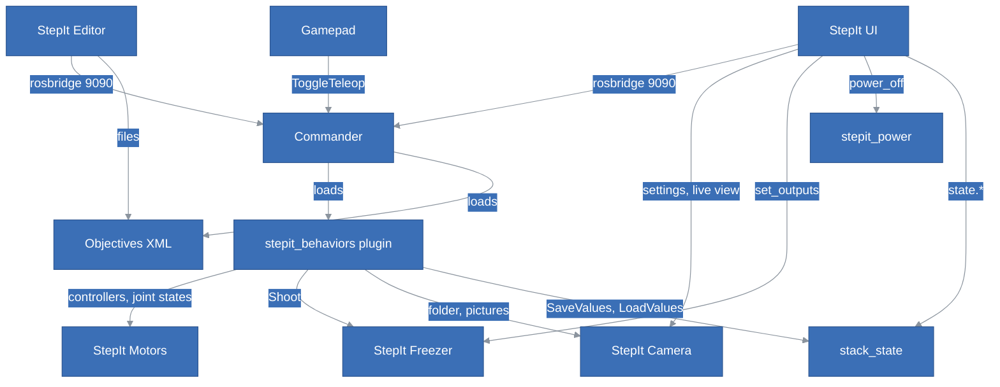

# StepIt Macro Architecture Review

## Table of Contents <!-- omit in toc -->

- [Scope and Method](#scope-and-method)
- [Verdict](#verdict)
- [The System as It Is](#the-system-as-it-is)
- [Structure and Boundaries](#structure-and-boundaries)
- [Interfaces and Abstractions](#interfaces-and-abstractions)
- [Separation of Concerns](#separation-of-concerns)
- [SOLID](#solid)
- [API Design](#api-design)
- [Coupling and Duplication](#coupling-and-duplication)
- [Tests](#tests)
- [Background: the Commander's Parameters and the End of a Run](#background-the-commanders-parameters-and-the-end-of-a-run)
- [Implementation Issues](#implementation-issues)
- [Recommendations](#recommendations)

## Scope and Method

This review describes StepIt Macro at commit `cf03a80`, on 2026-10-09, with every module at the commit the repo records:

| Module | Commit |
|---|---|
| StepIt Commander | `13ffae2`, with BehaviorTree.ROS2 from our fork at `b0ae01d`, see [How a run ends](#how-a-run-ends) |
| StepIt Camera | `4402400` |
| StepIt Freezer | `2f720fd` |
| StepIt Editor | `e45cf90` |
| StepIt Motors | `dfa8afb` |

Every finding names the file it rests on. Those marked *verified* were reproduced, on the rig with fake hardware or on the Raspberry Pi; the others come from reading the code.

## Verdict

**The structure is sound: the modules are independent, and the rig composes them through configuration.** The strengths, with their evidence:

- **Each module is its own product**, with its own repository, CI, fake hardware and test page. The rig composes the modules only through launch arguments and parameter files.
- **The commander is generic.** Its single extension interface, `ProgressReporter`, lets a plugin report progress without depending on the server: it is header-only, and the server finds it with `dynamic_cast`.
- **Mechanism and policy are separated**: the behaviors are C++, the objectives are XML. The XML is checked in CI by the editor's validator, against node models that `test_nodes_model` keeps equal to the real registration.
- **Each device sits behind an interface, with a fake that the tests use.** The drivers are written for failure:
  - the Freezer's `ShotRunner` takes its clock and its sleep as functions;
  - the firmwares validate every table and every configuration;
  - `StepitHardware` tracks which controller owns each joint, with atomics, and resets commands to NaN when a controller takes a joint;
  - the camera's parameters are read-only where they should be, and its folder parameter refuses `..`.
- **The state every page shares has one owner**, the node `stack_state`, off the commander's node, whose parameters BehaviorTree.ROS2 watches: see [Background](#background-the-commanders-parameters-and-the-end-of-a-run).
- **The rules are written down**, in `CLAUDE.md`, with the measurements behind them in `docs/`, e.g. the controller switching in [`ActivateController.md`](docs/ActivateController.md).
- **The policy lives on the rig.** `TakeShot` fails without a picture, with `ExpectPicture`, as every shot of a stack does, and StepIt UI only shows its result ([`take_shot.xml`](src/plugins/stepit_objectives/objectives/take_shot.xml), [`shot/store.ts`](ui/src/shot/store.ts)).

The weak points are **between the modules**:

1. **Anyone on the network can drive the rig, write objectives, and switch it off.** rosbridge, the editor's file API, Groot2 and the power button have no authorisation.
2. **The rig's own contracts are untyped, and kept in step by hand across modules.** These are the topics of the finished stacks, the state parameters, the joint lists, the motor limits and the objective names.
3. **Nothing tests the parts together.** No test runs the plugin inside the real commander. No test starts the real launch file. No CI job builds the modules at the commits the rig pins.

None of the findings is a safety issue for the motion. The stops are:

- the watchdog of `ui_teleop` and of the gamepad;
- the deactivation of the controller when `CommandJointPositions` is halted;
- the zero velocity that `StepitHardware` sends to the joints it releases;
- the last step of every Freezer table, which switches every output off, enforced on both sides of the serial line.

## The System as It Is



Tasks go through the commander; configuration goes straight to the drivers. The sliders of StepIt UI reach the robot through `ui_teleop`, a second `gamepad_teleop`. State shared between pages lives on the rig, in four places:

- the parameters `state.*` of `stack_state`: the marks in memory, the counts also in its state file;
- latched topics: `/stepit_server/objective`, `/stepit_server/execution`, `/focus_stack/*` and `/freezer/outputs`;
- the files `stack.json` and `all_stacks.json`;
- the camera's folder of pictures.

## Structure and Boundaries

**Verdict: good.** The structure has three tiers, each with a clear rule:

| Tier | What | Rule | Respected? |
|---|---|---|---|
| Modules | Motors, Commander, Camera, Freezer, Editor | Self-contained, know nothing of the rig | Yes. The commander names no robot interface, and the Freezer's docs never mention the rig. The editor knows the commander's `~/execution` contract, as a documented option. |
| Rig plugin | `src/plugins` | Behaviors in C++, objectives in XML, tests apart | Mostly. The XML restates robot interfaces, see [Separation of Concerns](#separation-of-concerns). |
| Rig programs | `src/stepit-macro`, `ui` | One launch file and one config file | Yes. `rig.launch.py` refuses unknown arguments, and each include is a scoped `GroupAction`. |

The workspaces are layered in the direction of the dependencies. CI builds `src/plugins` on the commander alone, and `src/stepit-macro` on ROS alone, which keeps the dependencies honest. **But no CI job builds the `modules` workspace that the rig actually runs**: Motors, Camera, Freezer and the commander together, at the pinned commits, with `check_shared_libraries`. A module bump that breaks the rig's build is found on a developer's machine, not in CI.

**The weakest part** is the contracts between the rig's parts: the topics and parameters that the plugin publishes and StepIt UI reads, the joint lists, the objective names. Nothing declares them; each side names them, and they are kept in step by hand, see [API Design](#api-design) and [Coupling and Duplication](#coupling-and-duplication).

## Interfaces and Abstractions

| Interface | Where | Judgement |
|---|---|---|
| `stepit_camera::Camera` | [`camera.hpp`](modules/stepit-camera/src/stepit_camera/include/stepit_camera/camera.hpp) | Good. It is pure virtual and documented for threading and errors (`CameraError::isFatal`). `CameraDriver` owns the single thread that libgphoto2 needs, and `run()` marshals calls onto it with a `packaged_task`. One flaw, finding 2: a call that times out stays queued. |
| `freezer_driver::Driver` | [`driver.hpp`](modules/stepit-freezer/src/freezer_driver/include/freezer_driver/driver.hpp) | Good. One request gives one response. `SynchronizedDriver` adds locking as a decorator. `ShotRunner` knows nothing of ROS, and takes its clock and its sleep, so a test runs a shot instantly on the fake's clock. |
| `stepit_driver::Driver` | [`driver.hpp`](modules/stepit-motors/src/stepit_driver/include/stepit_driver/driver.hpp) | Good layering under `StepitHardware`. Its methods that write to the serial port are `const`, which forces `FakeDriver` to make its motors `mutable`. Three abstract factories inject one fake. Less defensive than the Freezer's driver, from the same template: see finding 5. |
| `stepit_server::ProgressReporter` | [`progress.hpp`](modules/stepit-commander/src/stepit_server/include/stepit_server/progress.hpp) | Good. It is header-only, optional (found with `dynamic_cast`), and a plugin needs nothing else of the server. |
| `stepit_behaviors::RosActionNode` | [`ros_action_node.hpp`](src/plugins/stepit_behaviors/include/stepit_behaviors/ros_action_node.hpp) | Good. One narrow fix to a third-party base class, in one place, explained. |
| `stepit_state::StackState` | [`stack_state.hpp`](src/stepit-macro/stepit_state/include/stepit_state/stack_state.hpp) | Good. Its interface is the parameter services every ROS node has, so the behaviors and StepIt UI need no type of their own. What it keeps and forgets is configuration, read-only. One executor thread makes it the file's only writer. |
| `RunCommand` of `stepit_power` | [`power_off.hpp`](src/stepit-macro/stepit_power/include/stepit_power/power_off.hpp) | Good. A `std::function` seam, so no test can switch the computer off. |
| `Rule` of the editor's validation | [`validate.ts`](modules/stepit-editor/src/shared/validate.ts) | Good. Each check is an object with hooks per level, and adding one means adding it to `RULES`. |
| The rig's topics and parameters | `/focus_stack/*`, `state.*`, `/stepit_server/objective` | Weak. Nothing defines them: a C++ publisher and a TypeScript reader agree by convention. |

The behaviors have **no shared abstraction for "a node that listens to a topic"**. `GetJointPositions`, `CommandJointPositions` and `ExpectPicture` each build the same private callback group, single-threaded executor and subscription ([`get_joint_positions.cpp:70`](src/plugins/stepit_behaviors/src/get_joint_positions.cpp), [`command_joint_positions.cpp:95`](src/plugins/stepit_behaviors/src/command_joint_positions.cpp), [`expect_picture.cpp:57`](src/plugins/stepit_behaviors/src/expect_picture.cpp)).

**The error policy of the behaviors is consistent.** A misconfigured or badly typed port **throws** `BT::RuntimeError`; a failure at runtime returns `FAILURE`. The tests pin this down, e.g. `AWrongNumberOfOffsetsAbortsTheObjective` expects a throw. A throw is how a bad payload aborts a goal with a readable message, and the commander ends such a run like any other: see [How a run ends](#how-a-run-ends).

## Separation of Concerns

**Mostly respected.** Each place where knowledge sits in the wrong part:

1. **Robot interfaces in the objectives.** `CLAUDE.md` says that `stepit_behaviors` is "the **only** place the objectives name robot topics, actions and services". Yet the XML names 21 robot topics, services and actions in 11 files: `topic_name="/joint_states"` 7 times, `"/position_controller/commands"` 11 times, the services of the controller manager 3 times; each of these values equals the port's default. The joint list `joint1;…;joint5` appears 25 times in 7 files, 13 of them in [`focus_stack.xml`](src/plugins/stepit_objectives/objectives/focus_stack.xml), and must match `controllers.yaml` of StepIt Motors.
2. **Objective names in StepIt UI.** The page disables Manual drive by matching `ActivateTeleop` and `ActivateController` ([`Toolbar.tsx:100`](ui/src/components/Toolbar.tsx)), and shows progress only while the objective is `'FocusStack'` ([`StackBar.tsx`](ui/src/components/StackBar.tsx)). A renamed objective breaks the page silently.
3. **Three of StepIt UI's stores name ROS topics and services themselves**, without an interface module like the commander's or the camera's. Everything goes through rosbridge, but the names sit in the stores: `/freezer/set_outputs` and `/freezer/outputs` in [`lights.ts`](ui/src/freezer/lights.ts), `/controller_manager/list_controllers` in [`motion/store.ts`](ui/src/motion/store.ts), and `/stack_state`'s parameter services, `/parameter_events` and `/focus_stack/progress` in [`stack/store.ts`](ui/src/stack/store.ts). StepIt UI's own review reports it too.
4. **StackDone reaches into the camera's disk.** It rebuilds the camera's folder path itself, from `pictures_folder`, the folder and `angleFolder(index, degrees)`, then lists the camera's files ([`stack_done.cpp`](src/plugins/stepit_behaviors/src/stack_done.cpp)). The YAML anchor `&pictures`, and `test_the_commander_writes_into_the_cameras_pictures_folder`, keep the two folders equal. It is still an implicit contract with the camera's layout of files.
5. **The limits of the motors are known twice.** StepIt Motors makes the controller "the authority on the limits": `StepitHardware` reads them from the firmware at configure time. `ui_teleop`'s `scale` in `rig.yaml` hard-codes the top speed instead, 18.8496 rad/s.

## SOLID

| Principle | Verdict | Evidence |
|---|---|---|
| **Single responsibility** | Good in the rig and in most classes. Strained in two places. | The behaviors are small and do one thing each. `rig.launch.py` is a set of small functions, the Freezer's recipes are pure functions, and `ShotRunner` only runs a shot. Against it: [`freezer_node.cpp`](modules/stepit-freezer/src/freezer_node/src/freezer_node.cpp), 823 lines. It holds the schema of the sequences' parameters, the connection and the reconnect thread, the action server, the watching of the trigger with its reconciliation of shot ids, and the outputs, behind about 15 synchronisation fields. |
| **Open/closed** | Good. | A new objective is an XML file, with no build. A new behavior is one line in `registerNodes`. A new module is an entry in `MODULES` and a section in `rig.yaml`. A new camera setting is a row of `SETTINGS`, a new Freezer recipe a struct with `build()`, and a new editor check a `Rule`. The commander gained progress reporting without knowing any rig node. |
| **Liskov substitution** | Good, where it applies: the device interfaces. | The fakes are substitutable enough that every test runs on them. They mirror the firmware's refusals: `FakeDriver::configure` validates "mirroring the firmware", and the Freezer's fake reproduces `Busy`, `NoTable` and a reset during a shot. One gap: the `const` methods of `stepit_driver::Driver` promise no side effect, and every implementation has one. |
| **Interface segregation** | Good. | `ProgressReporter` has one method, and the behaviors take only the ports they use. `Camera` is wide (preview, settings, capture, files), but it is one device used by one driver. One API forces too much on its clients: `SetOutputs` of the Freezer sets all 16 lines, so a client that wants to switch the lights must read and write back the other 14 (finding 6). |
| **Dependency inversion** | Good in C++. Weak at the system level and in the UI stores. | `FreezerNode(options, driver)` and `StepitHardware(DriverFactory)` take their abstraction. `CameraNode` picks its implementation inside ([`camera_node.cpp`](modules/stepit-camera/src/stepit_camera/src/camera_node.cpp), the `fake_camera` parameter). At the system level, every client depends on concrete names: topics, parameters and objectives. StepIt UI's stores take the shared rosbridge connection from the global `ros()` instead of receiving it, which makes them hard to test. |

## API Design

**The ROS interfaces of the modules: good.** They are typed and documented in their `.msg`, `.srv` and `.action` files. A few examples:

- [`Picture.msg`](modules/stepit-camera/src/stepit_camera_msgs/msg/Picture.msg) sends a path, not the bytes, and says why.
- [`Shoot.action`](modules/stepit-freezer/src/freezer_msgs/action/Shoot.action) has a result with timing, and feedback with states.
- The serial protocols carry a version, which both drivers check at connection time, with a message that says which firmware to flash.
- Latched QoS is used wherever a late subscriber must catch up. The Freezer keeps a depth of 1 on purpose, because rosbridge hands a new client the *oldest* kept message.

**The commander's API is generic by design, and stringly typed as a consequence.**

- The `payload` is YAML in a string, and errors surface only when a port is read, as an exception.
- The feedback and `~/execution` are JSON in a string, documented in comments on both sides: the commander's [`execution_status.hpp`](modules/stepit-commander/src/stepit_server/include/stepit_server/execution_status.hpp) and the editor's [`execution.ts`](modules/stepit-editor/src/client/execution.ts).
- The editor even parses the text of BehaviorTree.CPP's exceptions, `/Exception in node '[^']*::(\d+)'/` (`failedNodeUid`), to find the node that failed.
- Each change publishes a whole snapshot on `~/execution`, including the XML of the tree, at up to 20 Hz (`onLoopFeedback`): see finding 7.

**The rig's own contracts are the weakest API in the system:**

| Contract | Type | Problem |
|---|---|---|
| `/focus_stack/progress` | `stepit_macro_msgs/StackProgress` | Typed, with one latched publisher for every node and every run. |
| `/focus_stack/stack_done`, `/focus_stack/all_stacks_done` | `std_msgs/String` | A relative folder, with no type of its own. |
| `state.*` parameters of `/stack_state` | `double[]`, `[]` for not set | Named by convention: the names in `saved` and `forgotten` of `rig.yaml`, the keys of `SaveValues` and `LoadValues` in the objectives, and StepIt UI's `STACK_PARAMETERS` must agree. A name the node does not keep fails, at least. |
| `stack.json`, `all_stacks.json` | JSON written by hand ([`stack_done.cpp`](src/plugins/stepit_behaviors/src/stack_done.cpp), `jsonString`) | No schema, and an escaping function copied from the camera's [`web_server.cpp`](modules/stepit-camera/src/stepit_camera/src/web_server.cpp), while `nlohmann::json` is at hand. |

**The HTTP APIs are good.**

- The editor's [`api.ts`](modules/stepit-editor/src/server/api.ts) makes writes conditional (`If-Match`, `If-None-Match`, `412`) and atomic, answers `409` when the folder changed, refuses paths outside the folder with `safePath`, and serves an OpenAPI description.
- The camera's web server serves ranges, lists folders through `folderUnder` (which checks against the canonical root), and describes itself in OpenAPI.

Neither has authorisation: see finding 1.

**Naming across modules is inconsistent.** Methods are `snake_case` in the drivers of the motors and of the Freezer, and `camelCase` in the camera, the commander and the plugin. `StepitHardware` lives in the namespace `stepit_driver`. The two kinematics of the fake motors order their arguments differently: `(v_max, a, v0, x0, …)` in one, `(v_max, a, x0, v0, …)` in the other, and the documentation of `velocity_kinematics::position` lists them in a third order.

## Coupling and Duplication

**Rules kept in step by hand.** These are the places where a change in one spot silently needs a change in another:

| What | Where | Weight |
|---|---|---|
| The joints of the robot and their order | 25 times in the objectives; `ui_teleop.joints` in [`rig.yaml`](src/stepit-macro/stepit_bringup/config/rig.yaml); [`logitech_dual_action.yaml`](src/stepit-macro/stepit_teleop/config/logitech_dual_action.yaml); the default of `gamepad_teleop`; `controllers.yaml` of StepIt Motors | High. Four places in two repositories. |
| The motor limits | `scale: 18.8496` in `rig.yaml`; the firmware's `MAX_SPEED`; the xacro | Low. The firmware reports them at connection time, and only `StepitHardware` asks. |
| Objective names in StepIt UI | `Toolbar.tsx`, `StackBar.tsx`, `motion/store.ts`, `stack/store.ts`, `shot/store.ts` | Medium. |
| The node name `/stack_state` and the `state.*` names | `saved` and `forgotten` in `rig.yaml`; `kStateNode` in [`values_file.hpp`](src/plugins/stepit_behaviors/include/stepit_behaviors/values_file.hpp); the keys of the objectives; [`stack/store.ts:22`](ui/src/stack/store.ts) and `STACK_PARAMETERS` | Medium. |
| The overshoots, derived from the ratios | `overshoot.*` in [`rig.yaml:88`](src/stepit-macro/stepit_bringup/config/rig.yaml) | Low. They are computed by hand, but `test_the_stage_overshoots_by_a_degree_and_the_rail_by_a_millimetre` fails if a ratio changes alone. |
| The serial protocols | command ids, frame layouts and versions in the firmware's `main.cpp` and in each `default_driver.cpp` | Low. The protocol version check catches a mismatch at connection time. |
| The pictures folder | `pictures_folder` and the camera's `download_directory` | Low. Tied by the anchor `&pictures`, and tested. |

**Copied code:**

| What | Where | Weight |
|---|---|---|
| The rosbridge client | Four clients: StepIt UI, the camera's test page, the Freezer's board page (each with a different API, e.g. `sendActionGoal` against `sendGoal`), and the editor, which opens a raw WebSocket per call ([`ros.ts`](modules/stepit-editor/src/client/ros.ts)) | High. Fixes do not travel: the camera's test page, at its recorded commit, still reads 64 KB from the start of every picture ([`picture.ts`](modules/stepit-camera/web/src/client/camera/picture.ts)), the case cpp-httplib 0.14 answers wrongly, which StepIt UI fixed with a `HEAD` request first. |
| The firmware's serial and framing layer | `Buffer.h`, `DataBuffer.{h,cpp}`, `SerialPort.{h,cpp}`, `CrcUtils.{h,cpp}`: 7 files, **identical** in both MCU projects | Medium. They are identical today, but nothing keeps them so. The host side is shared through the `framed-serial` submodule, with a check in `bin/modules/build.sh`. |
| The host-side response classes | `msgs/response.hpp`, `info_response.hpp` and `status_response.hpp` of both drivers | Low. They differ by 60 or more lines each. |
| A reconnect loop | `CameraDriver::loop`, `FreezerNode::reconnect_loop` | Low. They live in independent modules. |
| A private executor for a subscription | three behaviors | Medium. The threading is subtle. |
| Looking up a joint in a `JointState` | `GetJointPositions::read`, `CommandJointPositions::positionsOf` and `::arrived` | Low. |
| Writing to a temporary file, then renaming | [`stack_state.cpp`](src/stepit-macro/stepit_state/src/stack_state.cpp), [`stack_done.cpp`](src/plugins/stepit_behaviors/src/stack_done.cpp), the editor's `writeAtomically` | Low. The camera's `savePicture`, which most needs it, does not do it (finding 9). |
| `jsonString` | the camera's `web_server.cpp` and the plugin's `stack_done.cpp`, identical | Low. |
| Expanding `~/` in a path | the plugin's `parameters.cpp`, `stack_state.cpp`, the camera's `settings.cpp` | Low. |
| An objective is the `main_tree_to_execute` of its file | `TreeLoader::mainTree` in C++ (a regex) and the editor in TypeScript | Low, and documented. |

## Tests

**Verdict: well tested per unit and per objective, with fakes that honour the real contracts. Not tested as a whole.**

| Part | Tests | Strength |
|---|---|---|
| Commander | Payload, tree loader, execution status, and preemption through the real server, including the published objective and runs, and a tree that throws. | Good. |
| Behaviors and objectives | 20 test files, `TakeShot` failing without a picture included. The objectives run against `FakeRobot`, `FakeControllerManager`, `FakeFreezer`, `FakeCamera` and `FakeState`, with the real names, on ROS domain 77. | Good. `test_focus_stack_objective` checks every command sent, including the approaches against backlash, the folders, the progress, the files and the announcements. One limit: `FakeRobot` succeeds every trajectory at once without moving, so arrival through the trajectory controller is not tested. |
| `stepit_teleop`, `stepit_power` | Against a fake commander: the watchdog, the stop button, refusal while any objective runs, the system's refusal. | Good. |
| `stepit_state` | The real node on a file of its own: defaults, what a restart keeps and forgets, the file's format, refusals, read-only configuration. | Good. |
| `rig.yaml`, `rig.launch.py` | `test_rig_config.py`: the structure, refusal of unknown arguments, and the relations between values, e.g. that the commander holds no state. | Good for the logic. Several tests pin measured values, e.g. `test_the_stage_turns_on_an_80_to_1_gear`: these are change detectors. |
| StepIt UI | The transport, against `FakeSocket`; pure functions; the commander and power interfaces. | Good below the stores. **No store is tested**: `settings.ts:76` calls `window.matchMedia` at import time. |
| Camera | Driver, node, fake, settings and web server: 56 tests. | Good. Not tested: a `run()` that times out (finding 2). |
| Freezer | Driver, `ShotRunner` on the fake's clock, recipes, sequence, and the node. | Good. |
| Motors | `test_stepit_hardware.cpp` alone has 1,374 lines, plus driver and fake motor tests: 49 tests. | Good. Not tested: malformed responses to the default driver (finding 5). |
| Editor | API, store, actions, validation, execution and the ROS client, including a test against the real native validator. | Good. |

**What is not tested:**

1. **The plugin loaded by the real commander.** Every objective test calls `registerNodes` on a fresh factory ([`objective.hpp`](src/plugins/stepit_tests/tests/objective.hpp), `runObjective`). Nothing checks, in the real commander, the rule that keeps BehaviorTree.ROS2 from registering everything again: the plugin never declares or sets a parameter on the commander's node (see [Background](#why-the-commanders-node-must-not-change)). `TheCommandersNodeHoldsNoState` and `TheOvershootComesFromTheParameters` check it for one value each, on a plain node.
2. **The rig's launch file, started.** Only its functions are tested.
3. **The modules at the commits the rig pins.** `bin/modules/build.sh` builds them with `-DBUILD_TESTING=OFF` and skips their test packages. CI builds only the commander and two message packages. No job runs `check_shared_libraries`. A module's own CI runs on its own `main`.

## Background: the Commander's Parameters and the End of a Run

Two mechanisms of the commander shape the rig: how BehaviorTree.ROS2 reacts to the commander's parameters, which is why the rig keeps its state on a node of its own, and how a run ends, which every client that shows what runs relies on. This section explains both, for a reader who has not looked inside the commander or BehaviorTree.ROS2.

### What "the commander's parameters" are

Every ROS 2 node has **parameters**: named settings held in the memory of its process. They get their first values from YAML files when the node starts. Any client can read or change them while the node runs, through services every node has (`<node>/get_parameters`, `<node>/set_parameters`, `<node>/list_parameters`), and every change is announced on `/parameter_events`. In the container:

```bash
ros2 param list /stepit_server
ros2 param get /stack_state state.shots
```

The commander is the node `/stepit_server`. When `rig.launch.py` starts it, the node loads two YAML files, one after the other:

1. **The commander's defaults**, [`stepit_server.yaml`](modules/stepit-commander/src/stepit_server/config/stepit_server.yaml): `action_name`, `tick_frequency`, `ros_plugins_timeout`, `preempt`.
2. **The rig's section** `stepit_server:` of [`rig.yaml`](src/stepit-macro/stepit_bringup/config/rig.yaml): `plugins`, `behavior_trees`, `overshoot.*`, `mm_per_turn.*`, `deg_per_turn.*`, `pictures_folder`.

| Read by | Parameters | Declared on the node? |
|---|---|---|
| BehaviorTree.ROS2 | `action_name`, `tick_frequency`, `plugins`, `behavior_trees`, … | Yes |
| The commander, [`stepit_server.cpp`](modules/stepit-commander/src/stepit_server/src/stepit_server.cpp) | `preempt` | Yes |
| The rig's plugin, [`parameters.cpp`](src/plugins/stepit_behaviors/src/parameters.cpp) | `overshoot.*`, `mm_per_turn.*`, `deg_per_turn.*`, `pictures_folder` | **No**: read from the parameter file, the node's overrides |

None of them changes while the rig runs. The state that does, the marks and the counts of a stack, is the parameters `state.*` of another node, `stack_state` ([`stack_state.hpp`](src/stepit-macro/stepit_state/include/stepit_state/stack_state.hpp)): the marks in memory only, empty at every start, the counts also in its state file, `~/ws/state/stack.yaml`. `SaveValues`, `LoadValues` and StepIt UI read and set them through that node's parameter services.

### Why the commander's node must not change

When the commander starts, BehaviorTree.ROS2 runs a step it calls **registration** (`executeRegistration`):

1. it clears every behavior tree it knows;
2. it loads the plugins, the `.so` files of the folders in `plugins`: here `libstepit_behaviors_plugin.so`, whose entry point calls `stepit_behaviors::registerNodes`;
3. it loads the XML files of the **installed** folders in `behavior_trees`, e.g. `install/plugins/stepit_objectives/share/stepit_objectives/objectives`.

Before each goal, it runs the registration again **if its parameters changed since the last one** ([`tree_execution_server.cpp:184`](modules/stepit-commander/modules/BehaviorTree.ROS2/behaviortree_ros2/src/tree_execution_server.cpp), `is_old`). It decides that with a listener generated by `generate_parameter_library`, which stamps the parameters as changed on **any** parameter set or declared on the node (`bt_executor_parameters.hpp:230`). It cannot tell its own parameters from anyone else's.

The commander adds a mechanism of its own on top: its **`TreeLoader`** ([`tree_loader.cpp`](modules/stepit-commander/src/stepit_server/src/tree_loader.cpp)), called before each goal from `onGoalReceived`. It re-reads the XML files when any changed, and also reads the **source** folder that the installed links point to. That is what lets a new objective, saved from the editor into `src/plugins/stepit_objectives/objectives`, run with no build. BehaviorTree.ROS2's registration knows nothing of it, and reads only the installed folder.

So a registration repeated while the rig runs drops every objective added since the last build, and loads the plugin a second time, which fails as its behaviors are registered already: the log then shows `Failed to load ROS Plugin: libstepit_behaviors_plugin.so … already registered`. The rig avoids it with one rule, written in `CLAUDE.md`: **the plugin never declares or sets a parameter on the commander's node**, and state that changes while the rig runs lives on `stack_state`. It holds (*verified*): six goals in a row on the rig at `cf03a80`, marks saved and counts read included, logged no second registration. Setting a parameter of the commander by hand, e.g. `preempt`, still triggers it.

### How a run ends

The commander publishes the name of the running objective on the latched topic `/stepit_server/objective`, and `""` when it ends, from its hook `onTreeExecutionCompleted`. Two clients rely on it: StepIt UI, to show "Running FocusStack", and to tell whether to turn Stop red until the status of the action comes, e.g. right after a restart, when the commander has published none; and `power_off`, to refuse to switch off while any objective runs.

BehaviorTree.ROS2 ends a run in one of three ways ([`tree_execution_server.cpp`](modules/stepit-commander/modules/BehaviorTree.ROS2/behaviortree_ros2/src/tree_execution_server.cpp), `execute`):

| How the run ends | Tree halted? | `onTreeExecutionCompleted` called? | `/stepit_server/objective` afterwards |
|---|---|---|---|
| The tree returns SUCCESS or FAILURE | Not needed | Yes | `""` |
| Cancelled, or preempted by another goal | Yes | Yes | `""`, or the next objective |
| An exception after `onTreeCreated`: a node during a tick, `onLoopAfterTick` or `onLoopFeedback` | Yes | Yes, once, with FAILURE | `""` |

The third row is our fork's, [kineticsystem/BehaviorTree.ROS2](https://github.com/kineticsystem/BehaviorTree.ROS2), branch `humble`, which the commander builds: upstream aborts the goal of a tree that throws and returns at once, without halting the tree or calling the hook. The fix is not upstream: its pull request, [BehaviorTree.ROS2#135](https://github.com/BehaviorTree/BehaviorTree.ROS2/pull/135), is closed unmerged, so the commander depends on the fork for this behaviour. The behaviors throw on purpose for a bad payload or a misconfigured port, so this row is easy to reach; the commander's `ATreeThatThrowsEndsItsRun` covers it. With every end published, `/stepit_server/objective` is the one answer to "what runs?": StepIt UI and `power_off` both read it.

## Implementation Issues

These are ordered from the most to the least serious.

1. **Anyone on the network can drive the rig, write objectives, and switch it off.** The README says this of rosbridge, port 9090. The full surface is wider:

   - **Through rosbridge**: `/power_off/power_off` switches the computer off, and `/freezer/set_outputs` latches any of the 16 lines, a camera's shutter included, until the next command.
   - **Through the editor**, port 8080: `PUT /api/root` opens any folder under the server's home (`BEHAVIORS_BASE` defaults to `homedir()`), and `PUT /api/files/…` writes `.xml` files there.
   - **Through BehaviorTree.ROS2's Groot2 publisher**, which opens ports 1667 and 1668 for each goal.

   On the Pi, the rig listens on every interface on ports 1667, 1668, 8070, 8080, 8081, 8090 and 9090 (*verified*, with `ss -ltn`).

   DDS itself is confined to loopback by [`cyclonedds.xml`](docker/cyclonedds.xml), which is good. The servers listen on every interface, and the container is privileged with passwordless `sudo`. This is acceptable on a workshop's own network, as the README says, but the README names only rosbridge.

2. **A camera call that times out still runs later.** `CameraDriver::run()` throws `The camera did not answer in time` after 5 s, but its task stays queued and runs when the driver gets to it ([`camera_driver.hpp`](modules/stepit-camera/src/stepit_camera/include/stepit_camera/camera_driver.hpp), `run`). A setting changed while a large RAW downloads is therefore refused to the caller, and the parameter keeps its old value, but the camera applies the new one afterwards: the node and the camera then disagree. `onSetParameters` also blocks the executor's thread for those 5 s.

3. **The robot's shape is duplicated in the XML.** A sixth joint, or a renamed controller, means editing eight XML files, `rig.yaml`, the gamepad's config and default, and StepIt Motors.

4. **`FreezerNode` carries too many responsibilities** for its locking to be reviewed easily: three threads (the executor, which also runs the watch timer, the shot's worker, and the reconnector) and flags shared between them. Its tests are thorough (538 lines). The risk is in future changes, e.g. a race between `watch()` disconnecting and the reconnector connecting, which today heals itself after three failed polls.

5. **StepIt Motors' default driver trusts the length of every response.** `configure`, `set_position` and `set_velocity` read `out[0]` without checking that `out` is empty. `get_status` reads 13 bytes per motor while `i < out.size()`, without checking that 13 remain ([`default_driver.cpp`](modules/stepit-motors/src/stepit_driver/src/default_driver.cpp)). The Freezer's driver, from the same template, checks every length (`check_length`). The CRC of the framing makes a short frame unlikely; a firmware of another version is caught by the handshake.

6. **`SetOutputs` sets all 16 lines.** A client that wants to switch one jack must know and write back the other 15 bits: StepIt UI's `withLights(get().outputs ?? 0, on)` in [`lights.ts`](ui/src/freezer/lights.ts). Two clients switching different jacks at once can undo each other. A set-and-clear mask would make the operation safe.

7. **`~/execution` republishes the whole run on every change.** `snapshot()` includes the XML of the expanded tree and every status, and `onLoopFeedback` publishes it whenever feedback is due, up to 20 times a second. For `FocusStack` that is tens of kilobytes per message, through rosbridge, to every open editor, from a Raspberry Pi.

8. **The firmware's serial layer is copied across two repositories**, identically today; see [Coupling and Duplication](#coupling-and-duplication).

9. **Smaller issues:**
    - Every workspace, the Pi's included, is built with `-DCMAKE_BUILD_TYPE=Debug` (`bin/*/build.sh`).
    - The camera's `savePicture` writes the final file in place, so its web server's listing can show a picture half written. The listing hides only dotfiles, "a file still being written under a temporary name".
    - `StepitHardware::on_init` swallows its exception without a log.
    - `CubicTrajectory` rounds the fraction of a second with `std::lround(fraction * 1e9)` ([`cubic_trajectory.cpp:85`](src/plugins/stepit_behaviors/src/cubic_trajectory.cpp)), which gives a `nanosec` of 1,000,000,000, out of range, for a fraction above 0.9999999995. No objective uses `CubicTrajectory` today.
    - `rig.launch.py` writes its parameter file with `delete=False` and never removes it: one file per start, three in the Pi's container (*verified*).
    - `Stack` ([`stack.xml`](src/plugins/stepit_objectives/objectives/stack.xml)) is a prototype grid of 11 × 11 moves whose photo is a comment, `<!-- Take the photo here. -->`, listed among the objectives as if it shot.
    - Documentation has drifted:
      - `logitech_dual_action.yaml` refers to `docs/Teleop.md`, which is `docs/Gamepad.md`;
      - the commander's `TODO.md` says it has no CI, while it has three workflows;
      - StepIt UI's [ARCHITECTURE.md](ui/docs/ARCHITECTURE.md), in its review, says `stack/store.ts` calls the commander's parameter services, where it calls `stack_state`'s;
      - [`docs/ARCHITECTURE.md`](docs/ARCHITECTURE.md) describes the state on the commander's node, `declareParameters()`, `clear_state()` and `TODO.md`, none of which exists.

## Recommendations

These are ordered by value against effort, and each fits in one pull request.

1. **Test the plugin inside the real commander** (guards the rule of the [Background](#why-the-commanders-node-must-not-change)). Start a `CommanderServer` with the rig's parameters, as `test_preemption` does, then:
   - run an objective, and check that the log shows no second registration;
   - add an XML file to the source folder, run a `SaveValues`, and run the new file.
2. **Close the cheap network gaps** (fixes 1).
   - Set `BEHAVIORS_BASE` to the objectives folder in `rig.launch.py`.
   - Name the editor, the power button, `set_outputs` and Groot2 in the README's warning.
   - Later, if the rig ever leaves the workshop's network, bind the servers to an interface of choice.
3. **Drop a camera task that timed out** (fixes 2). Mark the task as abandoned when `run()` gives up, and skip it in `runTasks()`. Add a test with a fake whose call outlasts the timeout.
4. **Give `StackDone` and `AllStacksDone` a message of `stepit_macro_msgs`**, as the progress has, and write the JSON files with `nlohmann::json`.
5. **Take the robot out of the XML** (fixes 3). First, delete the 21 `topic_name` and `service_name` attributes that equal their default. Then give the joint list one home, e.g. `robot.joints` in the commander's section of `rig.yaml`, read like the other configuration of the plugin, used as the default of the behaviors' ports and read by both teleops.
6. **Derive what can be derived.** Check `ui_teleop`'s scale against StepIt Motors' limits in a test. Remove `Stack`, or make it shoot.
7. **Build and test the rig as it runs, in CI** (closes the test gaps).
    - Add a job that runs `bin/modules/build.sh`, with `check_shared_libraries`, and the modules' tests at the pinned commits.
    - Add a launch smoke test that starts `rig.launch.py` on fake hardware and waits for the commander's action.
    - Have `dock.sh build` warn when `git submodule status` shows a module off its recorded commit.
8. **Harden the motors' default driver** (fixes 5), with the Freezer's `read_header` and `check_length`, and add a set-and-clear mask to `SetOutputs` (fixes 6). Both are module changes, each in its own repository.
9. **Lighten `~/execution`** (fixes 7). Publish the tree once per run, and only the changed statuses afterwards, with a sequence number. Alternatively, keep the snapshot but limit it to a few Hz.
10. **Share the firmware's serial layer**, and a header of each protocol's constants, as `framed-serial` is shared on the host (fixes 8).
11. **Split `FreezerNode`** into the action server, a `Connection` that owns the reconnect loop, and a `TriggerWatcher` (fixes 4), the next time the node changes.
12. **Carry on with the UI review's own list.** Move the theme out of `settings.ts` so the stores can be tested, then test them. Give the subscriptions one owner, and each device an interface module. Then share one rosbridge client between the four web clients, and port the picture-size fix to the camera's test page.
13. **Tidy up** (fixes 9): build in `RelWithDebInfo`, save pictures through a temporary name, log in `on_init`, compute `CubicTrajectory`'s time with `rclcpp::Duration::from_seconds()`, remove the parameter file when the launch ends, and fix the drifted documents.
