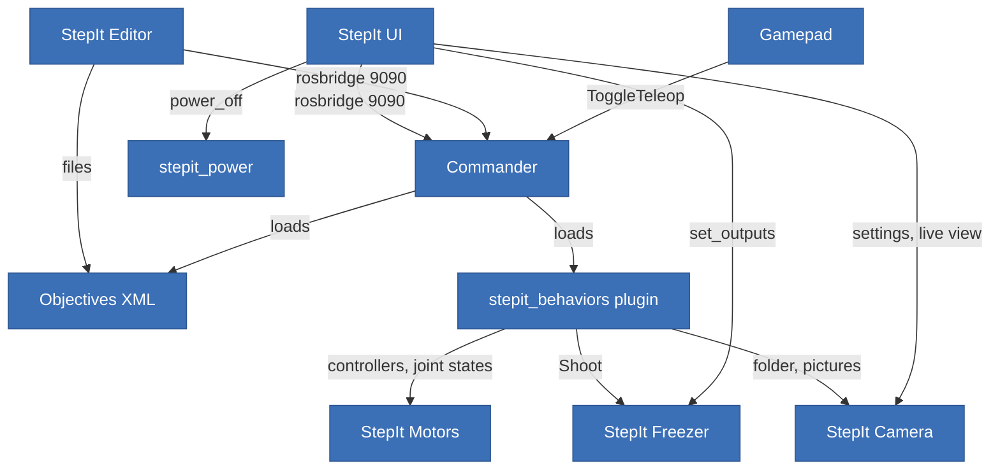

# StepIt Macro Architecture Review

## Table of Contents <!-- omit in toc -->

- [Scope and Method](#scope-and-method)
- [Verdict](#verdict)
- [The System as It Is](#the-system-as-it-is)
- [Structure and Boundaries](#structure-and-boundaries)
- [Interfaces and Abstractions](#interfaces-and-abstractions)
- [Separation of Concerns](#separation-of-concerns)
- [SOLID](#solid)
- [API Design](#api-design)
- [Coupling and Duplication](#coupling-and-duplication)
- [Tests](#tests)
- [Background: the Commander's Parameters and the End of a Run](#background-the-commanders-parameters-and-the-end-of-a-run)
- [Implementation Issues](#implementation-issues)
- [Recommendations](#recommendations)

## Scope and Method

This is the second pass of the review, written on 2026-10-08 at commit `cfe83b7` of StepIt Macro. The first pass was written from a partial reading. This one follows a reading of the whole code base, and corrects the first where the reading changed a judgement.

The modules were read at the commits the repo records:

| Module | Commit |
|---|---|
| StepIt Commander | `e57fdb6` |
| StepIt Camera | `4402400` |
| StepIt Freezer | `2f720fd` |
| StepIt Editor | `03cf499` |
| StepIt Motors | `dfa8afb` |

> [!NOTE]
> In this checkout, four submodules are **behind** the commits the repo records: the commander by 3 commits, the camera by 6, the editor by 3, and the Freezer by 4. The review reads the recorded commits, exported with `git archive`. The build in `install/` comes from the older checkouts: its commander publishes no `~/objective`, which `stepit_power` relies on, and its plugin declares no `state.*` parameter. Run `git submodule update --recursive` and `./docker/dock.sh build` before trusting a run of the rig on this machine.

**What was read.** Every source file of the rig was read. That covers:

- `src/plugins`: the behaviors, the 18 objectives, the fakes and the tests;
- `src/stepit-macro`: bringup, teleop, power and their tests;
- `rig.yaml`, `rig.launch.py`, the `bin` scripts, the `docker` folder, the three CI workflows and `.pre-commit-config.yaml`;
- every source of StepIt UI except `styles.css`.

In the modules, the following were read in full:

- **Commander**: the server, its tests' names, and the parts of BehaviorTree.ROS2 it depends on (`tree_execution_server.cpp`, `bt_utils.cpp`, the generated `bt_executor_parameters.hpp`).
- **Camera**: every C++ source, and the camera's store and picture loading of its test page.
- **Freezer**: the node, the driver, `ShotRunner`, the recipes, the fake driver, the firmware's `main.cpp` and `Sequencer.cpp`, and the store of its board page.
- **Motors**: `StepitHardware`, the default and fake drivers, the fake motor, the firmware's `main.cpp`, `controllers.yaml` and the bringup.
- **Editor**: the server, the ROS client, execution, payload and validator sources.

**Not read line by line, only searched** for topic, service and objective names and for policy:

- the React view components of the editor and of the two test pages, and every `styles.css`;
- the closed-form kinematics of the fake motors;
- the Python plotting scripts and the command-line tools of `stepit_hardware_tests`;
- the libraries `serial` and `framed-serial`;
- the rest of the vendored BehaviorTree.ROS2.

Findings marked *verified* were reproduced. I ran the installed commander and plugin in a throwaway container on ROS domain 88, with no network. Every other finding comes from reading, and names the file it rests on.

## Verdict

**This is a well-architected system, better than most robotics projects of its size, and the whole reading confirms it.** The quality is even across the modules: a careful hand wrote every one of them.

- **Each module is its own product**, with its own repository, CI, fake hardware and test page. The rig composes the modules only through launch arguments and parameter files.
- **The commander is generic.** Its single extension interface, `ProgressReporter`, is a model of how to let a plugin talk to a server without depending on it.
- **Mechanism and policy are separated**: the behaviors are C++, the objectives are XML. The XML is checked in CI by the editor's validator, against node models that `test_nodes_model` keeps equal to the real registration.
- **Each device sits behind an interface, with a fake that the tests use.** The drivers are written for failure:
  - the Freezer's `ShotRunner` takes its clock and its sleep as functions;
  - the firmwares validate every table and every configuration;
  - `StepitHardware` tracks which controller owns each joint, with atomics, and resets commands to NaN when a controller takes a joint;
  - the camera's parameters are read-only where they should be, and its folder parameter refuses `..`.
- **The rules are written down**, with the measurements behind them.

The weak points are, again, **between the modules**, and the second pass adds to them:

1. **The rig's shared state lives in the commander's own parameters.** That collides with how BehaviorTree.ROS2 reloads its plugins. It breaks "a new XML runs on the next goal with no build" (*verified*), and leaks one parameter callback per reload.
2. **A tree that throws leaves `~/objective` naming it.** StepIt UI works around this in two places; `power_off` does not, and refuses to switch the rig off.
3. **Anyone on the network can drive the rig, write files, and switch it off.** New in this pass: the plugin's file-path parameters, `state_file` and `pictures_folder`, can be changed at runtime through rosbridge. The camera, by contrast, makes the same kind of parameter read-only.
4. **The rig's own contracts are untyped, and kept in step by hand across modules.** These are the progress topic, the state parameters, the joint lists, the motor limits and the objective names.
5. **Rules are split across layers.** The proof of a shot is checked in the XML for a stack, but in StepIt UI for a test shot.
6. **Nothing tests the parts together.** No test runs the plugin inside the real commander. No test starts the real launch file. No CI job builds the modules at the commits the rig pins.

None of the findings is a safety issue for the motion. The stops are in the right places:

- the watchdog of `ui_teleop` and of the gamepad;
- the deactivation of the controller when `CommandJointPositions` is halted;
- the zero velocity that `StepitHardware` sends to the joints it releases;
- the last step of every Freezer table, which switches every output off, enforced on both sides of the serial line.

## The System as It Is



Tasks go through the commander; configuration goes straight to the drivers. The sliders of StepIt UI reach the robot through `ui_teleop`, a second `gamepad_teleop`. State shared between pages lives on the rig, in four places:

- the commander's parameters `state.*`;
- latched topics: `/stepit_server/objective`, `/stepit_server/execution`, `/focus_stack/*` and `/freezer/outputs`;
- the files `stack.json` and `all_stacks.json`;
- the camera's folder of pictures.

## Structure and Boundaries

**Verdict: good.** The structure has three tiers, each with a clear rule:

| Tier | What | Rule | Respected? |
|---|---|---|---|
| Modules | Motors, Commander, Camera, Freezer, Editor | Self-contained, know nothing of the rig | Yes. The commander names no robot interface, and the Freezer's docs never mention the rig. The editor knows the commander's `~/execution` contract, as a documented option. |
| Rig plugin | `src/plugins` | Behaviors in C++, objectives in XML, tests apart | Mostly. The XML restates robot interfaces, see [Separation of Concerns](#separation-of-concerns). |
| Rig programs | `src/stepit-macro`, `ui` | One launch file and one config file | Yes. `rig.launch.py` refuses unknown arguments, and each include is a scoped `GroupAction`. |

The workspaces are layered in the direction of the dependencies. CI builds `src/plugins` on the commander alone, and `src/stepit-macro` on ROS alone, which keeps the dependencies honest. **But no CI job builds the `modules` workspace that the rig actually runs**: Motors, Camera, Freezer and the commander together, at the pinned commits, with `check_shared_libraries`. A module bump that breaks the rig's build is found on a developer's machine, not in CI.

**The weakest part** is the state of a stack. It has four owners, in three processes and two languages:

- the YAML state file;
- the commander's parameters `state.*`;
- the `on_set_parameters` callback that writes them back;
- `rig.launch.py`, which removes entries from the file at start.

## Interfaces and Abstractions

| Interface | Where | Judgement |
|---|---|---|
| `stepit_camera::Camera` | [`camera.hpp`](modules/stepit-camera/src/stepit_camera/include/stepit_camera/camera.hpp) | Good. It is pure virtual and documented for threading and errors (`CameraError::isFatal`). `CameraDriver` owns the single thread that libgphoto2 needs, and `run()` marshals calls onto it with a `packaged_task`. One flaw, finding 5: a call that times out stays queued. |
| `freezer_driver::Driver` | [`driver.hpp`](modules/stepit-freezer/src/freezer_driver/include/freezer_driver/driver.hpp) | Very good. One request gives one response. `SynchronizedDriver` adds locking as a decorator. `ShotRunner` knows nothing of ROS, and takes its clock and its sleep, so a test runs a shot instantly on the fake's clock. |
| `stepit_driver::Driver` | [`driver.hpp`](modules/stepit-motors/src/stepit_driver/include/stepit_driver/driver.hpp) | Good layering under `StepitHardware`. Its methods that write to the serial port are `const`, which forces `FakeDriver` to make its motors `mutable`. Three abstract factories inject one fake. Less defensive than the Freezer's driver, from the same template: see finding 10. |
| `stepit_server::ProgressReporter` | [`progress.hpp`](modules/stepit-commander/src/stepit_server/include/stepit_server/progress.hpp) | Excellent. It is header-only, optional (found with `dynamic_cast`), and a plugin needs nothing else of the server. |
| `stepit_behaviors::RosActionNode` | [`ros_action_node.hpp`](src/plugins/stepit_behaviors/include/stepit_behaviors/ros_action_node.hpp) | Good. One narrow fix to a third-party base class, in one place, explained. |
| `RunCommand` of `stepit_power` | [`power_off.hpp`](src/stepit-macro/stepit_power/include/stepit_power/power_off.hpp) | Good. A `std::function` seam, so no test can switch the computer off. |
| `Rule` of the editor's validation | [`validate.ts`](modules/stepit-editor/src/shared/validate.ts) | Good. Each check is an object with hooks per level, and adding one means adding it to `RULES`. |
| The rig's topics and parameters | `/focus_stack/*`, `state.*`, `/stepit_server/objective` | Weak. Nothing defines them: a C++ publisher and a TypeScript reader agree by convention. |

The behaviors have **no shared abstraction for "a node that listens to a topic"**. `GetJointPositions`, `CommandJointPositions` and `ExpectPicture` each build the same private callback group, single-threaded executor and subscription ([`get_joint_positions.cpp:70`](src/plugins/stepit_behaviors/src/get_joint_positions.cpp), [`command_joint_positions.cpp:95`](src/plugins/stepit_behaviors/src/command_joint_positions.cpp), [`expect_picture.cpp:57`](src/plugins/stepit_behaviors/src/expect_picture.cpp)).

**The error policy of the behaviors is consistent, but costly.** A misconfigured or badly typed port **throws** `BT::RuntimeError`; a failure at runtime returns `FAILURE`. The tests pin this down, e.g. `AWrongNumberOfOffsetsAbortsTheObjective` expects a throw. A throw is how a bad payload aborts a goal with a readable message, but it bypasses the commander's end-of-run hooks: see finding 2.

## Separation of Concerns

**Mostly respected.** Each place where knowledge sits in the wrong part:

1. **Robot interfaces in the objectives.** `CLAUDE.md` says that `stepit_behaviors` is "the **only** place the objectives name robot topics, actions and services". Yet the XML repeats `topic_name="/joint_states"` 10 times, `"/position_controller/commands"` 11 times, and the services of the controller manager 3 times. Each of these values equals the port's default. The joint list `joint1;…;joint5` appears 25 times in 8 files, 13 of them in [`focus_stack.xml`](src/plugins/stepit_objectives/objectives/focus_stack.xml), and must match `controllers.yaml` of StepIt Motors.
2. **The commander's parameters used as the rig's key-value store.** Read-only configuration measured by hand belongs there: `overshoot.*`, `mm_per_turn.*` and `deg_per_turn.*`. Mutable state shared between pages does not: `state.*` lives on a node that belongs to a third-party framework, which reacts to parameter changes (finding 1).
3. **The proof of a shot is in two layers.** `FocusStack` wraps `Shoot` in `ExpectPicture`, so the picture proves the shot. `TakeShot` does not ([`take_shot.xml`](src/plugins/stepit_objectives/objectives/take_shot.xml)), and StepIt UI re-implements the check with a timeout of its own ([`shot/store.ts`](ui/src/shot/store.ts), `takeShot`, `PICTURE_TIMEOUT`). A test shot from any other client is not checked.
4. **Objective names in the clients.** Several clients name objectives directly:
   - `power_off` refuses during `[FocusStack, Stack]`, in [`rig.yaml:195`](src/stepit-macro/stepit_bringup/config/rig.yaml);
   - StepIt UI repeats that list as `STACKS` in [`power.ts`](ui/src/power/power.ts);
   - StepIt UI disables Manual drive by matching `ActivateTeleop` and `ActivateController` ([`Toolbar.tsx:100`](ui/src/components/Toolbar.tsx)), and shows progress only while the objective is `'FocusStack'` ([`StackBar.tsx`](ui/src/components/StackBar.tsx)).

   The clients know the names of the policy, not its meaning, e.g. "an objective that must not be interrupted".
5. **StepIt UI's stores talk to ROS directly**: `/freezer/set_outputs`, `/controller_manager/list_controllers`, and `/stepit_server` with its parameter services. The UI's own review of 2026-10-05 reported this, and it still holds.
6. **StackDone reaches into the camera's disk.** It rebuilds the camera's folder path itself, from `pictures_folder`, the folder and `angleFolder(index, degrees)`, then lists the camera's files ([`stack_done.cpp`](src/plugins/stepit_behaviors/src/stack_done.cpp)). The YAML anchor `&pictures`, and `test_the_commander_writes_into_the_cameras_pictures_folder`, keep the two folders equal. It is still an implicit contract with the camera's layout of files.
7. **The limits of the motors are known twice.** StepIt Motors makes the controller "the authority on the limits": `StepitHardware` reads them from the firmware at configure time. The plugin hard-codes them instead, in `kMotorMaxVelocity` and `kMotorMaxAcceleration` ([`trapezoidal_trajectory.hpp`](src/plugins/stepit_behaviors/include/stepit_behaviors/trapezoidal_trajectory.hpp)), and so does `ui_teleop`'s `scale` in `rig.yaml`.

## SOLID

| Principle | Verdict | Evidence |
|---|---|---|
| **Single responsibility** | Good in the rig and in most classes. Strained in two places. | The behaviors are small and do one thing each. `rig.launch.py` is a set of small functions, the Freezer's recipes are pure functions, and `ShotRunner` only runs a shot. Against it: [`freezer_node.cpp`](modules/stepit-freezer/src/freezer_node/src/freezer_node.cpp), 823 lines. It holds the schema of the sequences' parameters, the connection and the reconnect thread, the action server, the watching of the trigger with its reconciliation of shot ids, and the outputs, behind about 15 synchronisation fields. Also [`parameters.cpp`](src/plugins/stepit_behaviors/src/parameters.cpp), which mixes reading the configuration, persisting the state, and the parameter callback that writes it back. |
| **Open/closed** | Good. | A new objective is an XML file, with no build. A new behavior is one line in `registerNodes`. A new module is an entry in `MODULES` and a section in `rig.yaml`. A new camera setting is a row of `SETTINGS`, a new Freezer recipe a struct with `build()`, and a new editor check a `Rule`. The commander gained progress reporting without knowing any rig node. |
| **Liskov substitution** | Good, where it applies: the device interfaces. | The fakes are substitutable enough that every test runs on them. They mirror the firmware's refusals: `FakeDriver::configure` validates "mirroring the firmware", and the Freezer's fake reproduces `Busy`, `NoTable` and a reset during a shot. One gap: the `const` methods of `stepit_driver::Driver` promise no side effect, and every implementation has one. |
| **Interface segregation** | Good. | `ProgressReporter` has one method, and the behaviors take only the ports they use. `Camera` is wide (preview, settings, capture, files), but it is one device used by one driver. One API forces too much on its clients: `SetOutputs` of the Freezer sets all 16 lines, so a client that wants to switch the lights must read and write back the other 14 (finding 11). |
| **Dependency inversion** | Good in C++. Weak at the system level and in the UI stores. | `FreezerNode(options, driver)` and `StepitHardware(DriverFactory)` take their abstraction. `CameraNode` picks its implementation inside ([`camera_node.cpp`](modules/stepit-camera/src/stepit_camera/src/camera_node.cpp), the `fake_camera` parameter). At the system level, every client depends on concrete names: topics, parameters and objectives. StepIt UI's stores reach the singleton `ros()` directly, which is why none of them is tested. |

## API Design

**The ROS interfaces of the modules: good.** They are typed and documented in their `.msg`, `.srv` and `.action` files. A few examples:

- [`Picture.msg`](modules/stepit-camera/src/stepit_camera_msgs/msg/Picture.msg) sends a path, not the bytes, and says why.
- [`Shoot.action`](modules/stepit-freezer/src/freezer_msgs/action/Shoot.action) has a result with timing, and feedback with states.
- The serial protocols carry a version, which both drivers check at connection time, with a message that says which firmware to flash.
- Latched QoS is used wherever a late subscriber must catch up. The Freezer keeps a depth of 1 on purpose, because rosbridge hands a new client the *oldest* kept message.

**The commander's API is generic by design, and stringly typed as a consequence.**

- The `payload` is YAML in a string, and errors surface only when a port is read, as an exception.
- The feedback and `~/execution` are JSON in a string, documented in comments on both sides: the commander's [`execution_status.hpp`](modules/stepit-commander/src/stepit_server/include/stepit_server/execution_status.hpp) and the editor's [`execution.ts`](modules/stepit-editor/src/client/execution.ts).
- The editor even parses the text of BehaviorTree.CPP's exceptions, `/Exception in node '[^']*::(\d+)'/` (`failedNodeUid`), to find the node that failed.
- Each change publishes a whole snapshot on `~/execution`, including the XML of the tree, at up to 20 Hz (`onLoopFeedback`): see finding 12.

**The rig's own contracts are the weakest API in the system:**

| Contract | Type | Problem |
|---|---|---|
| `/focus_stack/progress` | `std_msgs/Int32MultiArray`, `[taken, total]` | The meaning is positional, and each `ReportProgress` node has its own publisher (finding 7). |
| `/focus_stack/stack_done`, `/focus_stack/all_stacks_done` | `std_msgs/String` | A relative folder, with no type of its own. |
| `state.*` parameters of `/stepit_server` | `double[]` | Named by convention. The UI must call `list_parameters` first, because `get_parameters` answers nothing at all for an unknown name ([`stack/store.ts`](ui/src/stack/store.ts), `readStack`). |
| `state_file`, `pictures_folder` | writable `string` parameters | Declared without `read_only` ([`parameters.cpp`](src/plugins/stepit_behaviors/src/parameters.cpp), `declareParameters`): any client can redirect where the rig writes (finding 3). The camera declares its `download_directory` read-only. |
| `stack.json`, `all_stacks.json` | JSON written by hand ([`stack_done.cpp`](src/plugins/stepit_behaviors/src/stack_done.cpp), `jsonString`) | No schema, and an escaping function copied from the camera's [`web_server.cpp`](modules/stepit-camera/src/stepit_camera/src/web_server.cpp), while `nlohmann::json` is at hand. |
| Payload of `MoveRailToMark` | `{mark: near}` | `mark` is passed to `LoadValues` as a key. `{mark: shots}` therefore moves the rail to "the mark" 10 radians, the number of shots. There is no allow-list. |

**The HTTP APIs are good.**

- The editor's [`api.ts`](modules/stepit-editor/src/server/api.ts) makes writes conditional (`If-Match`, `If-None-Match`, `412`) and atomic, answers `409` when the folder changed, refuses paths outside the folder with `safePath`, and serves an OpenAPI description.
- The camera's web server serves ranges, lists folders through `folderUnder` (which checks against the canonical root), and describes itself in OpenAPI.

Neither has authorisation: see finding 3.

**Naming across modules is inconsistent.** Methods are `snake_case` in the drivers of the motors and of the Freezer, and `camelCase` in the camera, the commander and the plugin. `StepitHardware` lives in the namespace `stepit_driver`. The two kinematics of the fake motors order their arguments differently: `(v_max, a, v0, x0, …)` in one, `(v_max, a, x0, v0, …)` in the other, and the documentation of `velocity_kinematics::position` lists them in a third order.

## Coupling and Duplication

**Rules kept in step by hand.** These are the places where a change in one spot silently needs a change in another:

| What | Where | Weight |
|---|---|---|
| The joints of the robot and their order | 25 times in the objectives; `ui_teleop.joints` in [`rig.yaml`](src/stepit-macro/stepit_bringup/config/rig.yaml); [`logitech_dual_action.yaml`](src/stepit-macro/stepit_teleop/config/logitech_dual_action.yaml); the default of `gamepad_teleop`; `controllers.yaml` of StepIt Motors | High. Four places in two repositories. |
| The motor limits | the plugin's `kMotorMaxVelocity`; `scale: 18.8496` in `rig.yaml`; the firmware's `MAX_SPEED`; the xacro | Medium. The firmware reports them at connection time, and only `StepitHardware` asks. |
| Objective names in the clients | `refuse_during` in `rig.yaml` and in `power_off.yaml`; StepIt UI's `STACKS`, `Toolbar.tsx`, `StackBar.tsx`, `motion/store.ts`, `stack/store.ts`, `shot/store.ts` | Medium. |
| The node name `/stepit_server` and the `state.*` keys | [`stack/store.ts:22`](ui/src/stack/store.ts), `STACK_PARAMETERS`, `parameters.cpp` | Medium. |
| The overshoots, derived from the ratios | `overshoot.*` in [`rig.yaml:88`](src/stepit-macro/stepit_bringup/config/rig.yaml) | Low. They are computed by hand, but `test_the_stage_overshoots_by_a_degree_and_the_rail_by_a_millimetre` fails if a ratio changes alone. *Corrected from the first pass, which missed the test.* |
| The serial protocols | command ids, frame layouts and versions in the firmware's `main.cpp` and in each `default_driver.cpp` | Low. The protocol version check catches a mismatch at connection time. |
| The pictures folder | `pictures_folder` and the camera's `download_directory` | Low. Tied by the anchor `&pictures`, and tested. |

**Copied code:**

| What | Where | Weight |
|---|---|---|
| The rosbridge client | Four clients: StepIt UI, the camera's test page, the Freezer's board page (each with a different API, e.g. `sendActionGoal` against `sendGoal`), and the editor, which opens a raw WebSocket per call ([`ros.ts`](modules/stepit-editor/src/client/ros.ts)) | High. Fixes do not travel: the camera's test page, at its recorded commit, still reads 64 KB from the start of every picture ([`picture.ts`](modules/stepit-camera/web/src/client/camera/picture.ts)), the case cpp-httplib 0.14 answers wrongly, which StepIt UI fixed with a `HEAD` request first. |
| The firmware's serial and framing layer | `Buffer.h`, `DataBuffer.{h,cpp}`, `SerialPort.{h,cpp}`, `CrcUtils.{h,cpp}`: 7 files, **identical** in both MCU projects | Medium. They are identical today, but nothing keeps them so. The host side is shared through the `framed-serial` submodule, with a check in `bin/modules/build.sh`. |
| The host-side response classes | `msgs/response.hpp`, `info_response.hpp` and `status_response.hpp` of both drivers | Low. They differ by 60 or more lines each. |
| A reconnect loop | `CameraDriver::loop`, `FreezerNode::reconnect_loop` | Low. They live in independent modules. |
| A private executor for a subscription | three behaviors | Medium. The threading is subtle. |
| Looking up a joint in a `JointState` | `GetJointPositions::read`, `CommandJointPositions::positionsOf` and `::arrived` | Low. |
| Writing to a temporary file, then renaming | [`parameters.cpp`](src/plugins/stepit_behaviors/src/parameters.cpp), [`stack_done.cpp`](src/plugins/stepit_behaviors/src/stack_done.cpp), [`rig.launch.py`](src/stepit-macro/stepit_bringup/launch/rig.launch.py), the editor's `writeAtomically` | Low. The camera's `savePicture`, which most needs it, does not do it (finding 14). |
| `jsonString` | the camera's `web_server.cpp` and the plugin's `stack_done.cpp`, identical | Low. |
| An objective is the `main_tree_to_execute` of its file | `TreeLoader::mainTree` in C++ (a regex) and the editor in TypeScript | Low, and documented. |

## Tests

**Verdict: well tested per unit and per objective, with fakes that honour the real contracts. Not tested as a whole.**

| Part | Tests | Strength |
|---|---|---|
| Commander | Payload, tree loader, execution status, and preemption through the real server, including the published objective and runs. | Good. |
| Behaviors and objectives | 22 test files. The objectives run against `FakeRobot`, `FakeControllerManager`, `FakeFreezer` and `FakeCamera`, with the real names, on ROS domain 77. | Very good. `test_focus_stack_objective` checks every command sent, including the approaches against backlash, the folders, the progress, the files and the announcements. One limit: `FakeRobot` succeeds every trajectory at once without moving, so arrival through the trajectory controller is not tested. |
| `stepit_teleop`, `stepit_power` | Against a fake commander: the watchdog, the stop button, refusal during a stack, the system's refusal. | Good. |
| `rig.yaml`, `rig.launch.py` | `test_rig_config.py`: the structure, `clear_state`, refusal of unknown arguments, and the relations between values. | Good for the logic. Several tests pin measured values, e.g. `test_the_stage_turns_on_an_80_to_1_gear`: these are change detectors. |
| StepIt UI | The transport, against `FakeSocket`; pure functions; the commander and power interfaces. | Good below the stores. **No store is tested**: `settings.ts:76` still calls `window.matchMedia` at import time. |
| Camera | Driver, node, fake, settings and web server: 56 tests. | Good. Not tested: a `run()` that times out (finding 5). |
| Freezer | Driver, `ShotRunner` on the fake's clock, recipes, sequence, and the node. | Very good. |
| Motors | `test_stepit_hardware.cpp` alone has 1,374 lines, plus driver and fake motor tests: 49 tests. | Very good. Not tested: malformed responses to the default driver (finding 10). |
| Editor | API, store, actions, validation, execution and the ROS client, including a test against the real native validator. | Good. |

**What is not tested:**

1. **The plugin loaded by the real commander.** Every objective test calls `registerNodes` on a fresh factory ([`objective.hpp`](src/plugins/stepit_tests/tests/objective.hpp), `runObjective`). Re-registration, the parameter callbacks and the reloading of trees are never exercised together. Findings 1 and 2 sit there.
2. **The rig's launch file, started.** Only its functions are tested.
3. **The modules at the commits the rig pins.** `bin/modules/build.sh` builds them with `-DBUILD_TESTING=OFF` and skips their test packages. CI builds only the commander and two message packages. No job runs `check_shared_libraries`. A module's own CI runs on its own `main`.
4. **A late subscriber to the progress topic**: the test subscribes before the stack starts.

## Background: the Commander's Parameters and the End of a Run

The two most serious findings, 1 and 2, come from how the rig uses two mechanisms of the commander. This section explains both, for a reader who has not looked inside the commander or BehaviorTree.ROS2.

### What "the commander's parameters" are

Every ROS 2 node has **parameters**: named settings held in the memory of its process. They get their first values from YAML files when the node starts. Any client can read or change them while the node runs, through services every node has (`<node>/get_parameters`, `<node>/set_parameters`, `<node>/list_parameters`), and every change is announced on `/parameter_events`. In the container:

```bash
ros2 param list /stepit_server
ros2 param get /stepit_server state.shots
```

The commander is the node `/stepit_server`. When `rig.launch.py` starts it, the node loads two YAML files, one after the other:

1. **The commander's defaults**, [`stepit_server.yaml`](modules/stepit-commander/src/stepit_server/config/stepit_server.yaml): `action_name`, `tick_frequency`, `ros_plugins_timeout`, `preempt`.
2. **The rig's section** `stepit_server:` of [`rig.yaml`](src/stepit-macro/stepit_bringup/config/rig.yaml): `plugins`, `behavior_trees`, `overshoot.*`, `mm_per_turn.*`, `deg_per_turn.*`, `focus_stack.*`, `state_file`, `pictures_folder`.

They all end up on the same node, declared by three different pieces of code:

| Declared by | Parameters | Changed while the rig runs? |
|---|---|---|
| BehaviorTree.ROS2 | `action_name`, `tick_frequency`, `plugins`, `behavior_trees`, … | No |
| The commander, [`stepit_server.cpp`](modules/stepit-commander/src/stepit_server/src/stepit_server.cpp) | `preempt` | No |
| The rig's plugin, [`parameters.cpp`](src/plugins/stepit_behaviors/src/parameters.cpp) `declareParameters` | `overshoot.*`, `mm_per_turn.*`, `deg_per_turn.*`, `focus_stack.*`, `state_file`, `pictures_folder` | No |
| The rig's plugin, from the state file | `state.near`, `state.far`, `state.shots`, `state.angles`, `state.turn` | **Yes, many times a session** |

The plugin runs inside the commander's process, so it attaches its parameters to the commander's node. The `state.*` ones mirror the state file, `~/ws/state/stack.yaml`, in both directions:

- `MarkNear` and `MarkFar`, through `SaveValues` and `publishState`, set `state.near` and `state.far`.
- StepIt UI sets `state.shots`, `state.angles` and `state.turn` by calling `/stepit_server/set_parameters` ([`stack/store.ts`](ui/src/stack/store.ts), `setPlan`).
- A callback that the plugin adds to the node writes every change of a `state.*` parameter back into the file.

The configuration, the first three rows, is fine on the commander's node: it is read at start and never changes. The trouble is only `state.*`, mutable state shared between pages, kept on a node that belongs to a framework that **reacts when its parameters change**.

### How BehaviorTree.ROS2 reacts to a parameter change

When the commander starts, BehaviorTree.ROS2 runs a step it calls **registration** (`executeRegistration`):

1. it clears every behavior tree it knows;
2. it loads the plugins, the `.so` files of the folders in `plugins`: here `libstepit_behaviors_plugin.so`, whose entry point calls `stepit_behaviors::registerNodes`;
3. it loads the XML files of the **installed** folders in `behavior_trees`, e.g. `install/plugins/stepit_objectives/share/stepit_objectives/objectives`.

Before each goal, it runs the registration again **if its parameters changed since the last one** ([`tree_execution_server.cpp:184`](modules/stepit-commander/modules/BehaviorTree.ROS2/behaviortree_ros2/src/tree_execution_server.cpp), `is_old`). It decides that with a listener generated by `generate_parameter_library`, which stamps the parameters as changed on **any** parameter set on the node (`bt_executor_parameters.hpp:231`). It cannot tell its own parameters from the ones the plugin added: a change to `state.shots` looks to it like a reconfiguration of the server.

The commander adds a mechanism of its own on top: its **`TreeLoader`** ([`tree_loader.cpp`](modules/stepit-commander/src/stepit_server/src/tree_loader.cpp)), called before each goal from `onGoalReceived`. It re-reads the XML files when any changed, and also reads the **source** folder that the installed links point to. That is what lets a new objective, saved from the editor into `src/plugins/stepit_objectives/objectives`, run with no build. BehaviorTree.ROS2's registration knows nothing of it, and reads only the installed folder.

Finding 1 is what happens when the two meet.

### How a run ends

The commander publishes the name of the running objective on the latched topic `/stepit_server/objective`, and `""` when it ends, from its hook `onTreeExecutionCompleted`. Two clients rely on it: StepIt UI, to show "Running FocusStack" and turn Stop red, and `power_off`, to refuse to switch off during a stack.

BehaviorTree.ROS2 ends a run in one of three ways ([`tree_execution_server.cpp`](modules/stepit-commander/modules/BehaviorTree.ROS2/behaviortree_ros2/src/tree_execution_server.cpp), `execute`):

| How the run ends | Tree halted? | `onTreeExecutionCompleted` called? | `/stepit_server/objective` afterwards |
|---|---|---|---|
| The tree returns SUCCESS or FAILURE | Not needed | Yes | `""` |
| Cancelled, or preempted by another goal | Yes | Yes | `""`, or the next objective |
| A node **throws** an exception | **No** | **No** | **Still the objective's name** |

The behaviors throw on purpose for a bad payload or a misconfigured port: it is how a goal is aborted with a readable message, and tests such as `AWrongNumberOfOffsetsAbortsTheObjective` expect it. So the third row is easy to reach, and finding 2 is what happens there.

## Implementation Issues

These are ordered from the most to the least serious.

1. **Every parameter change on the commander re-runs the plugin's registration, which fails and drops objectives added since the last build** (*verified*). See [Background](#background-the-commanders-parameters-and-the-end-of-a-run) for the two mechanisms involved.

   BehaviorTree.ROS2 calls `executeRegistration()` before a goal whenever its parameters are "old" ([`tree_execution_server.cpp:184`](modules/stepit-commander/modules/BehaviorTree.ROS2/behaviortree_ros2/src/tree_execution_server.cpp)). The listener generated by `generate_parameter_library` stamps them as old on *any* parameter set on the node (`bt_executor_parameters.hpp:231`). The rig sets the commander's parameters all the time: `SaveValues` on every `MarkNear` or `MarkFar`, and every page that changes the shots, angles or turn. The next goal then does two things:

   - **It clears every tree and reloads only the installed folder**, without the commander's `TreeLoader`. An objective saved from the editor since the last build disappears. The goal is accepted, then aborted with `Can't find a tree with name`, and later goals are rejected.
   - **It loads the plugin again.** `registerNodes` first calls `declareParameters`, which adds one more `on_set_parameters` callback to a `static` vector ([`parameters.cpp:119`](src/plugins/stepit_behaviors/src/parameters.cpp)) and re-reads the state file. It then throws on the first `registerNodeType`, logged as `Failed to load ROS Plugin`. The callbacks accumulate without bound, and each `state.*` change then writes the file once per callback.

   Reproduced with the installed commander and plugin:

   ```
   ProbeA                      SUCCEEDED
   ProbeB (new, no build)      SUCCEEDED   "Reloaded the behavior trees, changed: ProbeB.xml"
   ros2 param set … preempt true
   ProbeB                      ABORTED     "Failed to load ROS Plugin" / "Can't find a tree with name: ProbeB"
   ProbeB                      rejected    "no behavior tree has this ID"
   ```

   In the rig's own words, the sequence is:

   1. You save a new objective, `MyMove`, from the editor. It is only in the source folder: no build has made its installed link.
   2. You run `MyMove`. `TreeLoader` finds it through the source folder, and it runs.
   3. You mark the near end with **Mark** in StepIt UI, or change Shots. That sets a `state.*` parameter on the commander's node.
   4. You run `MyMove` again. BehaviorTree.ROS2 sees changed parameters and redoes its registration: it clears every tree, reloads only the installed folder, and `MyMove` is gone. `TreeLoader` still believes it is loaded, because the file has not changed, so the goal is accepted and then aborted. Later goals for it are rejected, until a build or an edit of the file.

   This is not a safety issue. It is a correctness issue in the workflow the rig is built around. The cause is architectural: mutable shared state on a node that belongs to a framework that reacts to its changes. The fix, recommendation 1, moves only `state.*` and the state file to a node of their own, so the commander's node changes only when someone actually reconfigures it.

2. **A tree that throws leaves `~/objective` naming it, and is not halted.** See [How a run ends](#how-a-run-ends). BehaviorTree.ROS2's `catch` ([`tree_execution_server.cpp:263`](modules/stepit-commander/modules/BehaviorTree.ROS2/behaviortree_ros2/src/tree_execution_server.cpp)) aborts the goal without `haltTree()` or `onTreeExecutionCompleted`, so the commander's `publishObjective("")` never runs. The behaviors throw for any bad port, by design, and the editor's Run dialog sends any payload, e.g. `FocusStack` without `shots`. After that:

   - `power_off` reads `/stepit_server/objective` and **refuses to switch the rig off** until another goal runs ([`power_off.cpp`](src/stepit-macro/stepit_power/src/power_off.cpp), `onPowerOff`).
   - StepIt UI copes in **two** places, whose comments describe the workaround: `objectiveRuns` in [`commander.ts`](ui/src/commander/commander.ts), and [`TaskStatus.tsx`](ui/src/components/TaskStatus.tsx).

   A concrete case:

   1. In the editor, you run `FocusStack` and forget `shots`.
   2. A node throws on the missing value, and the goal is aborted. Nothing moves.
   3. `/stepit_server/objective` still says `FocusStack`, and keeps saying it until another objective runs.
   4. You hold the power button in StepIt UI. `power_off` answers "FocusStack is running: stop it first", and Stop changes nothing, because no goal is active. The rig refuses to switch off for no visible reason.

   The rule "is anything running?" has drifted into three places, the commander, StepIt UI and `power_off`, each with its own answer. The fix belongs in the commander, the one place that owns what runs (recommendation 3): catch the exception there, so the end of a run is always published. Then delete the UI's two workarounds.

   The missing `haltTree()` does not matter for today's objectives, which are sequences.

3. **Anyone on the network can drive the rig, write files where the rig writes, and switch it off.** The README says this of rosbridge, port 9090. The full surface is wider:

   - **Through rosbridge**, any client can set `state_file` or `pictures_folder` on the commander. These are declared writable, unlike the camera's `download_directory`, which is read-only. The next `SaveValues` or `StackDone` then writes YAML or JSON wherever the container's user may write, which includes the whole repo at `~/ws`.
   - **Also through rosbridge**: `/power_off/power_off` switches the computer off, and `/freezer/set_outputs` latches any of the 16 lines, a camera's shutter included, until the next command.
   - **Through the editor**, port 8080: `PUT /api/root` opens any folder under the server's home (`BEHAVIORS_BASE` defaults to `homedir()`), and `PUT /api/files/…` writes `.xml` files there.
   - **Through BehaviorTree.ROS2's Groot2 publisher**, which opens a port of its own for each goal (1667 by default).

   DDS itself is confined to loopback by [`cyclonedds.xml`](docker/cyclonedds.xml), which is good. The servers listen on every interface, and the container is privileged with passwordless `sudo`. This is acceptable on a workshop's own network, as the README says, but the README names only rosbridge.

4. **The state file has no single owner and no lock.** `SaveValues`, on the tree's thread, and the parameter callback, on an executor thread, both read, modify and write the same file, through the same `stack.yaml.tmp` ([`parameters.cpp`](src/plugins/stepit_behaviors/src/parameters.cpp), `writeStateValues`). A mark saved while a page sets the shots can lose one of the two updates. `SaveValues` also writes twice: directly, then again through `publishState` and the callback. And a `SaveValues` given another `file` still mirrors its key into `state_file`.

5. **A camera call that times out still runs later.** `CameraDriver::run()` throws `The camera did not answer in time` after 5 s, but its task stays queued and runs when the driver gets to it ([`camera_driver.hpp`](modules/stepit-camera/src/stepit_camera/include/stepit_camera/camera_driver.hpp), `run`). A setting changed while a large RAW downloads is therefore refused to the caller, and the parameter keeps its old value, but the camera applies the new one afterwards: the node and the camera then disagree. `onSetParameters` also blocks the executor's thread for those 5 s.

6. **The pictures go astray after a failure, and a test shot is not checked.** `FocusStack` resets the camera's folder only at its very end. A stack that fails or is stopped midway leaves the camera writing into its last angle's folder. The next picture that no objective set a folder for then lands among the stack's pictures: the Freezer's remote trigger on IN1, or a press of the camera's own shutter. `TakeShot` neither resets the folder after the shot nor waits for the picture (see [Separation of Concerns](#separation-of-concerns), item 3).

7. **Each `ReportProgress` node has a publisher of its own.** [`report_progress.cpp:56`](src/plugins/stepit_behaviors/src/report_progress.cpp) creates one on the first tick, and `FocusStack` has two such nodes. A page that opens during a stack receives the latched sample of each writer, `[0, total]` and `[k, total]`, in no defined order, and the UI subscribes with `queue_length: 1`. It may show 0 until the next picture. *Downgraded from the first pass*: StackBar shows the progress only while `FocusStack` runs, so the stale count lasts one shot at most. `StackDone` already solved this problem, with `latchedPublisher`.

8. **The robot's shape is duplicated in the XML.** A sixth joint, or a renamed controller, means editing eight XML files, `rig.yaml`, the gamepad's config and default, and StepIt Motors.

9. **`FreezerNode` carries too many responsibilities** for its locking to be reviewed easily: three threads (the executor, which also runs the watch timer, the shot's worker, and the reconnector) and flags shared between them. Its tests are thorough (538 lines). The risk is in future changes, e.g. a race between `watch()` disconnecting and the reconnector connecting, which today heals itself after three failed polls.

10. **StepIt Motors' default driver trusts the length of every response.** `configure`, `set_position` and `set_velocity` read `out[0]` without checking that `out` is empty. `get_status` reads 13 bytes per motor while `i < out.size()`, without checking that 13 remain ([`default_driver.cpp`](modules/stepit-motors/src/stepit_driver/src/default_driver.cpp)). The Freezer's driver, from the same template, checks every length (`check_length`). The CRC of the framing makes a short frame unlikely; a firmware of another version is caught by the handshake.

11. **`SetOutputs` sets all 16 lines.** A client that wants to switch one jack must know and write back the other 15 bits: StepIt UI's `withLights(get().outputs ?? 0, on)` in [`lights.ts`](ui/src/freezer/lights.ts). Two clients switching different jacks at once can undo each other. A set-and-clear mask would make the operation safe.

12. **`~/execution` republishes the whole run on every change.** `snapshot()` includes the XML of the expanded tree and every status, and `onLoopFeedback` publishes it whenever feedback is due, up to 20 times a second. For `FocusStack` that is tens of kilobytes per message, through rosbridge, to every open editor, from a Raspberry Pi.

13. **The firmware's serial layer is copied across two repositories**, identically today; see [Coupling and Duplication](#coupling-and-duplication).

14. **Smaller issues:**
    - Every workspace, the Pi's included, is built with `-DCMAKE_BUILD_TYPE=Debug` (`bin/*/build.sh`).
    - The camera's `savePicture` writes the final file in place, so its web server's listing can show a picture half written. The listing hides only dotfiles, "a file still being written under a temporary name".
    - `StepitHardware::on_init` swallows its exception without a log.
    - Documentation has drifted:
      - `logitech_dual_action.yaml` refers to `docs/Teleop.md`, which is `docs/Gamepad.md`;
      - the commander's `TODO.md` still says it has no CI;
      - the comment in [`register_nodes.cpp:83`](src/plugins/stepit_behaviors/src/register_nodes.cpp) says registration is repeated "for every goal": it is repeated after every parameter change (finding 1).

## Recommendations

These are ordered by value against effort, and each fits in one pull request.

1. **Move the stack's state off the commander's node** (fixes 1 and 4). Add a small node in `src/stepit-macro`, e.g. `stack_state`, which owns the state file. It would load the file, apply `state_cleared_on_start` (taking it out of the launch file), expose `state.*` as its own parameters, and write them under one mutex. `SaveValues` and `LoadValues` would call it, and StepIt UI would point `COMMANDER` at it. Also make `declareParameters` idempotent, so that a reload can never add a callback.
   - *Trade-off:* one more node, and `SaveValues` becomes an asynchronous call.
2. **Test the plugin inside the real commander** (guards 1 and 2). Start a `CommanderServer` with the rig's parameters, as `test_preemption` does, then:
   - run an objective;
   - set a parameter;
   - add an XML file and run it;
   - send a payload that makes a node throw, and check that `~/objective` ends empty.
3. **End every run in the commander** (fixes 2). Install, in `onTreeCreated`, a root decorator that catches an exception, halts the tree and returns `FAILURE`, so that `onTreeExecutionCompleted` always runs. Then remove the workarounds from `objectiveRuns` and `TaskStatus`.
4. **Close the cheap network gaps** (fixes 3).
   - Declare `state_file` and `pictures_folder` `read_only`, as the camera does.
   - Set `BEHAVIORS_BASE` to the objectives folder in `rig.launch.py`.
   - Name the editor, the power button, `set_outputs` and Groot2 in the README's warning.
   - Later, if the rig ever leaves the workshop's network, bind the servers to an interface of choice.
5. **Drop a camera task that timed out** (fixes 5). Mark the task as abandoned when `run()` gives up, and skip it in `runTasks()`. Add a test with a fake whose call outlasts the timeout.
6. **Make the shot's proof and the folder the objectives' business** (fixes 6). Wrap `Shoot` in `ExpectPicture` in `TakeShot`, and let StepIt UI rely on the result. Reset the camera's folder on every exit of `FocusStack`, e.g. with a `Fallback` that resets it and then fails.
7. **Create the progress publisher once, at registration**, as `StackDone` does (fixes 7). Introduce `stepit_macro_msgs` with `StackProgress` and `StackDone`, write the JSON files with `nlohmann::json`, and check `mark` in `MoveRailToMark`.
8. **Take the robot out of the XML** (fixes 8). First, delete the 24 `topic_name` and `service_name` attributes that equal their default. Then give the joint list one home, e.g. `robot.joints` in the commander's section of `rig.yaml`, used as the default of the behaviors' ports and read by both teleops.
9. **Derive what can be derived.** Read the motor limits from the controller instead of `kMotorMaxVelocity`. Replace objective names in the clients by a property: e.g. an `uninterruptible` flag in an objective's `TreeNodesModel`, which the commander publishes with `~/objective`.
10. **Build and test the rig as it runs, in CI** (closes the test gaps).
    - Add a job that runs `bin/modules/build.sh`, with `check_shared_libraries`, and the modules' tests at the pinned commits.
    - Add a launch smoke test that starts `rig.launch.py` on fake hardware and waits for the commander's action.
    - Have `dock.sh build` warn when `git submodule status` shows a module off its recorded commit.
11. **Harden the motors' default driver** (fixes 10), with the Freezer's `read_header` and `check_length`, and add a set-and-clear mask to `SetOutputs` (fixes 11). Both are module changes, each in its own repository.
12. **Lighten `~/execution`** (fixes 12). Publish the tree once per run, and only the changed statuses afterwards, with a sequence number. Alternatively, keep the snapshot but limit it to a few Hz.
13. **Share the firmware's serial layer**, and a header of each protocol's constants, as `framed-serial` is shared on the host (fixes 13).
14. **Split `FreezerNode`** into the action server, a `Connection` that owns the reconnect loop, and a `TriggerWatcher` (fixes 9), the next time the node changes.
15. **Carry on with the UI review's own list.** Move the theme out of `settings.ts` so the stores can be tested, then test them. Give the subscriptions one owner, and each device an interface module. Then share one rosbridge client between the four web clients, and port the picture-size fix to the camera's test page.
16. **Tidy up**: build in `RelWithDebInfo`, save pictures through a temporary name, log in `on_init`, and fix the drifted documents (fixes 14).
