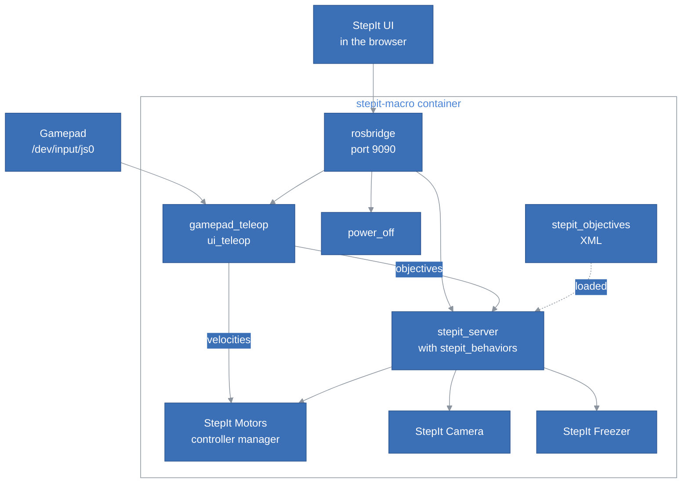
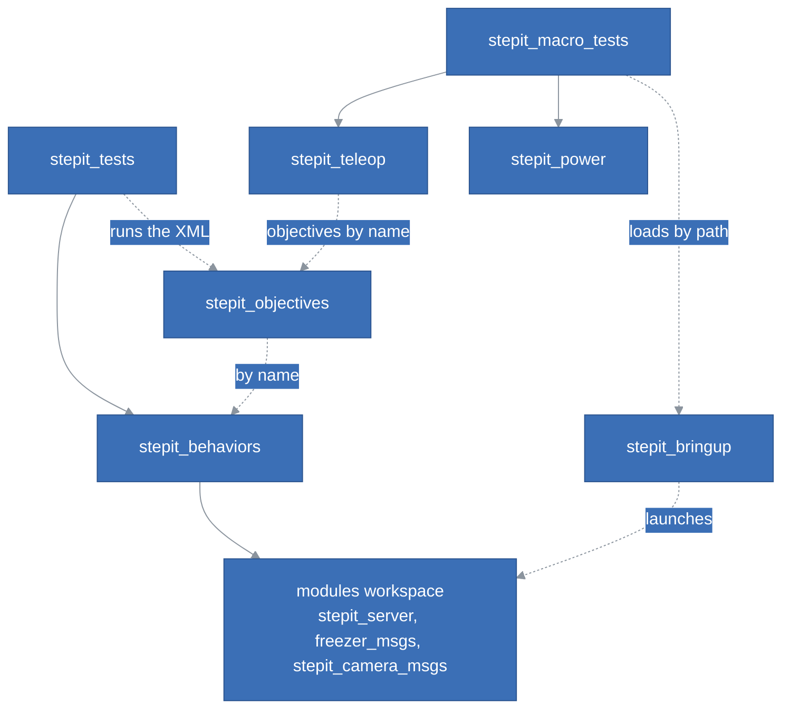
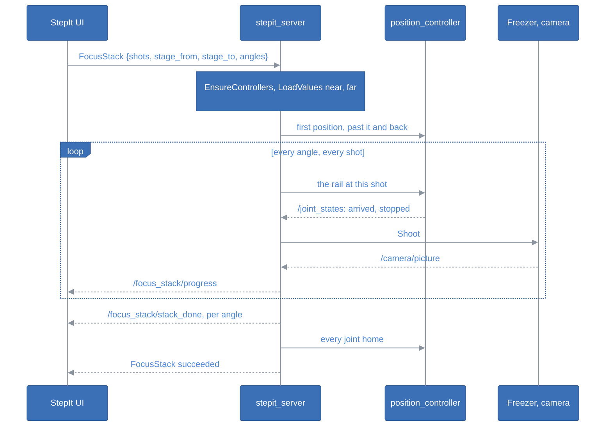

# StepIt Macro Architecture

## Table of Contents <!-- omit in toc -->

- [Introduction](#introduction)
- [The Big Picture](#the-big-picture)
- [The Workspaces and the Packages](#the-workspaces-and-the-packages)
- [Starting the Rig](#starting-the-rig)
- [The Behaviors](#the-behaviors)
  - [Registration and Parameters](#registration-and-parameters)
  - [The Families of Behaviors](#the-families-of-behaviors)
  - [The State File](#the-state-file)
- [The Objectives](#the-objectives)
- [A Focus Stack, from the Button to the Pictures](#a-focus-stack-from-the-button-to-the-pictures)
- [The Rig's Own Programs](#the-rigs-own-programs)
  - [The Gamepad and the Sliders](#the-gamepad-and-the-sliders)
  - [Switching the Rig Off](#switching-the-rig-off)
- [StepIt UI](#stepit-ui)
- [The Container, the Scripts and CI](#the-container-the-scripts-and-ci)
- [Tests](#tests)
- [How to Extend the Rig](#how-to-extend-the-rig)
- [Design Decisions and Trade-offs](#design-decisions-and-trade-offs)

## Introduction

This document explains how StepIt Macro is built, what each part is responsible for, and where to start when we want to change something. It assumes you have read the [README](../README.md) and started the rig once with `./docker/dock.sh start`. It covers the rig's own code: the behaviors and objectives in `src/plugins`, the programs and the launch file in `src/stepit-macro`, the scripts in `bin`, the container in `docker` and CI. StepIt UI, in `ui`, has its own [ARCHITECTURE.md](../ui/docs/ARCHITECTURE.md), which this document only summarises. How the rig and its modules are judged, what is fragile and what should change, is in the review, [Review.md](../Review.md).

It follows one idea: **the modules know nothing of the rig**. StepIt Motors, StepIt Commander, StepIt Camera, StepIt Freezer and StepIt Editor are generic, each with its own repository, container and CI. Everything that makes them a focus stacking rig lives here: the behaviors and objectives the commander loads, the programs that run beside the modules, the one file that configures them all, `rig.yaml`, and the page that drives them, StepIt UI.

## The Big Picture

One container, `stepit-macro`, runs every module and the rig's own programs, started by one launch file. The browser and the gamepad are the only things outside it.

The commander is a generic action server: it runs any behavior tree it finds, by name. The rig gives it a plugin, `stepit_behaviors`, which it loads into its own process, and a folder of objectives, `stepit_objectives/objectives`. The browser reaches everything through the commander's rosbridge, which knows every message of the rig because every module is installed in the same container; it also loads the live view and the pictures from StepIt Camera's servers, ports 8081 and 8090, which the diagram leaves out.

The interface the rig's own code adds to the modules':

| Name | Type | What it does |
|---|---|---|
| `/commander/execute_objective` | action, `btcpp_ros2_interfaces/action/ExecuteTree` | The commander's: runs an objective of `stepit_objectives` by name, with a YAML payload. |
| `/stepit_server` parameters `overshoot.<joint>`, `mm_per_turn.<joint>`, `deg_per_turn.<joint>`, `focus_stack.*`, `state_file`, `pictures_folder` | parameters | Declared on the commander's node by the plugin, from the section `stepit_server` of `rig.yaml`. |
| `/stepit_server` parameters `state.<key>` | parameters, lists of numbers | The rig's state file, e.g. `state.near`; a page that sets one writes the file. |
| `/focus_stack/progress` | `stepit_macro_msgs/StackProgress`, latched, one publisher created when the plugin loads | `done` and `total`, the pictures of a running focus stack, from `ReportProgress`. |
| `/focus_stack/stack_done`, `/focus_stack/all_stacks_done` | `std_msgs/String`, latched | The folder of a finished angle, and of a finished focus stack, from `StackDone` and `AllStacksDone`. |
| `/joy`, `/ui/joy` | `sensor_msgs/Joy`, in | The gamepad, and StepIt UI's sliders, for `gamepad_teleop` and `ui_teleop`. |
| `/velocity_controller/commands` | `std_msgs/Float64MultiArray`, out | The joints' velocities, from both teleop nodes. |
| `/power_off/power_off` | service, `std_srvs/Trigger` | Switches the computer off, refused while any objective runs. |
| ports 8070 and 8080 | HTTP | StepIt UI's static files, and StepIt Editor on the rig's objectives. |

## The Workspaces and the Packages

The rig is built as three colcon workspaces and one pnpm project, each with its scripts in `bin/<workspace>`, building into `build/<workspace>` and `install/<workspace>`:

| Workspace | Packages | Responsibility | May know |
|---|---|---|---|
| `modules` | every module's ROS packages, the editor's page and validator | The modules, built into the rig's own folders. | Nothing of the rig. |
| `plugins` | `stepit_behaviors` | The BehaviorTree.CPP nodes of the rig, one plugin; the **only** place a behavior names a robot topic, action or service. | The commander's BehaviorTree libraries, `stepit_server/progress.hpp`, the messages of the controllers, the Freezer and the camera. |
| | `stepit_objectives` | The objectives and their subtrees, XML only, and the generated node model. | The behaviors, by name. |
| | `stepit_tests` | Every test of the behaviors and objectives, against fakes. | Everything above. |
| | `stepit_macro_msgs` | The messages of the rig's own topics: `StackProgress`. | Nothing. |
| `stepit-macro` | `stepit_bringup` | `rig.launch.py` and `rig.yaml`: the only place the rig starts and configures the modules. | The modules' launch files, by package name. |
| | `stepit_teleop` | `gamepad_teleop`: a `Joy` to velocities, a button to an objective. | `btcpp_ros2_interfaces`, built here from the commander's submodule. |
| | `stepit_power` | `power_off`: the computer off, on request. | `std_srvs`, the commander's objective topic, by name. |
| | `stepit_macro_tests` | Every test of `src/stepit-macro`, `rig.yaml` included. | Everything above. |
| `ui` (pnpm) | StepIt UI | The rig's page. | The ROS interfaces of every module, by name, through rosbridge. |

The dependencies as they are, the build-time ones solid, the ones by name at run time dashed:

The `plugins` workspace is built on top of `modules`, which holds the commander: the plugin is loaded into the commander's process, so it must be compiled against the same BehaviorTree.CPP and BehaviorTree.ROS2. `stepit-macro` is built on ROS alone, so that CI builds it without the modules: it builds its own copy of `btcpp_ros2_interfaces` from the commander's submodule, the one interface it needs.

> [!IMPORTANT]
> Keep the robot's names in `stepit_behaviors`: an objective says *what* to do, a behavior knows *where* the robot's topic or service is. See [Separation of Concerns](../Review.md#separation-of-concerns) in the review for where the objectives repeat them today.

## Starting the Rig

[`rig.launch.py`](../src/stepit-macro/stepit_bringup/launch/rig.launch.py) reads [`rig.yaml`](../src/stepit-macro/stepit_bringup/config/rig.yaml) and starts everything. `rig.yaml` has two parts:

- **`launch`**: the launch arguments of each module, by its name in `MODULES` (`robot`, `commander`, `camera`, `freezer`, `teleop`, `power`) or in `PROGRAMS` (`editor`, `ui`). `split_config()` refuses a name it does not know, and `include()` reads the arguments the module's launch file declares and refuses any other: a typo stops the rig rather than being ignored.
- **every other section**: an ordinary ROS 2 parameter file, written to a temporary file and passed as `params_file` to the commander, the camera, the Freezer and `power_off`, after their own; and to `ui_teleop`, a second `gamepad_teleop` the launch file starts itself, with `/joy` remapped to `/ui/joy`.

Each include is a `GroupAction(scoped=True, forwarding=False)`: arguments with the same name, `usb_port` or `web_port`, never leak from one module to the next. Before anything starts, `clear_state()` removes the entries of `state_cleared_on_start` from the state file, the marks of the rail, which are counts of motor steps and mean nothing once the motors' controller powers up again; it takes the entry out of the parameters, so the commander never sees it. The editor and StepIt UI are not launch files: `editor()` runs the editor's server with `tsx`, `ui()` serves `ui/dist` with `python3 -m http.server`.

The launch file finds the repo from its own source, `RIG_DIR`, because `build.sh` installs it as a link (`--symlink-install`). A change to `rig.yaml` needs a restart of the rig, no build.

## The Behaviors

### Registration and Parameters

[`plugin.cpp`](../src/plugins/stepit_behaviors/src/plugin.cpp) exports the whole package as one `BT_REGISTER_ROS_NODES` plugin, which calls `registerNodes()` in [`register_nodes.cpp`](../src/plugins/stepit_behaviors/src/register_nodes.cpp). It registers every behavior, gives `Shoot` and `SetPictureFolder` the default name of their action and service, creates the two latched publishers of the finished stacks once, and calls `declareParameters()` in [`parameters.cpp`](../src/plugins/stepit_behaviors/src/parameters.cpp).

`declareParameters()` makes the commander's node carry the rig's parameters, which the commander itself knows nothing about: every `overshoot.*`, `mm_per_turn.*`, `deg_per_turn.*` and `focus_stack.*` that `rig.yaml` gives, `state_file` and `pictures_folder`. It then loads the state file into `state.<key>` parameters, gives `state.turn`, `state.shots` and `state.angles` the defaults of `focus_stack.*` until a page sets them, and adds a callback that writes every `state.<key>` a page sets into the file. The behaviors read the parameters through the functions of [`parameters.hpp`](../src/plugins/stepit_behaviors/include/stepit_behaviors/parameters.hpp), e.g. `overshootParameter()`, never by name.

The commander calls `registerNodes()` again before a goal whenever its own parameters changed, and setting any parameter counts: see [Why the Commander's Node Must Not Change](../Review.md#why-the-commanders-node-must-not-change) in the review.

[`nodes_model.cpp`](../src/plugins/stepit_behaviors/src/nodes_model.cpp) builds the `<TreeNodesModel>` of every behavior from the real registration, with no ROS node; `write_nodes_model` writes it to `stepit_objectives/objectives/stepit_behaviors.xml`, which the editor reads and `test_nodes_model` compares.

### The Families of Behaviors

| Family | Behaviors | What they share |
|---|---|---|
| Joint values, pure logic | `OffsetVector`, `SetJoints`, `Steps`, `MillimetresToRadians`, `DegreesToRadians` | Read numbers through [`ports.hpp`](../src/plugins/stepit_behaviors/include/stepit_behaviors/ports.hpp): a number or a list, `getNumbers()`, `requireNumbers()`, `isGiven()`. `Steps` is a decorator, a for loop that reports its progress to the commander. |
| Trajectories, pure logic | `CubicTrajectory` | Writes a `JointTrajectory` to the blackboard, one waypoint reached after a given duration, for `FollowJointTrajectory`. No objective uses either today. |
| Motion | `GetJointPositions`, `FollowJointTrajectory`, `CommandJointPositions` | The first and the last own a callback group and an executor of their own, spun when ticked. `FollowJointTrajectory` derives from the rig's [`RosActionNode`](../src/plugins/stepit_behaviors/include/stepit_behaviors/ros_action_node.hpp), which drops the exception a halt throws when its goal has just ended. |
| Controllers | `GetActiveControllers`, `IsControllerActive`, `SwitchController` | `BT::RosServiceNode`s of the controller manager. |
| State | `SaveValues`, `LoadValues` | The state file, see below. |
| Shot and pictures | `Shoot`, `ExpectPicture`, `SetPictureFolder`, `CurrentTime`, `StackDone`, `AllStacksDone`, `ReportProgress` | `Shoot` fires the Freezer's action; `ExpectPicture`, a decorator, succeeds only once `/camera/picture` reports the files of the shot; the others name the folders and announce what is done. |

`CommandJointPositions` is the one with the most behaviour: it sends every joint of the position controller its target, the others where they are, waits on `/joint_states` until the moved ones have arrived and stopped, goes past a target first when it would arrive against the approach direction (backlash), and on a halt or a timeout deactivates `position_controller`, so that the hardware brakes the released joints itself. Never stop by sending the current positions: a moving joint brakes past them and comes back.

### The State File

What the objectives learn while the rig runs goes into one YAML file, `state_file`, `~/ws/state/stack.yaml` on the rig, never into `rig.yaml`. Four writers share it:

- `SaveValues`, e.g. from `MarkNear`, writes a key, then sets its `state.<key>` parameter;
- the callback of `declareParameters()` writes a key when a page sets `state.<key>`;
- `declareParameters()` reads it and sets the parameters when the plugin is registered;
- `rig.launch.py`'s `clear_state()` removes the marks before the rig starts.

Every write goes to a temporary file, then renamed, so a crash never leaves it half written. Every page reads the parameters on connection and follows `/parameter_events`, so a mark set on one tablet shows on every other.

## The Objectives

An objective is an XML file in [`stepit_objectives/objectives`](../src/plugins/stepit_objectives/objectives) whose `<root>` names it in `main_tree_to_execute`; a tree it does not name is a subtree, which the commander refuses to run alone. Each objective declares its payload as the ports of a `<SubTree>` in its own `<TreeNodesModel>`, and is documented in `docs/<ObjectiveName>.md`.

| Objective | Controller | What it does |
|---|---|---|
| `EnsureControllers` (subtree) | the given ones | Stops every controller owning a command interface except the given ones, and starts those, best effort. Every motion objective calls it first. |
| `ActivateController`, `ActivateTeleop`, `ToggleTeleop` | the given one, `velocity_controller` | Hand the robot to a controller, to the gamepad and the sliders, or back. |
| `MoveJointsDirectlyTo`, `OffsetJointsDirectlyBy`, `MoveRailBy`, `RotateStageBy`, `MoveRailToMark`, `Stack`, `FocusStack` | `position_controller` | `CommandJointPositions`: each joint on the microcontroller's own profile. |
| `MarkNear`, `MarkFar` | none | Save where the rail is in the state file; they move nothing and leave the controllers alone. |
| `TakeShot` | none | `SetPictureFolder` `tests`, then `Shoot`. |

The payload is written into the global blackboard, so the objectives read it as `{@key}`; values passed between the nodes of one tree have no prefix. The rig's joints have roles that the objectives know: `joint1` is the rotary stage and `joint2` the rail.

## A Focus Stack, from the Button to the Pictures

`FocusStack` is the longest flow of the rig, and the one that crosses the most modules:

StepIt UI sends the plan; the marks are already on the rig, in the state file. The objective computes the first and the last position of the stack from where the joints are, with `DegreesToRadians` and `SetJoints`, and every move approaches its position going from the one toward the other, so that the gears always end loaded the same way. At each angle, `SetPictureFolder` sends the pictures into `<start time>/angle_NN_<degrees>deg`; after the last shot of an angle, `StackDone` writes `stack.json` there and announces the folder; after the last angle, `AllStacksDone` writes `all_stacks.json`. A shot whose picture does not come within 15 s fails `ExpectPicture`, and the whole stack stops where it is.

Every page shows every picture: StepIt UI follows `/camera/picture` and loads each one from the camera's web server, whichever page started the stack.

## The Rig's Own Programs

### The Gamepad and the Sliders

[`gamepad_teleop`](../src/stepit-macro/stepit_teleop/src/gamepad_teleop.cpp) turns each `/joy` message into one command on `/velocity_controller/commands`, one velocity per joint of the controller, `toVelocities()`. Sticks at rest are sent once, not repeated, so an idle gamepad leaves the velocity controller to others. A watchdog stops the joints once, when `/joy` stays silent for `joy_timeout` during a move. The stop button sends zero velocities, then asks the commander for the objective of its `objective` parameter, `ToggleTeleop` on the rig: the switching logic lives in that objective, not in the node.

The rig runs it twice: `gamepad_teleop` for the gamepad, configured by [`logitech_dual_action.yaml`](../src/stepit-macro/stepit_teleop/config/logitech_dual_action.yaml), and `ui_teleop` for StepIt UI's sliders, configured by the section `ui_teleop` of `rig.yaml`, with no stop button. The page sends a `Joy` 20 times a second while a slider is held; `ui_teleop`'s watchdog is what stops the joints when a tablet loses the network in the middle of a move. Never bypass it.

### Switching the Rig Off

[`power_off`](../src/stepit-macro/stepit_power/src/power_off.cpp) offers `~/power_off`, a `std_srvs/Trigger`. It follows the commander's latched `/stepit_server/objective`, refuses while any objective runs, so that it names none, and otherwise runs its `command`, by default `busctl` asking systemd-logind to power off over the host's D-Bus, mounted into the container. logind allows it only with [`50-stepit-power-off.rules`](../docker/polkit/50-stepit-power-off.rules) installed on the rig's computer. The command is a parameter and `runCommand` is injected, so the tests never switch anything off.

## StepIt UI

StepIt UI is a React page, built by Vite into `ui/dist` and served on port 8070. It owns nothing of the rig: it sends tasks to the commander as objectives, configuration straight to the drivers, and mirrors what the rig publishes. Its layers, stores, flows and its own review are in [ui/docs/ARCHITECTURE.md](../ui/docs/ARCHITECTURE.md). What it shares with the rest of the repo is only names: of objectives, topics, services, parameters and joints, see [Coupling and Duplication](../Review.md#coupling-and-duplication) in the review.

## The Container, the Scripts and CI

[`dock.sh`](../docker/dock.sh) wraps Docker Compose. `build` starts the package cache, builds the image from `ros:jazzy-ros-base`, then runs `update.sh` and `build.sh` in a container that it commits as the image, so the image holds the rosdep packages and the rig does not install them again on start. `start` passes the host's `input` and `plugdev` group numbers to the container, which a plain `docker compose up` would not. The container is privileged, on the host network, with `/dev` and `/run/dbus` mounted, and the repo at `~/ws`.

[`bin/update.sh`](../bin/update.sh), [`bin/build.sh`](../bin/build.sh) and [`bin/test.sh`](../bin/test.sh) run the scripts of each workspace in order. `build.sh` removes a workspace whose CMake cache was built from another folder, e.g. by a module's own container. `bin/modules/build.sh` refuses to build when StepIt Motors and StepIt Freezer pin different commits of `serial` or `framed-serial`. Both `test.sh` scripts set `ROS_DOMAIN_ID` to 77, as the fakes use the robot's real names.

[`ci.yml`](../.github/workflows/ci.yml) builds and tests `plugins`, on the commander's own workspace and the Freezer's and the camera's messages, and `stepit-macro`, on ROS alone; tests the UI with Node.js; and validates the objectives with the editor's validator. `ci-format.yml` and `ci-ros-lint.yml` run the formatters and the ament linters.

## Tests

The objective tests run the real XML and the real behaviors against fakes of the robot, the controller manager, the Freezer and the camera, in [`tests/fake`](../src/plugins/stepit_tests/tests/fake), with the real names: no hardware is needed. [`objective.hpp`](../src/plugins/stepit_tests/tests/objective.hpp) runs an objective as the commander does, the payload in the global blackboard.

| Test | What it covers |
|---|---|
| `test_offset_vector`, `test_set_joints`, `test_steps`, `test_ports` | The pure logic: offsets, the joints set, the loops, a number or a list. |
| `test_cubic_trajectory`, `test_follow_joint_trajectory` | The cubic trajectory's shape; following it through the trajectory controller, and a controller that fails. |
| `test_get_joint_positions`, `test_command_joint_positions` | Reading the joints; the direct moves, the approach against backlash, the stop on a halt or a timeout. |
| `test_switch_controller`, `test_expect_picture`, `test_values_file` | The strictness of a switch; waiting for every file of a shot; the state file, its parameters and a page setting one. |
| `test_*_objective`, `test_direct_objectives`, `test_axis_objectives` | Every objective, end to end: `FocusStack` alone has 17 cases. |
| `test_nodes_model` | The committed node model matches the registration. |
| `test_gamepad_teleop`, `test_power_off` | The sticks, the stop button, the watchdog; switching off, and the refusal during a stack, with a command of the test's own. |
| `test_rig_config.py` | `rig.yaml` as `rig.launch.py` reads it: the sections, the clearing of the state, the measured ratios. |

Not tested: the commander's own loop around the plugin, i.e. `registerNodes()` called again before a goal; `include()` of `rig.launch.py` against the modules' real launch files; and anything against the real hardware, which is checked by hand on the rig.

## How to Extend the Rig

| To… | Change… |
|---|---|
| add an objective | an XML file in `stepit_objectives/objectives` naming it in `main_tree_to_execute`, with its payload in a `<TreeNodesModel>`; `docs/<Name>.md` and the README's list; a test in `stepit_tests`. No build. |
| add a behavior | a class in `stepit_behaviors`, a line in `registerNodes()`, the node model regenerated with `write_nodes_model`, a test; then `bin/plugins/build.sh` and a restart. |
| add a measured constant | a parameter in the section `stepit_server` of `rig.yaml`, declared in `declareParameters()`, read through a function of `parameters.hpp`. |
| remember something across objectives | `SaveValues` and `LoadValues`, a key of the state file; `state_cleared_on_start` if a start of the rig must forget it. |
| add a program | a package in `src/stepit-macro`, its launch file, an entry in `MODULES` of `rig.launch.py`, its section in `rig.yaml`, its tests in `stepit_macro_tests`, and the package in `ci-ros-lint.yml` and `.pre-commit-config.yaml`. |
| configure a module | its section of `rig.yaml`, never the module. |

## Design Decisions and Trade-offs

**One container for the whole rig, one container per module to work on it.** The rig starts with one command and one log, and every message is known to one rosbridge. The price is two build folders per module, which `build.sh` keeps apart, and a rig image of about 4 GB.

**The behaviors in a plugin, not in the commander.** The commander stays a server that knows nothing of focus stacking, and the rig's nodes are built and tested here. The price is that the plugin must be compiled against the commander's BehaviorTree libraries, so `plugins` is built on top of `modules`, and in CI on the commander's own workspace.

**Objectives as XML, behaviors as C++.** A new or edited objective runs on the next goal with no build, and the editor shows it; a new behavior needs a build and a restart. What the XML may hold is limited to what the behaviors expose as ports, which is why `CommandJointPositions` takes the approach, the overshoot and the tolerances as ports.

**State in a file on the rig, shown as parameters.** Every page and every objective sees the same marks and counts, and they survive a restart of the browser. Parameters were chosen over a service of the rig's own because every page already follows `/parameter_events` through rosbridge; the price is a parameter callback inside the plugin, and a file with four writers.

**Two teleop nodes, the same program.** The sliders are a second gamepad, so they inherit the watchdog and the velocity scales of the real one, and the page never sends a velocity. The price is that both write `/velocity_controller/commands`, and a gamepad held at the same time as a slider fights it.

**The robot stops by releasing the position controller.** A halt of `CommandJointPositions` deactivates `position_controller`, and the hardware brakes every released joint at the motor's acceleration, measured in `docs/ActivateController.md`. Cancelling is a controlled stop, not an emergency stop: see `TODO.md`, item 4.

**No authentication.** Anyone who reaches rosbridge on port 9090 can run objectives, set parameters and switch the computer off; the rig is for a workshop's own network.
