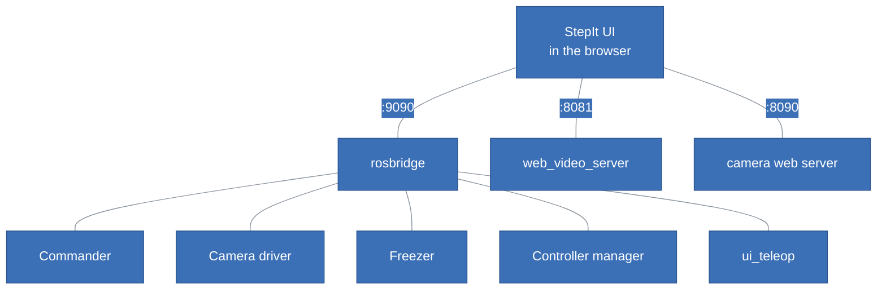
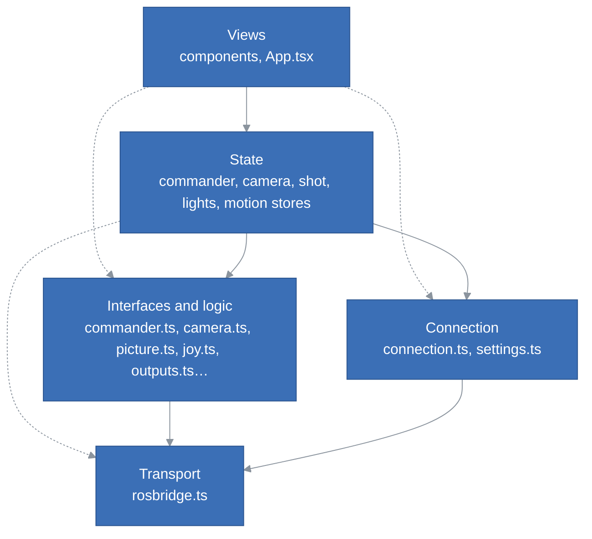
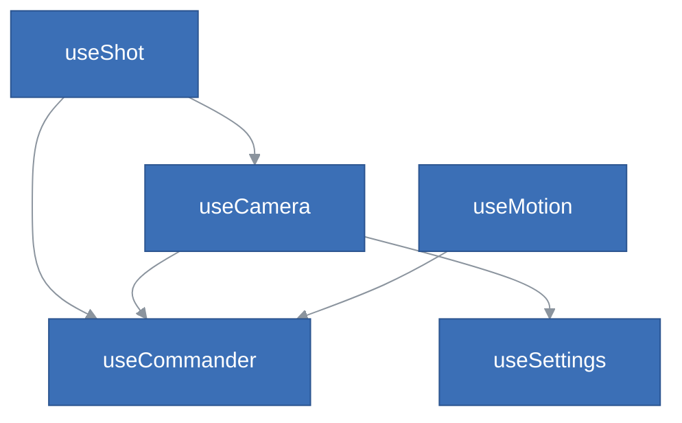
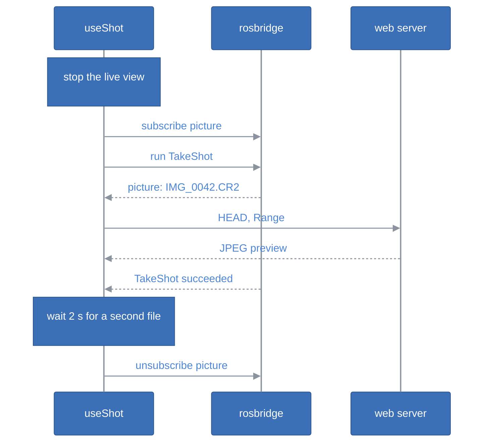
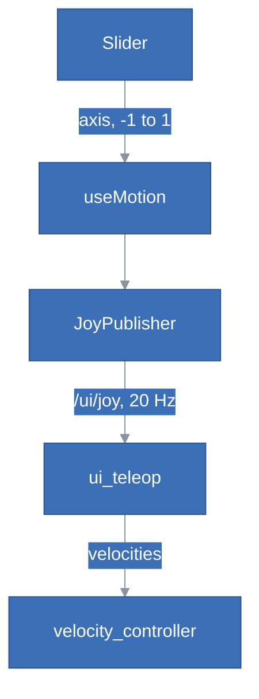

# StepIt UI Architecture

## Table of Contents <!-- omit in toc -->

- [Introduction](#introduction)
- [The Big Picture](#the-big-picture)
- [The Layers](#the-layers)
- [Talking to the Rig](#talking-to-the-rig)
  - [The rosbridge Client](#the-rosbridge-client)
  - [The One Connection](#the-one-connection)
  - [The Interfaces of the Modules](#the-interfaces-of-the-modules)
- [The Stores](#the-stores)
- [A Shot, from the Button to the Picture](#a-shot-from-the-button-to-the-picture)
- [The Sliders, from the Thumb to the Motor](#the-sliders-from-the-thumb-to-the-motor)
- [Components](#components)
- [Tests](#tests)
- [How to Extend the Page](#how-to-extend-the-page)
- [Design Decisions and Trade-offs](#design-decisions-and-trade-offs)
- [Review](#review)
  - [Is the Page Well Structured?](#is-the-page-well-structured)
  - [Are the Layers Respected?](#are-the-layers-respected)
  - [SOLID](#solid)
  - [Coupling Between Components](#coupling-between-components)
  - [Duplication](#duplication)
  - [Implementation Issues](#implementation-issues)
  - [Recommendations](#recommendations)

## Introduction

This document explains how StepIt UI is built, what each part is responsible for, and where to start when we want to change something. It assumes we have read the [README](../README.md) and used the page once on the rig. Its last section, [Review](#review), judges the structure against the rules the rest of the document describes, and lists what should change.

It follows one idea: **the page owns nothing of the rig**. The commander, the camera's driver, StepIt Freezer and the controller manager own the state; the page mirrors what they publish, asks them for changes, and keeps only what is its own: the browser's preferences, the slider under each thumb, and the pictures it has shown.

## The Big Picture

The page is a single-page React application, built by Vite into `dist` and served as static files on port 8070 by StepIt Macro. It has no server of its own: the browser talks to three servers of the rig directly.



| Server | Port | Carries |
|---|---|---|
| The commander's rosbridge | 9090 | Every message of the rig: in StepIt Macro every module is installed in one container, so this rosbridge knows them all. |
| web_video_server | 8081 | The live view, the camera's JPEG frames as MJPEG, in a plain ``. |
| The camera's web server | 8090 | The saved pictures, with `HEAD` and `Range` requests. |

The page follows the rule of the rig: **only tasks go through the commander**, as objectives (`TakeShot`, `ActivateTeleop`, `ActivateController`); **configuration goes straight to the drivers** (the camera's settings and live view, the lights), so that changing the ISO never preempts a running shoot.

## The Layers

The source code lives in [`src`](../src), one folder per device of the rig, plus the transport and the views. Inside the device folders, the files fall into four layers:

| Layer | Files | Knows about |
|---|---|---|
| Transport | [`ros/rosbridge.ts`](../src/ros/rosbridge.ts) | The rosbridge protocol. Nothing of the rig. |
| Connection | [`ros/connection.ts`](../src/ros/connection.ts), [`settings.ts`](../src/settings.ts) | The one connection of the page, its status, and where the servers are. |
| Interfaces and logic | [`commander/commander.ts`](../src/commander/commander.ts), [`camera/camera.ts`](../src/camera/camera.ts), [`camera/picture.ts`](../src/camera/picture.ts), [`camera/raw.ts`](../src/camera/raw.ts), [`camera/format.ts`](../src/camera/format.ts), [`freezer/outputs.ts`](../src/freezer/outputs.ts), [`shot/pictures.ts`](../src/shot/pictures.ts), [`motion/axis.ts`](../src/motion/axis.ts), [`motion/joy.ts`](../src/motion/joy.ts) | The ROS interface of one module, given a `Rosbridge`, or pure computation. No React, no store, no global. |
| State | [`commander/store.ts`](../src/commander/store.ts), [`camera/store.ts`](../src/camera/store.ts), [`shot/store.ts`](../src/shot/store.ts), [`freezer/lights.ts`](../src/freezer/lights.ts), [`motion/store.ts`](../src/motion/store.ts) | One zustand store per device: what the page shows, and the actions the views call. |
| Views | [`components`](../src/components), [`App.tsx`](../src/App.tsx) | What the user sees and does. |

The dependencies are meant to point down only. The diagram shows the imports as they are; the dashed arrows skip the layer of interfaces, see [Are the Layers Respected?](#are-the-layers-respected).



> [!IMPORTANT]
> Keep the layer of interfaces free of React, of the stores and of `ros()`: each function or class takes the `Rosbridge` it talks to, or a function to publish with, as `JoyPublisher` does. This is what lets the tests run it against a fake WebSocket, and nothing else in the page is tested.

## Talking to the Rig

### The rosbridge Client

`Rosbridge` in [`rosbridge.ts`](../src/ros/rosbridge.ts) is a small client of the rosbridge protocol, written for the rig rather than taken from `roslibjs`. It started as the client of StepIt Camera's test page, and adds publishing and action goals:

```
→ call_service          a request                ← service_response
→ subscribe             a topic, once per topic  ← publish, for each message
→ unsubscribe
→ advertise, publish    a topic, a message
→ send_action_goal      a goal                   ← action_feedback, action_result
→ cancel_action_goal
                                                 ← fragment, parts of a large message
```

- `callService()` fails at once when not connected, rather than waiting, so that a button can say it did not work; it fails after a timeout, 10 s, or when the connection drops.
- `subscribe()` sends one `subscribe` per topic, whatever the number of listeners, and `unsubscribe` with the last one. The subscriptions, and the advertised topics, survive a reconnection: `onopen` sends them again.
- `publish()` drops a message while disconnected: a velocity that comes late is worse than none.
- `sendActionGoal()` returns the result as a promise, which fails when the connection drops, since the goal's end is then unknown.
- The connection comes back on its own every 2 s, e.g. while the rig restarts.

### The One Connection

[`connection.ts`](../src/ros/connection.ts) holds the page's one `Rosbridge`, opened by the first call to `ros()`, and opened again on the next call when the rosbridge of the settings changes. Its status lives in a small zustand store, read by React with `useStatus()` and by the stores with `status()`, `onConnected()` and `onDisconnected()`.

A store that follows a topic subscribes through `ros()`, and subscribes again on every `onConnected`, so that a new connection, to another rosbridge, gets its subscription too. The client re-subscribes on its own after a mere reconnection, so the two overlap: see [Implementation Issues](#implementation-issues).

### The Interfaces of the Modules

| Module | Where its interface is | What the page uses |
|---|---|---|
| StepIt Commander | [`commander/commander.ts`](../src/commander/commander.ts) | `runObjective` (the action `/commander/execute_objective`), `cancelAll` (its `cancel_goal` service, with a goal of zeros), `followObjectives` (its status topic, transient local). |
| The camera's driver | [`camera/camera.ts`](../src/camera/camera.ts), the class `Camera` | `get_settings`, `set_parameters`, `start_streaming`, `stop_streaming`, the topic `picture`; the URLs of the live view and of a picture. |
| The camera's web server | [`camera/picture.ts`](../src/camera/picture.ts), [`camera/raw.ts`](../src/camera/raw.ts) | A picture's size with `HEAD`, a RAW's JPEG preview with two `Range` requests. |
| StepIt Freezer | in the store, [`freezer/lights.ts`](../src/freezer/lights.ts), with the bits of a jack in [`freezer/outputs.ts`](../src/freezer/outputs.ts) | `/freezer/set_outputs`, `/freezer/outputs`. |
| The controller manager | in the store, [`motion/store.ts`](../src/motion/store.ts) | `/controller_manager/list_controllers`, every 2 s. |
| ui_teleop | [`motion/joy.ts`](../src/motion/joy.ts), `JoyPublisher` | `sensor_msgs/Joy` on `/ui/joy`, at 20 Hz while a slider is held. |

## The Stores

Each store is a zustand store, created at import time, with its actions on it. The `follow*()` functions keep the stores up to date while the page is open; `App.tsx` starts them on mount and stops them on unmount.

| Store | Holds | Kept up to date by | Uses |
|---|---|---|---|
| `useCommander` | `busy` (an objective runs, whoever sent it), `known`, `running` (the objective this page runs), `failure`; `run()`, `stop()` | `followCommander`: the status topic of the action | — |
| `useCamera` | the settings, the ones `changing` and `refused`, `streaming`, the errors; `refresh()`, `change()`, `setStreaming()` | `followCamera`: reads the settings every 3 s, unless a task runs; starts the live view again after a reconnection | `useCommander` (`busy`), `useSettings` |
| `useShot` | the state of the shot, its message, the latest two pictures; `takeShot()` | — | `useCamera`, `useCommander`, `useSettings` |
| `useLights` | the outputs of the board, `switching`, `error`; `setLights()` | `followLights`: `/freezer/outputs` | — |
| `useMotion` | `enabled` (the velocity controller runs), the axes; `enable()`, `disable()`, `setAxis()`, `release()` | `followMotion`: lists the controllers every 2 s; lets the sliders go when the page is hidden | `useCommander` |
| `useSettings` | the preferences of the browser, in `localStorage` | — | — |



`useShot` also reads `useSettings`, for the address of the pictures, and `useLights` depends on no other store. The stores form no cycle, and `useCommander` is the one they all lean on: whether a task runs decides what may be changed.

## A Shot, from the Button to the Picture

**Take a shot** is the longest flow of the page, and the one that crosses the most stores:



The Toolbar's button calls `takeShot()`. The live view is stopped through `useCamera`, and the objective runs through `useCommander`, which the diagram leaves out: both talk to rosbridge. If the objective ends before any picture came, the store waits up to 30 s for one, then says why none came.

The page shows only the latest picture, and keeps two, the files of a shot in RAW+JPEG ([`shot/pictures.ts`](../src/shot/pictures.ts)). The preview of a RAW is an object URL, which holds its JPEG in memory until revoked: a picture the page drops is released, and so is one dropped while it was still loading.

## The Sliders, from the Thumb to the Motor



`Slider` turns the pointer into an axis with `axisAt()`, which has a dead zone around the centre. `useMotion` ignores it unless manual drive is on. `JoyPublisher` sends the axes at once on a change, then 20 times a second while a slider is held, through `ros().publish()`, which drops them while disconnected.

The page never sends a velocity: `ui_teleop` turns the axes into velocities, with the scales of `rig.yaml`, and stops the joints when the axes stop coming for 0.5 s. The page only labels each slider with its speed at the ends, `SLIDERS` in [`motion/store.ts`](../src/motion/store.ts), which must be kept in step with `rig.yaml` by hand.

Manual drive is turned on by the objective `ActivateTeleop`, and off by `ActivateController` with `joint_trajectory_controller`. Whether it is on is not the page's own belief: it is read from the controller manager every 2 s, since any objective may take the velocity controller away, and it is off while the page is disconnected, when the sliders' messages would be dropped.

## Components

The screen is laid out in [`App.tsx`](../src/App.tsx): the top bar, a slider at each edge, and the toolbar over the live view in the middle.

| Component | Where | Responsibility | Reads |
|---|---|---|---|
| [`TaskStatus`](../src/components/TaskStatus.tsx) | Top bar | The task that runs, and why the last one of this page failed. | `useCommander` |
| [`ConnectionBadge`](../src/components/ConnectionBadge.tsx) | Top bar | Whether the page reaches rosbridge. | `useStatus`, `useSettings` |
| [`SettingsMenu`](../src/components/SettingsMenu.tsx) | Top bar | The camera's settings, the theme, the servers. | `useSettings` |
| [`CameraSettings`](../src/components/CameraSettings.tsx) | Settings menu | One list per setting of the camera, locked while a task runs. | `useCamera`, `useCommander` |
| [`Toolbar`](../src/components/Toolbar.tsx) | Centre | Take a shot, Live view, Lights, Manual drive, Stop: one small component per button. | every store but `useSettings` |
| [`LiveView`](../src/components/LiveView.tsx) | Centre | The live view, or the last photo with Download; the messages of the shot and of the lights. | `useCamera`, `useShot`, `useLights`, `useSettings` |
| [`Slider`](../src/components/Slider.tsx) | Edges | A vertical stick for a thumb. Props only: no store. | — |
| [`icons`](../src/components/icons.tsx) | Shared | Line icons in the text colour. | — |

`Slider` is the one purely presentational component: `SideSlider`, in `App.tsx`, connects it to `useMotion`. The others read the stores they need directly.

## Tests

`pnpm run test` runs vitest on [`tests`](../tests), in Node.js, with a fake WebSocket that answers as rosbridge ([`fakeSocket.ts`](../tests/fakeSocket.ts)). CI runs the type check, the tests and the build on every push.

| Test | Covers |
|---|---|
| `rosbridge.test.ts` | Services, subscriptions, fragments, reconnection, publishing and action goals. |
| `commander.test.ts` | Running an objective, how it ended, stopping them all, whether one runs. |
| `camera.test.ts` | The camera's interface, and how its settings are shown. |
| `picture.test.ts`, `raw.test.ts` | Loading a picture, and the preview inside a RAW. |
| `joy.test.ts`, `axis.test.ts` | The sliders as a gamepad, and a slider as an axis. |
| `lights.test.ts` | The bits of the lights on the Freezer's outputs. |
| `shot.test.ts` | The pictures kept, and the previews of the others released. |

Every test is of the transport or of the layer of interfaces and logic. **No store is tested**, and no component: importing a store imports `settings.ts`, which touches `window` at import time and fails in Node.js. The flows that cross several stores, a shot, manual drive, a reconnection, are only checked by hand on the rig.

## How to Extend the Page

| To… | Change… |
|---|---|
| add a command that is a task | an objective in the rig, then a button that calls `useCommander.getState().run('Name', payload)`, from the store of its device. |
| add a configuration of a driver | its service or topic in the device's interface (e.g. `Camera`), an action in its store, a control in a component. Never through the commander. |
| support a new module | a folder `src/<module>/`: an interface that takes a `Rosbridge`, a store with a `follow<Module>()`, started in `App.tsx`. Its messages must be installed next to the commander's rosbridge. |
| add a camera setting | nothing in the page: the driver lists it in `get_settings`. Add a label and an order in [`format.ts`](../src/camera/format.ts). |
| add a preference | `Settings` and `DEFAULTS` in [`settings.ts`](../src/settings.ts), and a control in `SettingsMenu`. |
| change a slider's speed | `rig.yaml`'s section `ui_teleop`, and `SLIDERS` in [`motion/store.ts`](../src/motion/store.ts), which only labels it. |

## Design Decisions and Trade-offs

**zustand stores per device, not one store.** Each device of the rig has its own small store, so a component subscribes to what it shows. A store may read another, `useCommander` mostly; none writes another's state.

**Module-level singletons.** The connection and the stores are created at import time, so any file can reach them without providers. It keeps the page short; the price is that the stores cannot be given a fake connection, and are not tested.

**Polling where the rig has no topic.** The camera's settings, every 3 s, and the controllers, every 2 s. The camera's settings change on the camera itself, with nothing published; the polling pauses during a task, when the driver may be busy downloading a 29 MB RAW.

**Pictures over HTTP, never over rosbridge.** A RAW would reach the browser as 40 MB of base64 in JSON, ahead of every service call on the same WebSocket. The page asks the size first and never reads past the end of a file, to step around a bug of cpp-httplib 0.14.

**The rosbridge client and the camera's code are copied from StepIt Camera's test page**, not shared, so that each module builds alone. The copies have diverged since: see [Duplication](#duplication).

**No authentication.** Anyone who reaches the rig's rosbridge can drive it, which suits a workshop's own network only.

## Review

Reviewed on 2026-10-05, at commit `fd0568b` of StepIt UI, with the `architect` skill of StepIt Macro. Each finding names where it is; the ones marked *verified* were reproduced with a test, the others come from reading the code.

### Is the Page Well Structured?

Yes, for its size: about 2,000 lines of TypeScript, one folder per device of the rig, the protocol in one class, the pure logic, the axes, the joy messages, the bits of a jack, the formats of the settings, the RAW previews, in small functions with tests of their own. The rule of the rig, tasks through the commander and configuration straight to the drivers, is followed everywhere, and the safety of the sliders rests on `ui_teleop`'s watchdog, not on the page, as it should.

The weak part is the layer of state. It holds the most complex code of the page, the shot, manual drive, the reconnections, and it is the one layer with no seam to test it and no rule about what it may know.

### Are the Layers Respected?

Mostly. Three kinds of shortcut:

1. **Stores that talk ROS themselves.** The camera and the commander have an interface that names their services and topics; StepIt Freezer and the controller manager do not. [`freezer/lights.ts`](../src/freezer/lights.ts) calls `/freezer/set_outputs` and subscribes to `/freezer/outputs`, and [`motion/store.ts`](../src/motion/store.ts) calls `/controller_manager/list_controllers`, each with the types of the responses declared in the store. The rig itself keeps the names of robot interfaces in one package, `stepit_behaviors`; the page has no such rule.
2. **Views that know the rig's objectives.** `ManualDriveButton` disables itself while `running` is `ActivateTeleop` or `ActivateController` ([`Toolbar.tsx`](../src/components/Toolbar.tsx), `ManualDriveButton`): the names of `useMotion`'s objectives, outside `useMotion`.
3. **Views and stores that import the transport for a helper.** `errorMessage()` lives in `rosbridge.ts`, so `LiveView`, which has nothing to do with rosbridge, imports the transport for it, as does every store.

The rules of what may be done when, connected, no task running, are also in the views: see [Coupling Between Components](#coupling-between-components).

### SOLID

| Principle | Verdict |
|---|---|
| **Single responsibility** | Good in the transport and the interfaces. `Rosbridge` is long, 330 lines, but about one thing, the protocol. `settings.ts` has three jobs: the preferences, the URLs of the servers, and the theme of the document, applied at import time. `Toolbar` holds five buttons, but as five small components. |
| **Open/closed** | Good where it matters: a new camera setting needs no code, a new objective is a string, a new module is a new folder. Adding a rule such as "locked during a task" means editing each button that applies it. |
| **Liskov substitution** | Barely applies: there is no inheritance beyond the error classes. |
| **Interface segregation** | Weak in the views: `useCamera()`, `useShot()`, `useCommander()` and `useMotion()` are read whole, without a selector, so a component re-renders on any change of the store, e.g. `LiveViewButton` and `LiveView` every 3 s when the settings are read again, as the poll always stores a new array. Harmless at this size. |
| **Dependency inversion** | Good in the layer of interfaces: `Camera` and the commander's functions take a `Rosbridge`, `JoyPublisher` takes a function to publish with, which is why they are tested. Broken in the layer of state: every store reaches the concrete singleton `ros()` and the other stores directly, which is why none is tested. |

### Coupling Between Components

The stores form a clean, acyclic graph (see [The Stores](#the-stores)). The coupling is in the views:

- **The rules of when a command may run are spread over the buttons.** `connected` is computed in four buttons, `busy` checked in three, and each combines them its own way: `ShotButton` (`!connected || busy || shooting`), `LightsButton` (`!connected || !known || busy || switching`), `ManualDriveButton` (two objective names), `StopButton`, `CameraSettings` (`busy`). A new rule, e.g. "nothing while the Freezer is unknown", means finding each of them, and none of it is tested.
- **`Toolbar` reads every device store**, and `LiveView` reads four, one of them only to show the lights' error. The errors of the page have five shapes in five places: `error` and `streamError` in `useCamera`, `refused` per setting, `failure` in `useCommander`, `message` with `state` in `useShot`, `error` in `useLights`, plus local state in `Photo`. Each view picks which to show.
- **`useShot` drives `useCamera`**: it stops the live view itself before a shot. It is the right place, a shot is the one flow that needs both, but it means the shot and the camera cannot change apart.

Each component can still be changed alone; what cannot is a rule that spans them.

### Duplication

| What | Where | Weight |
|---|---|---|
| **The rosbridge client and the camera's code, copied across modules.** | `ros/rosbridge.ts` exists in StepIt Camera's test page, StepIt Freezer's board page and here, each different (109 and 380 lines of `diff` against this one). `camera/raw.ts` and `camera/format.ts` are identical copies; `camera/camera.ts` and `camera/picture.ts` have diverged. | High: the fixes do not travel. This page reads the size of a picture first, to step around cpp-httplib 0.14; the camera's test page, from which it was copied, still reads 64 KB from the start of every file, the case that fails. |
| Following a topic across connections: subscribe, then again on every `onConnected`. | `followCommander`, `followLights`; the same idea in `followCamera` and `followMotion`. | Medium: and it overlaps with the client's own re-subscription. |
| The QoS of a latched topic, `reliable`, `transient_local`, `keep_last`, 1. | [`commander.ts`](../src/commander/commander.ts) and [`lights.ts`](../src/freezer/lights.ts). | Low. |
| `connected`, `busy` in the buttons. | [`Toolbar.tsx`](../src/components/Toolbar.tsx), [`CameraSettings.tsx`](../src/components/CameraSettings.tsx). | Medium, see above. |
| The speeds of the sliders. | `SLIDERS` in [`motion/store.ts`](../src/motion/store.ts), derived from `MAX_TURNS_PER_SECOND` in [`axis.ts`](../src/motion/axis.ts), and the scales of `ui_teleop` in `rig.yaml`. In step today: 0.75 and 3 turns/s. | Medium: a change in `rig.yaml` silently mislabels the sliders. |
| The theme: its storage key and how `auto` resolves. | [`index.html`](../index.html), before the first paint, and [`settings.ts`](../src/settings.ts). | Low, and deliberate. |
| `Cannot load … : status statusText`. | `fetchSize`, `fetchRange` in [`picture.ts`](../src/camera/picture.ts), `download` in [`shot/store.ts`](../src/shot/store.ts). | Low. |

### Implementation Issues

Ordered from the most to the least serious. None of them is a safety issue: the sliders stop through `ui_teleop`'s watchdog whatever the page does.

1. **The stores cannot be tested** (*verified*). [`settings.ts`](../src/settings.ts) calls `window.matchMedia` at import time, to apply the theme, so importing it in Node.js fails with `ReferenceError: window is not defined`; every store imports it through `connection.ts`. With the global `ros()` and the stores created at import, a test would also need to reset modules between cases. The untested code is the one that orchestrates: `takeShot`, `enable`/`disable`, the `follow*()` functions.
2. **Two layers re-subscribe after a connection** (*verified*). `Rosbridge`'s `onopen` sets the status to connected, which runs `onConnected` listeners, before it sends the subscriptions again. `followCommander` and `followLights` then unsubscribe and subscribe again, and `onopen` sends that new subscription a second time. On every connection, the first included, rosbridge receives an `unsubscribe` for an id it never saw, then the same `subscribe` twice. rosbridge copes, but the page does not own its subscriptions in one place, and a store that forgot the dance would silently lose its topic after a change of rosbridge.
3. **The live view is the page's belief.** `setStreaming()` in [`camera/store.ts`](../src/camera/store.ts) sets `streaming` before the call, and keeps it when the call fails: a failed stop leaves the camera streaming while the button says it is off. The driver publishes no state of its stream to correct it.

### Recommendations

In order, each one small enough for one pull request:

1. **Make the stores testable.** Move the theme out of `settings.ts` into a `theme.ts` that `main.tsx` starts, so that importing the settings has no effect on the document. Then test `takeShot`, manual drive and a reconnection against `FakeSocket`, with `vi.resetModules()` between cases. Later, if the stores grow, create them with a factory that takes the connection.
2. **Give the connection one owner of the subscriptions.** Let `connection.ts` offer `follow(topic, type, listener, qos)`, which keeps the subscription across a change of rosbridge by moving it to the new `Rosbridge`, and does nothing on a mere reconnection, which the client already handles. `followCommander` and `followLights` then shrink to one line, and the duplicate traffic goes.
3. **Give every module an interface.** `freezer/freezer.ts` with `setOutputs()` and `onOutputs()`, and `motion/controllers.ts` with `activeControllers()`, as `Camera` does; a `LATCHED` QoS constant in `rosbridge.ts`. Then only the interfaces name ROS topics and services, the page's version of the rig's own rule. Move `errorMessage()` to a `util.ts`.
4. **Move the rules of the buttons into the stores.** Selectors such as `canTakeShot`, `canSwitchLights`, and a `switching` flag in `useMotion` in place of the objective names in `ManualDriveButton`. Read stores with selectors, or `useShallow`, rather than whole.
5. **Share the code copied across modules.** One small package, e.g. `stepit-web`, with the rosbridge client and the camera's interface, used by the three pages; or, at the least, port this page's fix of the picture's size back to StepIt Camera's test page. Sharing costs each module its independence at build time, which is why it was copied; three diverging copies of a protocol client is the point where that trade stops paying.
