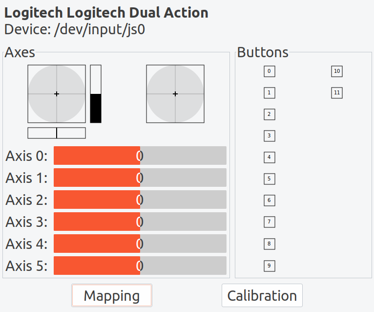
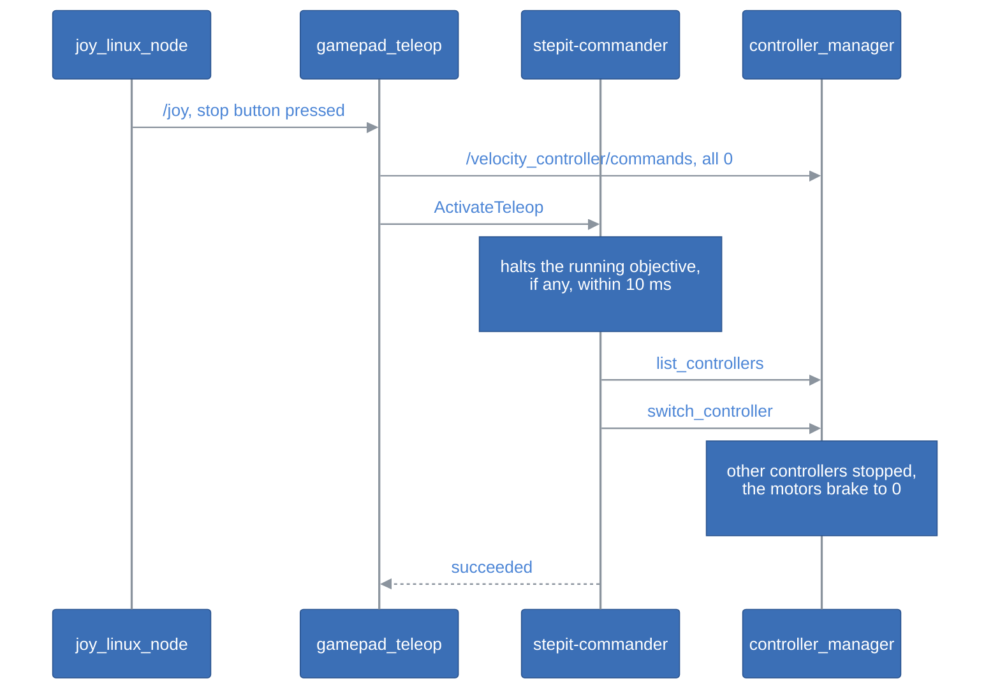

# Driving the Robot with a Gamepad

## Table of Contents <!-- omit in toc -->

- [Introduction](#introduction)
- [Prerequisites](#prerequisites)
  - [Test the Gamepad](#test-the-gamepad)
- [Running the Gamepad](#running-the-gamepad)
- [The Stop Button](#the-stop-button)
- [Parameters](#parameters)
  - [Launch Arguments](#launch-arguments)
- [Another Gamepad](#another-gamepad)
- [Troubleshooting](#troubleshooting)

## Introduction

The package [`stepit_teleop`](../src/stepit-macro/stepit_teleop) drives the robot with a Logitech Dual Action gamepad:

- each stick moves two joints, one per direction, at a velocity proportional to how far it is pushed, up to 2 turns/s;
- the D-pad moves a fifth joint, left and right, at half a turn per second;
- a stop button stops whatever moves the robot, an objective or the sticks, and hands the robot to the gamepad.

The sticks command the robot's `velocity_controller`, which only one controller at a time may drive: only the commander switches controllers in the rig, so the stop button asks the commander to run the objective [`ActivateTeleop`](ActivateTeleop.md). That is why the gamepad belongs to StepIt Macro, and not to StepIt Driver, which only provides the controllers.

## Prerequisites

We need a Logitech Dual Action connected over USB. Another gamepad works too, once mapped, see [Another Gamepad](#another-gamepad).

### Test the Gamepad

One easy way to check that the gamepad works with Ubuntu is the program `jstest-gtk`, on the host:

```
sudo apt install jstest-gtk
jstest-gtk
```

It lists the gamepad, as `/dev/input/js0` if it is the only one, and shows every axis and button as we move it. The numbers it shows are the ones the [configuration](../src/stepit-macro/stepit_teleop/config/logitech_dual_action.yaml) uses.



## Running the Gamepad

The gamepad runs in the `stepit-macro` container, the container of the rig's own programs, which `./docker/dock.sh start` starts with the rest of the rig. It runs the packages of [`src/stepit-macro`](../src/stepit-macro), on the image defined in [`docker/Dockerfile`](../docker/Dockerfile). The gamepad can be plugged in before or after: the container mounts `/dev/input` from the host, and `joy_linux_node` opens the gamepad as soon as it appears.

Follow what it does:

```
./docker/dock.sh logs stepit-macro
```

When the robot starts, the trajectory controller drives it and the sticks do nothing. Press the stop button, button 1 by default, and the log says:

```
ActivateTeleop succeeded: the gamepad drives the robot
```

From then on the sticks move the joints. Any objective sent afterwards, from the editor or the command line, switches back to the controller it needs by itself, as every objective does.

After a change to the code of `stepit_teleop`, build the macro workspace and restart the container:

```
./docker/dock.sh build stepit-macro
./docker/dock.sh stop stepit-macro
./docker/dock.sh start stepit-macro
```

A change to the configuration needs the same, because the launch file reads the copy installed by the build. A change to [`activate_teleop.xml`](../src/plugins/stepit_objectives/objectives/activate_teleop.xml) needs nothing: the commander reads it again before the next press.

## The Stop Button

The stop button makes the velocity controller the only controller driving the robot. Doing so stops the robot whatever it is doing: when a controller is deactivated, StepIt Driver sends velocity 0 to the joints it released, and the velocity controller sends nothing until a stick moves.

**The motors brake, they do not stop dead.** A velocity lower than the current one makes the firmware decelerate at the motor's acceleration, 2 turns/s² (`acceleration` in the driver's `stepit.ros2_control.xacro`), down to 0; the fake motor does the same. A joint turning at the gamepad's 2 turns/s therefore takes 1 s and one turn to stop, one at the motors' 3 turns/s 1.5 s and 2.25 turns. Every stop below works this way, whether it comes from a controller being released or from the gamepad sending velocity 0.

Pressing the button does two things, in order:

1. It sends velocity 0 to every joint, which brakes them if the velocity controller is already active.
2. It runs the objective [`ActivateTeleop`](ActivateTeleop.md). The commander halts the objective it is running, if any, and runs `ActivateTeleop` in its place, which stops every other controller driving the robot, leaves the broadcasters running, and activates `velocity_controller`.



**The commander preempts.** A goal sent while an objective runs replaces it: the commander halts the running tree at its next tick, which cancels its trajectory or deactivates its position controller, aborts its goal with the message `Preempted by objective 'ActivateTeleop'`, and runs the new objective. This is the commander's parameter `preempt`, on by default; with it off, `ActivateTeleop` would wait for the running objective to end, and the button would stop nothing. See [One Objective at a Time](https://github.com/kineticsystem/stepit-commander#one-objective-at-a-time) in the README of StepIt Commander.

**The switch is an objective, so it can change without a build.** The node only knows the name of the objective, its parameter `objective`; what handing the robot to the gamepad means is the XML of `ActivateTeleop`, which another objective can also call as a step of its own.

**Holding the button asks once.** Only the press counts, so holding the button does not send a goal 20 times a second. A second press while a switch is still under way only sends velocity 0 again; after 5 s without an answer from the commander, a press asks again.

**The sticks at rest are sent once.** While the gamepad is idle, the node sends nothing, so that a command sent by hand to `/velocity_controller/commands` is not overwritten 20 times a second.

**If the gamepad goes silent, the joints stop.** `joy_linux_node` repeats its message 20 times a second even when nothing changes. When no message comes for `joy_timeout`, e.g. because the gamepad was unplugged with a stick pushed, the node sends velocity 0 once, and the joints brake to a stop.

> [!WARNING]
> The stop button is not an emergency stop. It goes through ROS, the commander and the controller manager: if the commander is not running, the button only sends velocity 0, which stops nothing but the velocity controller. An emergency stop must cut the power of the motors.

## Parameters

The parameters of the node `gamepad_teleop` are in [`config/logitech_dual_action.yaml`](../src/stepit-macro/stepit_teleop/config/logitech_dual_action.yaml):

| Parameter | Default | Description |
|---|---|---|
| `stop_button` | `0` | The index of the button that stops the robot and hands it to the gamepad, counted from 0: button 1 on the gamepad. |
| `objective` | `ActivateTeleop` | The objective the stop button runs, in place of the running one. |
| `controller` | `velocity_controller` | The controller the sticks command, a `JointGroupVelocityController`, which `objective` activates. The node publishes on `/<controller>/commands`. |
| `joints` | `[joint1, joint2, joint3, joint4, joint5]` | The joints of the controller, in the order of its configuration in the driver's `controllers.yaml`: the controller takes one velocity per joint, by position. |
| `<joint>.axis` | `-1` | The index of the axis that drives the joint. A joint with no axis is held at 0. |
| `<joint>.scale` | `0.0` | The velocity of the joint at full deflection, in rad/s. A negative scale reverses the direction. |
| `joy_timeout` | `0.5` | The time without a message on `/joy`, in seconds, after which the joints are stopped. |

The configuration maps the joints as follows; the motors allow up to 18.85 rad/s, 3 turns/s:

| Joint | Axis | Velocity at full deflection |
|---|---|---|
| `joint1` | `0`, left stick left/right | `12.566` rad/s, 2 turns/s |
| `joint2` | `1`, left stick up/down | `12.566` rad/s, 2 turns/s |
| `joint3` | `2`, right stick left/right | `12.566` rad/s, 2 turns/s |
| `joint4` | `3`, right stick up/down | `12.566` rad/s, 2 turns/s |
| `joint5` | `4`, D-pad left/right | `3.1416` rad/s, half a turn per second: the D-pad is all or nothing |

### Launch Arguments

[`teleop.launch.py`](../src/stepit-macro/stepit_teleop/launch/teleop.launch.py) starts `joy_linux_node` and `gamepad_teleop`:

| Argument | Default | Description |
|---|---|---|
| `dev` | `/dev/input/js0` | The joystick device of the gamepad. |
| `config` | the installed `logitech_dual_action.yaml` | The parameters of `gamepad_teleop`. |

`joy_linux_node` runs with a dead zone of `0.1`, so that a stick at rest reads exactly 0, and repeats its message 20 times a second.

## Another Gamepad

Open `jstest-gtk` on the host, as in [Test the Gamepad](#test-the-gamepad), and note the number of each axis and button we want to use. Copy the configuration under a new name in [`config`](../src/stepit-macro/stepit_teleop/config), set the numbers, and pass it to the launch file, e.g. by changing the command of `stepit-macro` in [`docker/docker-compose.yml`](../docker/docker-compose.yml):

```
ros2 launch stepit_teleop teleop.launch.py config:=$(ros2 pkg prefix stepit_teleop)/share/stepit_teleop/config/my_gamepad.yaml
```

The numbers are those of the Linux joystick interface, which `jstest-gtk` and `joy_linux_node` share. The `joy` package, which reads gamepads through SDL, numbers them differently.

## Troubleshooting

**The sticks move nothing.** The velocity controller is not active: the robot starts with the trajectory controller, and every objective switches back to the controller it needs. Press the stop button.

**The log says `The commander is not running`.** The button found no commander to run `ActivateTeleop`. Start it with `./docker/dock.sh start stepit-commander`, and look at `./docker/dock.sh logs stepit-commander` if it stops right away.

**The log says `Couldn't open joystick /dev/input/js0`.** The gamepad is not plugged in, or it is not the first joystick. `ls /dev/input/js*` on the host lists the joysticks; pass another one with the launch argument `dev`.

**The log says `ActivateTeleop failed`.** The objective could not switch the controllers, e.g. because the driver is not running; `./docker/dock.sh logs stepit-commander` says why.

**A joint turns the wrong way.** Change the sign of its `scale` in the configuration, then build and restart the container.

**The log warns `Couldn't open joystick force feedback`.** It is harmless: the Logitech Dual Action has no force feedback, and the gamepad works anyway.
