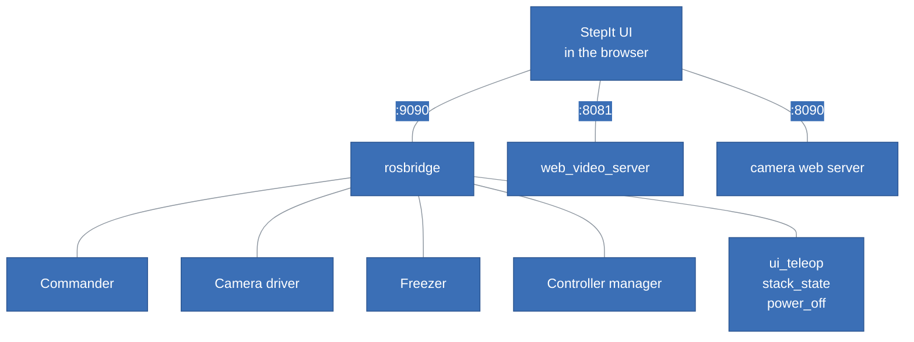
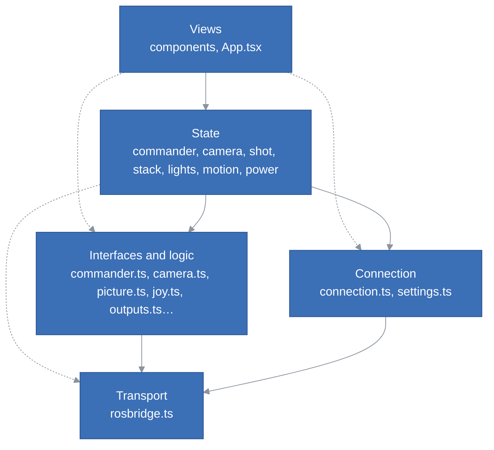
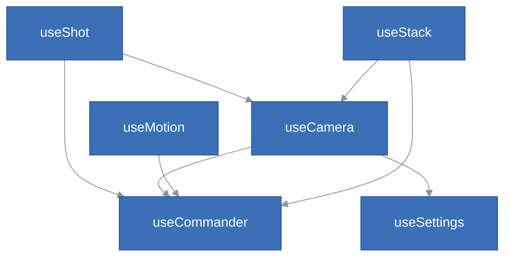
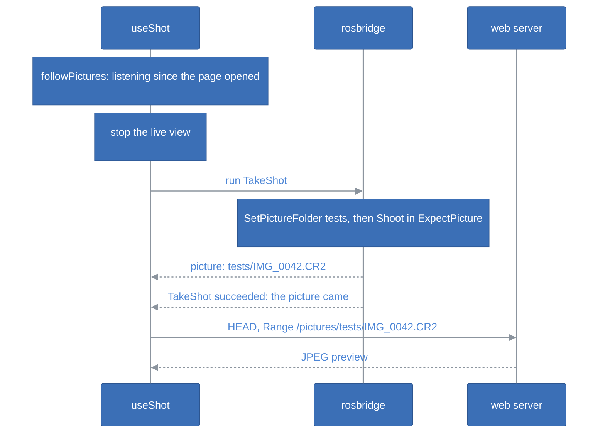
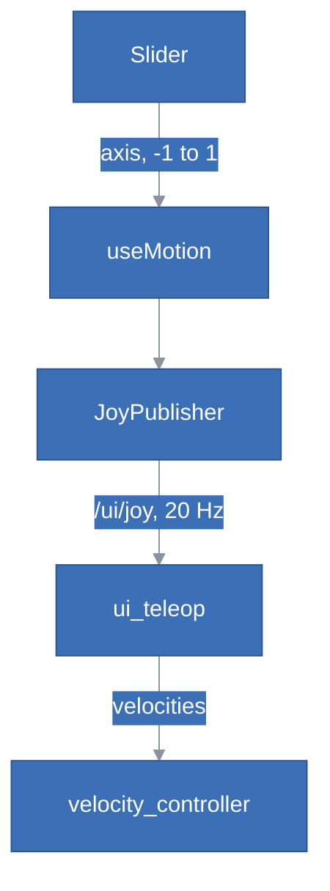

# StepIt UI Architecture

## Table of Contents <!-- omit in toc -->

- [Introduction](#introduction)
- [The Big Picture](#the-big-picture)
- [The Layers](#the-layers)
- [Talking to the Rig](#talking-to-the-rig)
  - [The rosbridge Client](#the-rosbridge-client)
  - [The One Connection](#the-one-connection)
  - [The Interfaces of the Modules](#the-interfaces-of-the-modules)
- [The Stores](#the-stores)
- [A Shot, from the Button to the Picture](#a-shot-from-the-button-to-the-picture)
- [The Sliders, from the Thumb to the Motor](#the-sliders-from-the-thumb-to-the-motor)
- [Components](#components)
- [Tests](#tests)
- [How to Extend the Page](#how-to-extend-the-page)
- [Design Decisions and Trade-offs](#design-decisions-and-trade-offs)
- [Review](#review)
  - [Is the Page Well Structured?](#is-the-page-well-structured)
  - [Are the Layers Respected?](#are-the-layers-respected)
  - [SOLID](#solid)
  - [Coupling Between Components](#coupling-between-components)
  - [Duplication](#duplication)
  - [Implementation Issues](#implementation-issues)
  - [Recommendations](#recommendations)

## Introduction

This document explains how StepIt UI is built, what each part is responsible for, and where to start when we want to change something. It assumes we have read the [README](../README.md) and used the page once on the rig. Its last section, [Review](#review), judges the structure against the rules the rest of the document describes, and lists what should change.

It follows one idea: **the page owns nothing of the rig**. The commander, the camera's driver, StepIt Freezer and the controller manager own the state; the page mirrors what they publish, asks them for changes, and keeps only what is its own: the browser's preferences, the slider under each thumb, and the pictures it has shown.

## The Big Picture

The page is a single-page React application, built by Vite into `dist` and served as static files on port 8070 by StepIt Macro. It has no server of its own: the browser talks to three servers of the rig directly.



| Server | Port | Carries |
|---|---|---|
| The commander's rosbridge | 9090 | Every message of the rig: in StepIt Macro every module is installed in one container, so this rosbridge knows them all. |
| web_video_server | 8081 | The live view, the camera's JPEG frames as MJPEG, in a plain ``. |
| The camera's web server | 8090 | The saved pictures, with `HEAD` and `Range` requests. |

The page follows the rule of the rig: **only tasks go through the commander**, as objectives (`TakeShot`, `ActivateTeleop`, `ActivateController`); **configuration goes straight to the drivers** (the camera's settings and live view, the lights), so that changing the ISO never preempts a running shoot.

## The Layers

The source code lives in [`src`](../src), one folder per device of the rig, plus the transport and the views. Inside the device folders, the files fall into four layers:

| Layer | Files | Knows about |
|---|---|---|
| Transport | [`ros/rosbridge.ts`](../src/ros/rosbridge.ts) | The rosbridge protocol. Nothing of the rig. |
| Connection | [`ros/connection.ts`](../src/ros/connection.ts), [`settings.ts`](../src/settings.ts) | The one connection of the page, its status, and where the servers are. |
| Interfaces and logic | [`commander/commander.ts`](../src/commander/commander.ts), [`camera/camera.ts`](../src/camera/camera.ts), [`camera/picture.ts`](../src/camera/picture.ts), [`camera/raw.ts`](../src/camera/raw.ts), [`camera/format.ts`](../src/camera/format.ts), [`freezer/outputs.ts`](../src/freezer/outputs.ts), [`shot/pictures.ts`](../src/shot/pictures.ts), [`stack/plan.ts`](../src/stack/plan.ts), [`stack/parameters.ts`](../src/stack/parameters.ts), [`motion/axis.ts`](../src/motion/axis.ts), [`motion/joy.ts`](../src/motion/joy.ts), [`power/power.ts`](../src/power/power.ts) | The ROS interface of one module, given a `Rosbridge`, or pure computation. No React, no store, no global. |
| State | [`commander/store.ts`](../src/commander/store.ts), [`camera/store.ts`](../src/camera/store.ts), [`shot/store.ts`](../src/shot/store.ts), [`stack/store.ts`](../src/stack/store.ts), [`freezer/lights.ts`](../src/freezer/lights.ts), [`motion/store.ts`](../src/motion/store.ts), [`power/store.ts`](../src/power/store.ts) | One zustand store per device: what the page shows, and the actions the views call. |
| Views | [`components`](../src/components), [`App.tsx`](../src/App.tsx) | What the user sees and does. |

The dependencies are meant to point down only. The diagram shows the imports as they are; the dashed arrows skip the layer of interfaces, see [Are the Layers Respected?](#are-the-layers-respected).



> [!IMPORTANT]
> Keep the layer of interfaces free of React, of the stores and of `ros()`: each function or class takes the `Rosbridge` it talks to, or a function to publish with, as `JoyPublisher` does. This is what lets the tests run it against a fake WebSocket, and nothing else in the page is tested.

## Talking to the Rig

### The rosbridge Client

`Rosbridge` in [`rosbridge.ts`](../src/ros/rosbridge.ts) is a small client of the rosbridge protocol, written for the rig rather than taken from `roslibjs`. StepIt Camera's test page and StepIt Freezer's board page each have a copy of their own, see [Duplication](#duplication). It speaks these operations:

```
→ call_service          a request                ← service_response
→ subscribe             a topic, once per topic  ← publish, for each message
→ unsubscribe
→ advertise, publish    a topic, a message
→ send_action_goal      a goal                   ← action_feedback, action_result
→ cancel_action_goal
                                                 ← fragment, parts of a large message
```

- `callService()` fails at once when not connected, rather than waiting, so that a button can say it did not work; it fails after a timeout, 10 s, or when the connection drops.
- `subscribe()` sends one `subscribe` per topic, whatever the number of listeners, and `unsubscribe` with the last one. The subscriptions, and the advertised topics, survive a reconnection: `onopen` sends them again.
- `publish()` drops a message while disconnected: a velocity that comes late is worse than none.
- `sendActionGoal()` returns the result as a promise, which fails when the connection drops, since the goal's end is then unknown.
- The connection comes back on its own every 2 s, e.g. while the rig restarts.

### The One Connection

[`connection.ts`](../src/ros/connection.ts) holds the page's one `Rosbridge`, opened by the first call to `ros()`, and opened again on the next call when the rosbridge of the settings changes. Its status lives in a small zustand store, read by React with `useStatus()` and by the stores with `status()`, `onConnected()` and `onDisconnected()`.

A store that follows a topic subscribes through `ros()`, and subscribes again on every `onConnected`, so that a new connection, to another rosbridge, gets its subscription too. The client re-subscribes on its own after a mere reconnection, so the two overlap: see [Implementation Issues](#implementation-issues).

### The Interfaces of the Modules

| Module | Where its interface is | What the page uses |
|---|---|---|
| StepIt Commander | [`commander/commander.ts`](../src/commander/commander.ts) | `runObjective` (the action `/commander/execute_objective`), `cancelAll` (its `cancel_goal` service, with a goal of zeros), `followObjective` (the name of the running objective, `/stepit_server/objective`, transient local, which the commander empties at every end of a run, a tree that throws included). |
| The rig's stack | [`stack/store.ts`](../src/stack/store.ts), [`stack/parameters.ts`](../src/stack/parameters.ts) | The parameters `state.*` of the rig's node `stack_state` (the marks, in memory, and the counts, in its state file), with `get_parameters`, `set_parameters` and `/parameter_events`; FocusStack's progress, `/focus_stack/progress`, transient local. |
| The camera's driver | [`camera/camera.ts`](../src/camera/camera.ts), the class `Camera` | `get_settings`, `set_parameters`, `start_streaming`, `stop_streaming`, the topic `picture`; the URLs of the live view and of a picture. |
| The camera's web server | [`camera/picture.ts`](../src/camera/picture.ts), [`camera/raw.ts`](../src/camera/raw.ts) | A picture's size with `HEAD`, a RAW's JPEG preview with two `Range` requests. |
| StepIt Freezer | in the store, [`freezer/lights.ts`](../src/freezer/lights.ts), with the bits of a jack in [`freezer/outputs.ts`](../src/freezer/outputs.ts) | `/freezer/set_outputs`, `/freezer/outputs`. |
| The controller manager | in the store, [`motion/store.ts`](../src/motion/store.ts) | `/controller_manager/list_controllers`, every 2 s. |
| ui_teleop | [`motion/joy.ts`](../src/motion/joy.ts), `JoyPublisher` | `sensor_msgs/Joy` on `/ui/joy`, at 20 Hz while a slider is held. |
| power_off | [`power/power.ts`](../src/power/power.ts) | `/power_off/power_off`, `std_srvs/Trigger`: switches the rig's computer off, or says why not. |

## The Stores

Each store is a zustand store, created at import time, with its actions on it. The `follow*()` functions keep the stores up to date while the page is open; `App.tsx` starts them on mount and stops them on unmount.

| Store | Holds | Kept up to date by | Uses |
|---|---|---|---|
| `useCommander` | `busy` (an objective runs, whoever sent it), `known`, `running` (the objective this page runs), `objective` (the one running, whoever sent it, from the commander's latched `/stepit_server/objective`), `failure`; `run()`, `stop()` | `followCommander`: the objective's latched topic, which the commander empties at every end of a run, a tree that throws included; `objectiveRuns()` tells whether it runs, and whether the page knows yet | — |
| `useCamera` | the settings, the ones `changing` and `refused`, `streaming`, the errors; `refresh()`, `change()`, `setStreaming()` | `followCamera`: reads the settings every 3 s, unless a task runs; starts the live view again after a reconnection | `useCommander` (`busy`), `useSettings` |
| `useShot` | the state of the shot, its message, the latest two pictures; `takeShot()`, `show()` | `followPictures`: shows every picture on `/camera/picture`, whoever fired it | `useCamera`, `useCommander`, `useSettings` |
| `useLights` | the outputs of the board, `switching`, `error`; `setLights()` | `followLights`: `/freezer/outputs` | — |
| `useMotion` | `enabled` (the velocity controller runs), the axes; `enable()`, `disable()`, `setAxis()`, `release()` | `followMotion`: lists the controllers every 2 s; lets the sliders go when the page is hidden | `useCommander` |
| `useStack` | the rail's marks, the counts and the stage's turn either way, from the rig's `stack_state`; `marking`, `progress`, from the rig; `setPlan()`, which sets the counts on the rig, `mark()`, `goToMark()`, `start()`; `flashed`, the end just marked. Nothing in `localStorage`; the payload and the checks are in [`stack/plan.ts`](../src/stack/plan.ts), the parameters in [`stack/parameters.ts`](../src/stack/parameters.ts), which the tests import | `followStack`: reads the `state.*` of `stack_state` on every connection, which declares them all, an empty list for a mark not made, follows `/parameter_events` and the latched `/focus_stack/progress` | `useCommander`, `useCamera` |
| `usePower` | `switchingOff`, `failure`, `hint`; `switchOff()`, `showHint()` | `followPower`: a new connection is a rig on again, which clears them | — |
| `useSettings` | the preferences of the browser, in `localStorage` | — | — |



`useShot` also reads `useSettings`, for the address of the pictures, `useStack` stops the live view through `useCamera` before a stack, and `useLights` depends on no other store. The stores form no cycle, and `useCommander` is the one they all lean on: whether a task runs decides what may be changed.

## A Shot, from the Button to the Picture

**Test shot** is the longest flow of the page, and the one that crosses the most stores:



The Toolbar's button calls `takeShot()`. The live view is stopped through `useCamera`, and the objective runs through `useCommander`, which the diagram leaves out: both talk to rosbridge. **Every page shows every picture**: `followPictures` hands each one the camera reports to `show()`, whoever fired the shot, a test shot or a stack, from this page or another device. **The rig proves the shot, not the page**: `TakeShot` wraps `Shoot` in `ExpectPicture`, so it succeeds only once the camera has reported the picture, and fails when none comes, for every client that runs it. `takeShot()` only says how the objective ended.

The picture is loaded at its `relative_path` under `/pictures`: a test shot's is in `tests`, a stack's in the stack's folder and the folder of its angle, which the rig chose.

The page shows only the latest picture, and keeps two, the files of a shot in RAW+JPEG ([`shot/pictures.ts`](../src/shot/pictures.ts)). The preview of a RAW is an object URL, which holds its JPEG in memory until revoked: a picture the page drops is released, and so is one dropped while it was still loading.

## The Sliders, from the Thumb to the Motor



`Slider` turns the pointer into an axis with `axisAt()`, which has a dead zone around the centre. `useMotion` ignores it unless manual drive is on. `JoyPublisher` sends the axes at once on a change, then 20 times a second while a slider is held, through `ros().publish()`, which drops them while disconnected.

The page never sends a velocity: `ui_teleop` turns the axes into velocities, with the scales of `rig.yaml`, and stops the joints when the axes stop coming for 0.5 s. The page only labels each slider with its speed at the ends, `SLIDERS` in [`motion/store.ts`](../src/motion/store.ts), which must be kept in step with `rig.yaml` by hand.

Manual drive is turned on by the objective `ActivateTeleop`, and off by `ActivateController` with `joint_trajectory_controller`. Whether it is on is not the page's own belief: it is read from the controller manager every 2 s, since any objective may take the velocity controller away, and it is off while the page is disconnected, when the sliders' messages would be dropped.

## Components

The screen is laid out in [`App.tsx`](../src/App.tsx): the top bar, a slider at each edge, and the toolbar over the live view in the middle.

| Component | Where | Responsibility | Reads |
|---|---|---|---|
| [`TaskStatus`](../src/components/TaskStatus.tsx) | Top bar | The task that runs, and why the last one of this page failed; before them, *Switching off…*, why the rig refused to, or the hint to hold the power button. | `useCommander`, `usePower` |
| [`ConnectionBadge`](../src/components/ConnectionBadge.tsx) | Top bar | Whether the page reaches rosbridge. | `useStatus`, `useSettings` |
| [`SettingsMenu`](../src/components/SettingsMenu.tsx) | Top bar | On three tabs: the camera's settings, the theme, the servers; under them, `PowerButton`. | `useSettings` |
| [`PowerButton`](../src/components/PowerButton.tsx) | Settings menu, under the tabs | Switches the rig off: hold for 3 seconds, `POWER_HOLD_MS`, with [`hold.ts`](../src/components/hold.ts), filling in red; off while disconnected or a stack runs, saying why under it, as a tablet has no tooltip. Away from the top bar, next to which a thumb reaches for Mark. | `useStatus`, `useCommander`, `usePower` |
| [`CameraSettings`](../src/components/CameraSettings.tsx) | Settings menu | One list per setting of the camera, locked while a task runs. | `useCamera`, `useCommander` |
| [`Toolbar`](../src/components/Toolbar.tsx) | Centre | Test shot, Live view, Lights, Manual drive, Stop: one small component per button. | every store |
| [`StackBar`](../src/components/StackBar.tsx) | Centre, under the live view | Stack, which runs it; Shots, Angles; while it runs, a progress bar of its pictures. | `useStack`, `useCommander` |
| [`RailMark`](../src/components/RailMark.tsx) | Above and below the rail's slider | Mark: MarkNear above, the camera away from the subject; MarkFar below, the camera close to it: hold to mark, the press told from a tap by [`hold.ts`](../src/components/hold.ts); a tap on a marked end, both being marked, runs MoveRailToMark. Green and Marked once marked, a flash at every new mark. | `useStack`, `useCommander` |
| [`LiveView`](../src/components/LiveView.tsx) | Centre | The live view, or the last photo; the messages of the shot and of the lights. | `useCamera`, `useShot`, `useLights`, `useSettings` |
| [`Slider`](../src/components/Slider.tsx) | Edges | A vertical stick for a thumb, an icon of what it drives on its knob. Props only: no store. | — |
| [`icons`](../src/components/icons.tsx) | Shared | Line icons in the text colour. | — |

`Slider` is the one purely presentational component: `SideSlider`, in `App.tsx`, connects it to `useMotion`. The others read the stores they need directly.

## Tests

`pnpm run test` runs vitest on [`tests`](../tests), in Node.js, with a fake WebSocket that answers as rosbridge ([`fakeSocket.ts`](../tests/fakeSocket.ts)). The `ui` job of StepIt Macro's CI runs the type check, the tests and the build on every push, with the scripts of `bin/ui`.

| Test | Covers |
|---|---|
| `rosbridge.test.ts` | Services, subscriptions, fragments, reconnection, publishing and action goals. |
| `commander.test.ts` | Running an objective, how it ended, stopping them all, whether one runs. |
| `camera.test.ts` | The camera's interface, and how its settings are shown. |
| `picture.test.ts`, `raw.test.ts` | Loading a picture, and the preview inside a RAW. |
| `joy.test.ts`, `axis.test.ts` | The sliders as a gamepad, and a slider as an axis. |
| `lights.test.ts` | The bits of the lights on the Freezer's outputs. |
| `power.test.ts` | Switching off: the service, the refusal passed on, when the button is off and why, the hold of 3 seconds. |
| `shot.test.ts` | The pictures kept, and the previews of the others released. |
| `stack.test.ts` | The plan of a focus stack: its payload, the stage's angles, and why it cannot run. |
| `stackParameters.test.ts` | The stack as `stack_state` keeps it: its parameters read, an empty mark read as not marked, a count saved. |
| `hold.test.ts` | A press told apart: a tap, a hold, a press abandoned. |

Every test is of the transport or of the layer of interfaces and logic. **No store is tested**, and no component: importing a store imports `settings.ts`, which touches `window` at import time and fails in Node.js. The flows that cross several stores, a shot, manual drive, a reconnection, are only checked by hand on the rig.

## How to Extend the Page

| To… | Change… |
|---|---|
| add a command that is a task | an objective in the rig, then a button that calls `useCommander.getState().run('Name', payload)`, from the store of its device. |
| add a configuration of a driver | its service or topic in the device's interface (e.g. `Camera`), an action in its store, a control in a component. Never through the commander. |
| support a new module | a folder `src/<module>/`: an interface that takes a `Rosbridge`, a store with a `follow<Module>()`, started in `App.tsx`. Its messages must be installed next to the commander's rosbridge. |
| add a camera setting | nothing in the page: the driver lists it in `get_settings`. Add a label and an order in [`format.ts`](../src/camera/format.ts). |
| add a preference | `Settings` and `DEFAULTS` in [`settings.ts`](../src/settings.ts), and a control in `SettingsMenu`. |
| change a slider's speed | `rig.yaml`'s section `ui_teleop`: the page sends only where the knob is. |

## Design Decisions and Trade-offs

**zustand stores per device, not one store.** Each device of the rig has its own small store, so a component subscribes to what it shows. A store may read another, `useCommander` mostly; none writes another's state.

**Module-level singletons.** The connection and the stores are created at import time, so any file can reach them without providers. It keeps the page short; the price is that the stores cannot be given a fake connection, and are not tested.

**Polling where the rig has no topic.** The camera's settings, every 3 s, and the controllers, every 2 s. The camera's settings change on the camera itself, with nothing published; the polling pauses during a task, when the driver may be busy downloading a 29 MB RAW.

**Pictures over HTTP, never over rosbridge.** A RAW would reach the browser as 40 MB of base64 in JSON, ahead of every service call on the same WebSocket. The page asks the size first and never reads past the end of a file, to step around a bug of cpp-httplib 0.14.

**The rosbridge client and the camera's code are copies of StepIt Camera's test page**, not shared, so that each module builds alone. The copies differ: see [Duplication](#duplication).

**No authentication.** Anyone who reaches the rig's rosbridge can drive it, which suits a workshop's own network only.


## Review

Reviewed on 2026-10-09, at commit `cfe83b7` of StepIt Macro, with the `architect` skill. The rest of the rig is reviewed in the repo's [ARCHITECTURE.md](../../docs/ARCHITECTURE.md#review). Each finding names where it is; the ones marked *verified* were reproduced with a throwaway vitest test in the rig's image, the others come from reading the code.

### Is the Page Well Structured?

Yes, for its size: about 2,900 lines of TypeScript, one folder per device of the rig, the protocol in one class, and the pure logic in small functions with tests of their own: the axes, the joy messages, the bits of a jack, the formats of the settings, the RAW previews, the plan of a stack, the stack's parameters, the hold of a button. The rule of the rig, tasks through the commander and configuration straight to the drivers, is followed everywhere, and the safety of the sliders rests on `ui_teleop`'s watchdog, not on the page, as it should. Nothing of the rig is kept in the browser: the marks and the counts live on the rig, and every page shows the same.

The weak part is the layer of state. It holds the code that orchestrates, the shot, manual drive, the stack, the reconnections, and it is the one layer with no seam to test it and no rule about what it may know. Both verified bugs below are in it.

### Are the Layers Respected?

Mostly. Three kinds of shortcut:

1. **Stores that talk ROS themselves.** The commander, the camera and `power_off` have an interface that names their services and topics; the others do not. [`freezer/lights.ts`](../src/freezer/lights.ts) calls `/freezer/set_outputs` and subscribes to `/freezer/outputs`; [`motion/store.ts`](../src/motion/store.ts) calls `/controller_manager/list_controllers`; and [`stack/store.ts`](../src/stack/store.ts), the largest, calls the commander's `set_parameters`, `list_parameters` and `get_parameters` and follows `/parameter_events` and `/focus_stack/progress`, each with the types of the messages declared in the store. The rig keeps the names of robot interfaces in one package, `stepit_behaviors`; the page has no such rule.
2. **Views that know the rig's objectives.** `ManualDriveButton` disables itself while `running` is `ActivateTeleop` or `ActivateController` ([`Toolbar.tsx`](../src/components/Toolbar.tsx)), the names of `useMotion`'s objectives; `StackBar` shows the progress while `objective` is `FocusStack` ([`StackBar.tsx`](../src/components/StackBar.tsx)), a name `useStack` already uses.
3. **Views and stores that import the transport for a helper.** `errorMessage()` lives in `rosbridge.ts`, so `LiveView`, which has nothing to do with rosbridge, imports the transport for it, as does every store.

The rules of what may be done when, connected, no task running, are also in the views: see [Coupling Between Components](#coupling-between-components).

### SOLID

| Principle | Verdict |
|---|---|
| **Single responsibility** | Good in the transport and the interfaces. `Rosbridge` is long, 320 lines, but about one thing, the protocol. `settings.ts` has three jobs: the preferences, the URLs of the servers, and the theme of the document, applied at import time. `useStack` holds the plan, the marks, the progress and the commander's parameters protocol. `Toolbar` holds five buttons, but as five small components. |
| **Open/closed** | Good where it matters: a new camera setting needs no code, a new objective is a string, a new module is a new folder. Adding a rule such as "locked during a task" means editing each button that applies it. |
| **Liskov substitution** | Barely applies: there is no inheritance beyond the error classes. |
| **Interface segregation** | Weak in the views: `useCamera()`, `useShot()`, `useCommander()`, `useMotion()`, `useStack()` and `usePower()` are read whole, without a selector, so a component re-renders on any change of the store, e.g. `LiveViewButton` and `LiveView` every 3 s when the settings are read again, as the poll always stores a new array, and `TaskStatus` on every change of the stack. Harmless at this size. |
| **Dependency inversion** | Good in the layer of interfaces: `Camera`, `powerOff()` and the commander's functions take a `Rosbridge`, `JoyPublisher` takes a function to publish with, which is why they are tested. Broken in the layer of state: every store reaches the concrete singleton `ros()` and the other stores directly, which is why none is tested. |

### Coupling Between Components

The stores form a clean, acyclic graph (see [The Stores](#the-stores)). The coupling is in the views:

- **The rules of when a command may run are spread over the buttons, and two buttons have none.** `connected` is computed nine times, in six files, and `busy` read in seven components, each combining them its own way: `ShotButton` (`!connected || busy || shooting`), `LightsButton` (`!connected || !known || busy || switching`), `StackBar` (`!idle || problem`), `RailMark` (`!connected || busy || marking`), `CameraSettings` (`busy`), `PowerButton` (through `powerProblem()`). `ManualDriveButton` checks two objective names and not `busy`, `LiveViewButton` checks nothing: see [Implementation Issues](#implementation-issues). None of it is tested.
- **`Toolbar` reads every device store**, and `LiveView` reads four, one of them only to show the lights' error. The errors of the page have seven shapes in seven places: `error` and `streamError` in `useCamera`, `refused` per setting, `failure` in `useCommander` and in `usePower`, `message` with `state` in `useShot`, `error` in `useLights` and in `useStack`. Each view picks which to show.
- **`useShot` and `useStack` drive `useCamera`**: both stop the live view before they shoot. It is the right place, a shot and a stack need both, but the rule "no live view while shooting" is in two stores and in no button.
- **The page repeats values of the rig.** `SLIDERS` and `App.tsx` know that `joint1` is the stage and `joint2` the rail; `STACKS` in [`power.ts`](../src/power/power.ts) repeats `refuse_during` of `power_off`; `COMMANDER` in the stack store is the commander's node name.

Each component can still be changed alone; what cannot is a rule that spans them.

### Duplication

| What | Where | Weight |
|---|---|---|
| **The rosbridge client and the camera's code, copied across modules.** | `ros/rosbridge.ts` exists in StepIt Camera's test page, StepIt Freezer's board page and here, each different (121 and 370 lines of `diff` against this one). `camera/format.ts` is an identical copy; `camera/raw.ts` differs by one function, `camera/camera.ts` by 34 lines, `camera/picture.ts` by 21. | High: the fixes do not travel. This page reads the size of a picture first, to step around cpp-httplib 0.14; the camera's test page still reads 64 KB from the start of every file, the case that fails for a small JPEG. |
| Following a topic across connections: subscribe, then again on every `onConnected`. | `followCommander`, `followLights`, `followPictures`; `followStack` does not. | High: one store forgot it, see issue 2, and the others overlap the client's own re-subscription, see issue 3. |
| The QoS of a latched topic, `reliable`, `transient_local`, `keep_last`, 1. | Twice in [`commander.ts`](../src/commander/commander.ts), in [`lights.ts`](../src/freezer/lights.ts) and [`stack/store.ts`](../src/stack/store.ts). | Low. |
| `connected`, `busy` in the views. | Six files, see above. | Medium. |
| The values of the rig. | `SLIDERS`, `STACKS`, `COMMANDER`, see above. | Medium: kept in step with `rig.yaml` by hand. |
| The theme: its storage key and how `auto` resolves. | [`index.html`](../index.html), before the first paint, and [`settings.ts`](../src/settings.ts). | Low, and deliberate. |
| A press told from a hold, wired to a button. | `RailMark` and `PowerButton`: the same eight pointer and key handlers around `createHold()`. | Low. |
| `Cannot load … : status statusText`. | `fetchSize`, `fetchRange` in [`picture.ts`](../src/camera/picture.ts). | Low. |

### Implementation Issues

Ordered from the most to the least serious. None of them is a safety issue: the sliders stop through `ui_teleop`'s watchdog whatever the page does, and the commander's preemption is a controlled stop.

1. **The stores cannot be tested** (*verified*). [`settings.ts`](../src/settings.ts) calls `window.matchMedia` at import time, to apply the theme, so importing any store in Node.js fails with `ReferenceError: window is not defined`; every store imports it through `connection.ts`. With the global `ros()` and the stores created at import, a test also needs `vi.resetModules()` between cases. The untested code is the one that orchestrates: `takeShot`, `enable` and `disable`, `mark`, `start`, the `follow*()` functions.
2. **The stack stops following the rig after a change of rosbridge** (*verified*). `followStack()` subscribes to `/parameter_events` and `/focus_stack/progress` once, on the `Rosbridge` of the moment; when the settings name another rosbridge, `ros()` closes that client and opens a new one, which never subscribes to them. With the stores stubbed into Node.js, the new connection received no `subscribe` for either topic. From then on, a mark set from another page, a count changed elsewhere and the progress of a running stack do not show until the page is reloaded; `readStack()` on each connection still reads the values once.
3. **Two layers re-subscribe after a connection** (*verified*). `Rosbridge`'s `onopen` sets the status to connected, which runs the `onConnected` listeners, before it sends the subscriptions again. `followCommander`, `followLights` and `followPictures` then unsubscribe and subscribe again, and `onopen` sends that new subscription a second time. On the first connection, rosbridge receives an `unsubscribe` for an id it never saw, then the same `subscribe` twice. rosbridge copes, but the page does not own its subscriptions in one place, which is how issue 2 came about.
4. **Manual drive and Live view are not locked while a task runs.** `ManualDriveButton` is off only while its own objectives run, so a tap during a focus stack runs `ActivateTeleop`, which the commander lets preempt the stack: 350 pictures end on a tap next to the sliders, while Stack, Mark, Test shot, Lights and the camera's settings are all locked during a task. `LiveViewButton` checks nothing, so the live view can be started in the middle of a stack, which `start()` turned it off for.
5. **The live view is the page's belief.** `setStreaming()` in [`camera/store.ts`](../src/camera/store.ts) sets `streaming` before the call, and keeps it when the call fails: a failed stop leaves the camera streaming while the button says it is off. The driver publishes no state of its stream to correct it.
6. **The counts of a stack are written to the rig at every keystroke, and accept what the plan refuses.** `NumberField` in [`StackBar.tsx`](../src/components/StackBar.tsx) calls `setPlan()` for every valid value typed, each a `set_parameters` that writes the rig's state file; typing 350 writes 3, 35 and 350. Shots and Angles have no `min`, so 0 or -5 is saved on the rig, for every page, and only then reported by `planProblem()`. The comment of `StackBar` also names a `StageMark` component, which does not exist.

### Recommendations

In order, each one small enough for one pull request:

1. **Make the stores testable** (fixes issue 1). Move the theme out of `settings.ts` into a `theme.ts` that `main.tsx` starts, so that importing the settings has no effect on the document. Then test a change of rosbridge, `takeShot`, manual drive and a stack against `FakeSocket`, with `vi.resetModules()` between cases. Later, if the stores grow, create them with a factory that takes the connection.
2. **Give the connection one owner of the subscriptions** (fixes issues 2 and 3). Let `connection.ts` offer `follow(topic, type, listener, qos)`, which keeps the subscription across a change of rosbridge by moving it to the new `Rosbridge`, and does nothing on a mere reconnection, which the client already handles. `followCommander`, `followLights`, `followPictures` and `followStack` then shrink to calls of it, and the duplicate traffic goes.
3. **Move the rules of the buttons into the stores** (fixes issue 4). Selectors such as `canTakeShot`, `canDrive`, `canStream`, one rule each, tested once recommendation 1 is done; a `switching` flag in `useMotion` in place of the objective names in `ManualDriveButton`; Manual drive and Live view locked while a task runs, Stop being the one way to end it. If taking the robot by hand mid-task is wanted, say so in the button, and keep it apart from the others. Read the stores with selectors, or `useShallow`, rather than whole.
4. **Give every module an interface.** `freezer/freezer.ts` with `setOutputs()` and `onOutputs()`, `motion/controllers.ts` with `activeControllers()`, and the commander's parameters, `getParameters()`, `setParameters()`, `onParameters()`, next to `runObjective()`, as `Camera` does; a `LATCHED` QoS constant in `rosbridge.ts`. Then only the interfaces name ROS topics and services, the page's version of the rig's own rule. Move `errorMessage()` to a `util.ts`, and read `refuse_during` from `power_off`'s parameters in place of `STACKS`.
5. **Apply the counts when they are done, not as they are typed** (fixes issue 6). On blur and Enter, as `UrlField` does, with a `min` of 1 for Shots and Angles; correct the comment of `StackBar`.
6. **Follow the live view's real state** (fixes issue 5). At the least, read the state back after a failed call; better, have StepIt Camera publish whether it streams, latched, and follow it as the lights are followed. The second is a change to StepIt Camera.
7. **Share the code copied across modules.** One small package, e.g. `stepit-web`, with the rosbridge client and the camera's interface, used by the three pages; or, at the least, port this page's reading of the picture's size to StepIt Camera's test page. Sharing costs each module its independence at build time, which is why the code is copied; three diverging copies of a protocol client is the point where that trade stops paying.
